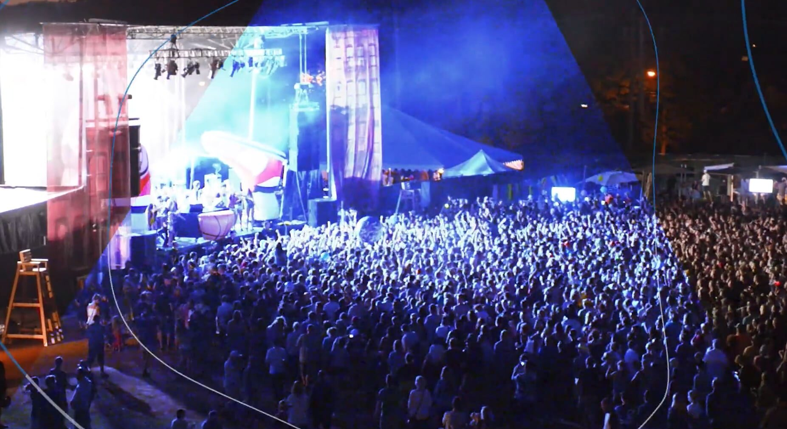
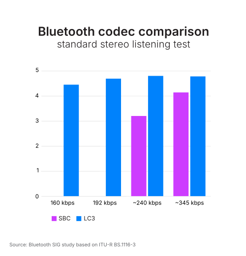
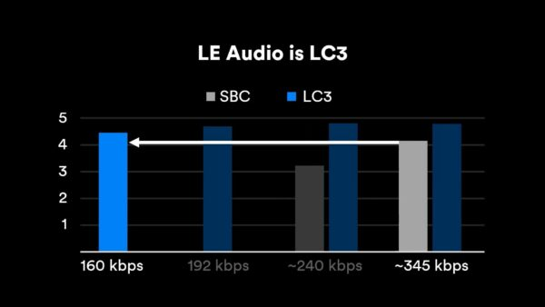
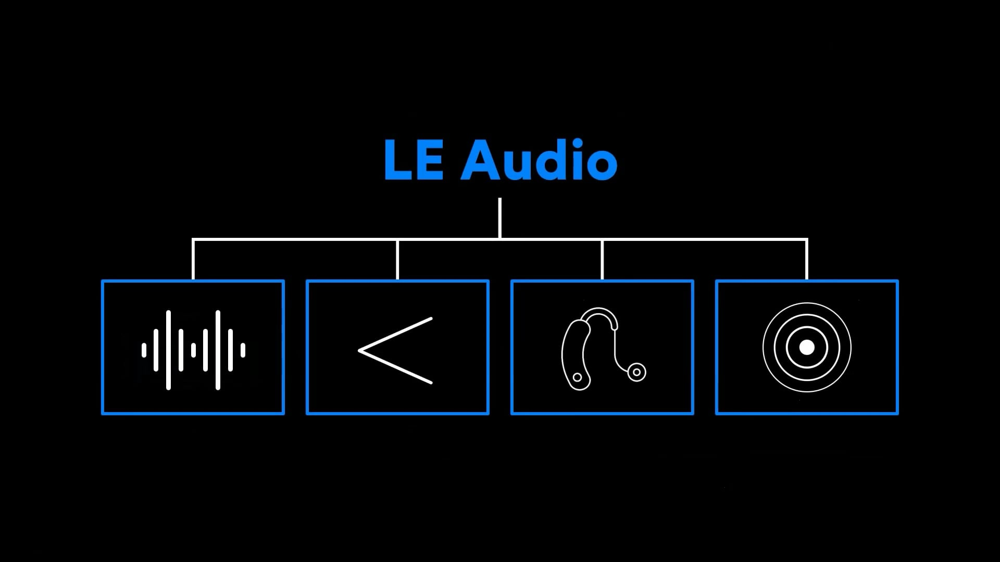
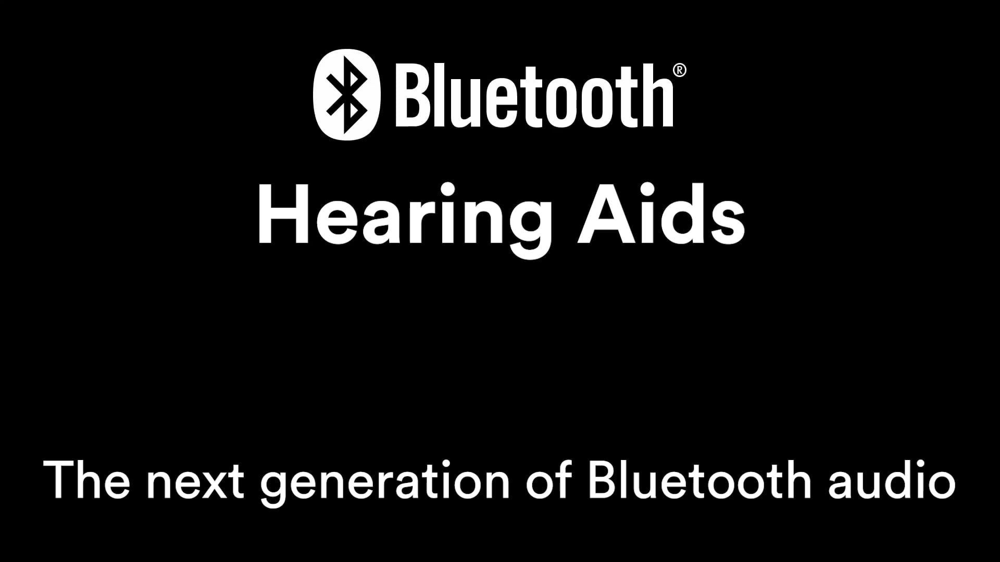

<!-- 来源信息区：本区不是原文正文。 -->

- 来源机构或作者：Bluetooth SIG（蓝牙技术联盟）
- 原始网址：https://www.bluetooth.com/learn-about-bluetooth/feature-enhancements/le-audio/
- 发布或更新日期：页面未显示单独发布日期
- 获取日期：2026-07-16
- 原文语言：English
- 清洗说明：网页导航、广告、脚本、重复页眉页脚和其他页面界面噪音已清除；正文内容保留。
- 图片或附件：页面中的图片已按规范归档到 `knowledge/assets/`；无法本地归档的外部附件仍保留原始链接。

---

# LE Audio

# LE Audio

## The next generation of Bluetooth® audio

Building on 20 years of innovation, LE Audio enhances the performance of Bluetooth® audio, adds support for hearing aids, and introduces Auracast™ broadcast audio, an innovative new Bluetooth use case with the potential to once again change the way we experience audio and connect with the world around us.

## Classic Audio and LE Audio

As the names suggest, Classic Audio operates on the Bluetooth Classic radio while LE Audio operates on the Bluetooth Low Energy radio. LE Audio not only supports development of the same audio products and use cases as Classic Audio, it introduces exciting new features that promise to improve their performance and enable the creation of new products and use cases.

### Auracast™ broadcast audio

LE Audio will also add broadcast audio, enabling an audio source device to broadcast one or more audio streams to an unlimited number of audio sink devices. Broadcast audio opens significant new opportunities for innovation, including the enablement of a new Bluetooth capability, [Auracast™ broadcast audio](https://www.bluetooth.com/auracast).

## Share your audio

Auracast™ broadcast audio will let you invite others to share in your audio experience, bringing us closer together.

## Unmute your world

Auracast™ broadcast audio will enable you to fully enjoy televisions in public spaces, unmuting what was once silent and creating a more complete watching experience.

## Hear your best

Auracast™ broadcast audio will allow you to hear your best in the places you go.

### Auracast™ resources

NEW TECHNICAL RESOURCES

### LE Audio resources for developers

The LE Audio Specifications are complete. Access a library of technical resources including a book, videos, study guides, and more designed to help you get familiar with the new LE Audio architecture, the individual specifications, and the capabilities LE Audio brings, including Auracast™ broadcast audio.

[Learn more](https://www.bluetooth.com/bluetooth-resources/?types=&categories=&tags=le-audio&keyword=&filter=)

LC3 codec

LE Audio will include a new high-quality, low-power audio codec, the Low Complexity Communications Codec (LC3). Providing high quality even at low data rates, LC3 will bring tremendous flexibility to developers, allowing them to make better design tradeoffs between key product attributes such as audio quality and power consumption.

> **Extensive listening tests have shown that LC3 will provide improvements in audio quality over the SBC codec included with Classic Audio, even at a 50% lower bit rate. Developers will be able to leverage this power savings to create products that can provide longer battery life or, in cases where current battery life is enough, reduce the form factor by using a smaller battery.**
>
> *Manfred Lutzky*
> *Head of Audio for Communications at Fraunhofer IIS*

What the industry is saying about LC3

### Why LC3 Will Be the Standard for the Next 20 Years

### How LC3 Checks All the Wireless Audio Boxes

### What LC3 Means for the Bluetooth Audio Listening Experience

### The Advantages and Flexibility of LC3

Now available

### LC3 specification

[Download the specification](https://www.bluetooth.com/specifications/le-audio/)

### LC3 resources

Multi-Stream Audio

Multi-Stream Audio will enable the transmission of multiple, independent, synchronized audio streams between an audio source device, such as a smartphone, and one or more audio sink devices.

> *Developers will be able to use the Multi-Stream Audio feature to improve the performance of products like truly wireless earbuds. For example, they can provide a better stereo imaging experience, make the use of voice assistant services more seamless, and make switching between multiple audio source devices smoother.*
>
> *Nick Hunn,
> CTO of WiFore Consulting
> Chair of the Bluetooth SIG Hearing Aid Working Group*

### Multi-Stream Audio resources

### The impact of Multi-Stream Audio on truly wireless earbuds

Hearing aids

Building on its low power, high quality and multi-stream capabilities, LE Audio adds support for Hearing Aids. Bluetooth audio has brought significant benefits to a large percentage of the global population. Wireless calling, listening, and watching have made people safer, more productive, and more entertained. LE Audio will enable the development of Bluetooth hearing aids that bring all the benefits of Bluetooth audio to the growing number of people with hearing loss.

> **LE Audio will be one of the most significant advances for users of hearing aids and hearing implants. EHIMA engineers have contributed their specialist knowledge to improve the audio experience especially for hard of hearing people. As a result, within a few years most new phones and TVs will be equally accessible to users with hearing loss.**
>
> *Stefan Zimmer
> Secretary General of EHIMA
> European Hearing Instrument Manufacturers Association*

### Hearing aid resources

### LE Audio and the future of hearing

Related resources

- [Blog Posts](#tab-blog-posts)
- [Case studies](#tab-case-studies)
- [Papers](#tab-papers)
- [Videos](#tab-videos)

As part of the bi-annual release cadence, Bluetooth® Core 6.3 has arrived. This update introduces new features that boost ranging precision, expand interface…

Bluetooth® Shorter Connection Intervals (SCI) is a transformative feature that reduces the minimum connection interval for Bluetooth® LE by a…

Frankfurt Airport is testing a new service at select gates that allows gate announcements to be transmitted directly to passengers’…

[View all resources](https://www.bluetooth.com/bluetooth-resources/?types=post&tags=bluetooth-le-audio)

The WYO sought a way to expand its assistive listening options to better serve all guests. While its existing hearing…

As part of its long-standing commitment to accessibility, the Everyman Theatre in Cheltenham has implemented a groundbreaking assistive listening solution…

University of the Arts London has implemented Auri™, our newest product in partnership with Ampetronic, to create more inclusive learning…

[View all resources](https://www.bluetooth.com/bluetooth-resources/?types=case-study&tags=bluetooth-le-audio)

This document presents a simple user scenario along with the underlying Bluetooth procedures that are used to make it happen….

This messaging guide includes Bluetooth® key brand messages and positioning details. we invite you to use the messaging shared in…

Over the past few years, QR codes have made a major comeback for tasks like viewing restaurant menus and making…

[View all resources](https://www.bluetooth.com/bluetooth-resources/?types=paper&tags=bluetooth-le-audio)

The Bluetooth® roadmap highlights how the global community continues to expand performance and innovation. Key initiatives include higher data throughput,…

Bluetooth is more than a technology — it’s a global standard shaped by a diverse community working together to create…

Auracast™ broadcast audio is here and increasingly showing up in everyday environments, from spaces where people come together to places where…

[View all resources](https://www.bluetooth.com/bluetooth-resources/?types=video&tags=bluetooth-le-audio)
