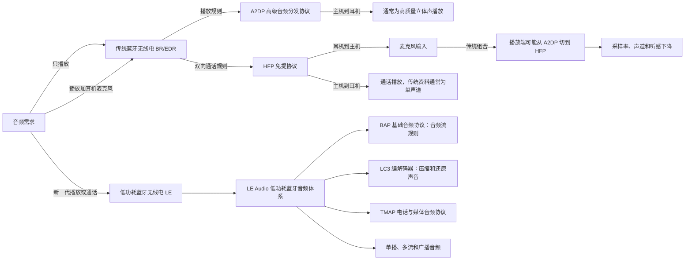

# A2DP、HFP 与 LE Audio 概念对照

## 结论

A2DP、HFP 和 LE Audio 不在同一个层级：

- **A2DP（高级音频分发协议）**是传统蓝牙里的“只把声音送到耳机”的播放规则，典型结果是高质量立体声播放。
- **HFP（免提协议）**是传统蓝牙里的“耳机要参与通话”的规则，同时承载耳机麦克风输入和耳机播放输出；传统链路的输出通常是单声道语音。
- **LE Audio（低功耗蓝牙音频）**不是一个单独的编解码器，也不是 A2DP 的一个开关，而是一套运行在低功耗蓝牙无线电上的新音频体系。它用 LC3（低复杂度通信编码器）以及一组音频流、通话、媒体和广播规范，覆盖传统蓝牙的播放和通话场景，并增加多流、助听器和广播音频等能力。

因此，“打开耳机麦克风后音乐变差”在传统蓝牙上通常应理解为 **A2DP 播放规则切换到 HFP 双向通话规则**，而不是简单的“某个音乐编解码器突然变差”。如果设备和主机实际建立的是 LE Audio，能否在麦克风使用时保持立体声，要看整套设备、系统、驱动和音频配置是否共同支持，不能只看耳机宣传语或蓝牙版本号。

## 一张概念图



图中“可能”是有意保留的边界：主机系统需要根据自身实现、应用行为和设备能力决定如何切换；图不能替代当前连接的系统日志或端点参数。

## 三者分别是什么

### A2DP：传统蓝牙的播放规则

Bluetooth SIG 对 A2DP 的定义是：为支持高质量音频分发的蓝牙设备规定要求，并定义音频分发使用场景中的服务、功能和互操作流程。Microsoft 的系统资料进一步把它落到电脑行为上：A2DP 用于普通媒体和视频播放，只支持主机到耳机的输出，不提供耳机麦克风采集。

可把 A2DP 理解成：

```text
电脑或手机 ──播放音频──> 耳机或音箱
```

A2DP 是“协议规则”，不是“某个固定音质数字”。它可以协商不同编解码器；Bluetooth SIG 的当前 A2DP 规范页面列出 SBC（子带编码）和 AAC（高级音频编码）测试资料，Microsoft 也说明 Windows 会在主机与耳机共同支持的范围内选择 A2DP 编解码器。因此，看到 A2DP 只能确认使用的是传统蓝牙播放类规则，不能单独推出当前实际编解码器、比特率或音质。

### HFP：传统蓝牙的双向通话规则

Bluetooth SIG 对 HFP 的定义是：让手机与免提设备协作，通过蓝牙链路提供手机远程控制和双方语音连接。耳机连接电脑时，电脑通常扮演手机或主机一侧，耳机扮演免提设备一侧。

可把 HFP 理解成：

```text
电脑或手机 ──通话播放──> 耳机
电脑或手机 <──麦克风声音── 耳机
```

传统蓝牙的 HFP 重点是“能同时说话和听话”，不是“保持音乐播放的宽频立体声”。Microsoft 的系统资料明确写出：HFP 同时提供麦克风采集和单声道播放；常见宽带语音是 16 kHz、mSBC（改进型子带编码），窄带语音是 8 kHz、CVSD（连续可变斜率增量调制）。实际模式由主机、蓝牙音频系统和耳机共同支持的能力决定。

### LE Audio：新一代低功耗蓝牙音频体系

Bluetooth SIG 将 LE Audio 与 Classic Audio（传统蓝牙音频）明确区分：前者运行在 Bluetooth Low Energy（低功耗蓝牙）无线电上，后者运行在 Bluetooth Classic（传统蓝牙）无线电上。LE Audio 的核心不是一个名称替换，而是新架构：

- **LC3（低复杂度通信编码器）**：用于压缩和还原音频的编解码器，面向语音、音乐和助听器等场景。
- **BAP（基础音频协议）**：规定如何通过低功耗蓝牙分发或接收音频，并管理单播和广播音频流。
- **PACS（已发布音频能力服务）**：让设备发布自己能支持的音频能力。
- **ASCS（音频流控制服务）**：用于配置和建立单播音频流。
- **TMAP（电话与媒体音频协议）**：把电话与媒体音频场景组合成可互操作的配置，覆盖并扩展传统蓝牙常见的播放和通话用途。

LE Audio 还支持：

- 单播：一个音频源对一个设备或一组协同设备传输。
- 多流：例如左右耳分别使用独立但同步的音频流。
- 广播音频：一个音频源向多个接收设备广播，Bluetooth SIG 将面向用户的广播能力称为 Auracast（蓝牙广播音频）。
- 助听器相关能力：通过 HAP（助听器访问协议）等规范支持助听设备场景。

## 最容易混淆的关系

| 比较项 | A2DP | HFP | LE Audio |
| --- | --- | --- | --- |
| 所属层级 | 传统蓝牙音频协议 | 传统蓝牙音频协议 | 新一代低功耗蓝牙音频体系 |
| 运行无线电 | Bluetooth Classic，传统蓝牙 | Bluetooth Classic，传统蓝牙 | Bluetooth Low Energy，低功耗蓝牙 |
| 主要目标 | 普通音乐、视频、系统声音播放 | 通话、语音和耳机麦克风 | 播放、通话、多流、助听器、广播等 |
| 方向 | 主要是主机到耳机的单向播放 | 主机与耳机双向 | 可按配置提供单播或广播，支持多个音频流 |
| 传统电脑端典型表现 | 输出高质量立体声 | 输入加输出，通常单声道 | 能力取决于完整的主机、驱动、系统和耳机组合 |
| 典型编解码器 | 必须支持 SBC；也可能有其他编解码器 | CVSD 或 mSBC 等语音模式 | 默认体系包含 LC3；实际支持仍需看产品和主机 |
| 能否单凭名称推出当前链路 | 不能推出实际编解码器和比特率 | 不能推出一定是宽带或窄带 | 不能仅凭“支持 LE Audio”推出当前已经使用 LE Audio |

表中的“传统电脑端典型表现”来自 Microsoft 的系统资料；它不是对每一款设备、每一个系统实现的无条件承诺。

## 为什么调用麦克风会影响音乐

传统蓝牙的核心矛盾可以分成三步：

1. 普通播放只需要主机把声音送给耳机，系统可使用 A2DP。
2. 一旦应用打开同一副耳机的麦克风，系统还要把耳机声音送回主机，单向的 A2DP 不够用。
3. 传统蓝牙系统于是改用 HFP 这类双向通话规则；HFP 的传统电脑实现通常是单声道、8 kHz 或 16 kHz 语音格式，其他播放内容还可能被重采样到这个端点格式。

所以，本项目遇到的“只播放正常、打开耳机麦克风后空洞或失真”与 A2DP/HFP 的职责边界相符。Apple 对 macOS 的用户现象说明也确认：使用蓝牙耳机内置麦克风时，音质和音量可能降低，直到麦克风不再使用。

但这里要分清两件事：

- **协议能力变化**：传统蓝牙从只播放的 A2DP 进入双向通话的 HFP，通常会带来声道和采样率变化。
- **应用恢复问题**：麦克风关闭后，应用或系统是否立刻重建播放流、是否短暂无声，属于系统音频路由和应用行为，不能只靠协议名称判断。

## LE Audio 是否一定解决这个问题

不能直接下这个结论。

Bluetooth SIG 的 LE Audio 规范体系可以覆盖电话和媒体两类场景，Microsoft 也记录了部分 Windows 11 电脑可以在 LE Audio 麦克风使用时保持立体声。但 Microsoft 同时明确说明，这取决于：

- 耳机是否支持 LE Audio 相关配置；
- 电脑蓝牙硬件是否支持；
- 操作系统和驱动是否支持；
- 蓝牙和音频子系统是否支持对应的通信格式；
- 当前用户配置是否被设为单声道。

因此，“耳机支持 LE Audio”最多是产品能力证据，不等于“这台电脑这一次连接正在使用 LE Audio”，更不等于“麦克风打开后一定保持立体声”。当前链路仍需由系统端点、诊断日志或厂商工具确认。

## 本项目的判别方法

### 先判定当前使用的是哪一类体系

- 日志或系统资料明确出现 A2DP、传统蓝牙立体声端点：可记为传统蓝牙播放路径。
- 日志或系统资料明确出现 HFP、CVSD、mSBC、耳机免提输入端点：可记为传统蓝牙通话路径。
- 日志或系统资料明确出现 LE Audio、BAP、TMAP、HAP、LC3 或低功耗蓝牙音频流：才可把当前链路记为 LE Audio 证据。
- 只有“蓝牙 5.x”“耳机支持 LE Audio”或一个采样率数字：不足以确认当前协议。

### 再记录可观测参数

至少记录：

- 当前输出端点和输入端点；
- 输出与输入的采样率；
- 声道数；
- 日志是否点名 A2DP、HFP 或 LE Audio；
- 打开和关闭麦克风的时间点；
- 应用是否在切换后重新建立音频流。

“48 kHz、双声道”可以说明当前端点呈现出高质量播放特征，但不能单独证明用了 A2DP；“16 kHz、单声道”符合传统 HFP 宽带语音的典型特征，但最好还要有输入端点或日志证据；任何单一采样率都不能单独证明 LE Audio。

## 结论边界与反例

- Bluetooth 5.x（蓝牙 5.x 版本）不等于 LE Audio。蓝牙版本描述无线标准版本，不能替代当前音频配置证据。
- LC3 是编解码器，不是 LE Audio 的全部；LE Audio 还包括音频流、能力发现、控制和使用场景规范。
- A2DP 与 HFP 是传统蓝牙的两个不同协议角色；它们不是两个可以同时无条件叠加的“音质开关”。
- 有些产品可能同时支持传统蓝牙和 LE Audio，系统会根据设备、主机、驱动和当前场景选择路径；产品支持列表不等于当前活动路径。
- LE Audio 可以扩展到广播和助听器等新场景，但这些能力不代表每个 LE Audio 耳机都支持、也不代表当前电脑已经实现。

## 本项目关联案例

- [传统蓝牙麦克风为何会让播放质量下降](01-传统蓝牙麦克风导致播放质量下降.md)
- [蓝牙音频模式与参数变化](02-蓝牙音频模式与参数变化.md)
- [macOS 与 Windows 的官方处理方式](03-macOS与Windows官方处理方式.md)
- [LE Audio 与硬件解决方案](04-LE-Audio与硬件解决方案.md)
- [本机 Bose 与 K03S 实测对照](05-本机K03S与Bose实测对照.md)
- [K03S 蓝牙与 2.4G 接收器对照](cases/2026-07-16-K03S蓝牙与2.4G对照.md)

## 来源

- [Bluetooth SIG：Advanced Audio Distribution Profile 1.4.1](../raw/bluetooth-sig/a2dp.md)
- [Bluetooth SIG：Hands-Free Profile 1.10](../raw/bluetooth-sig/hfp.md)
- [Bluetooth SIG：LE Audio](../raw/bluetooth-sig/le-audio.md)
- [Bluetooth SIG：LE Audio specifications](https://www.bluetooth.com/learn-about-bluetooth/feature-enhancements/le-audio/le-audio-specifications/)
- [Bluetooth SIG：Basic Audio Profile](https://www.bluetooth.com/wp-content/uploads/Files/Specification/HTML/BAP_v1.0/out/en/index-en.html)
- [Microsoft：Bluetooth Classic audio](../raw/microsoft/bluetooth-classic-audio.md)
- [Microsoft：Detect audio format capabilities for communications scenarios](../raw/microsoft/communications-audio-format-capabilities.md)
- [Microsoft：Bluetooth Low Energy (LE) Audio](../raw/microsoft/bluetooth-low-energy-audio.md)
- [Apple：如果 Mac 上连接了蓝牙耳机，音质降低](../raw/apple/apple-macos-bluetooth-headphones-sound-quality.md)
