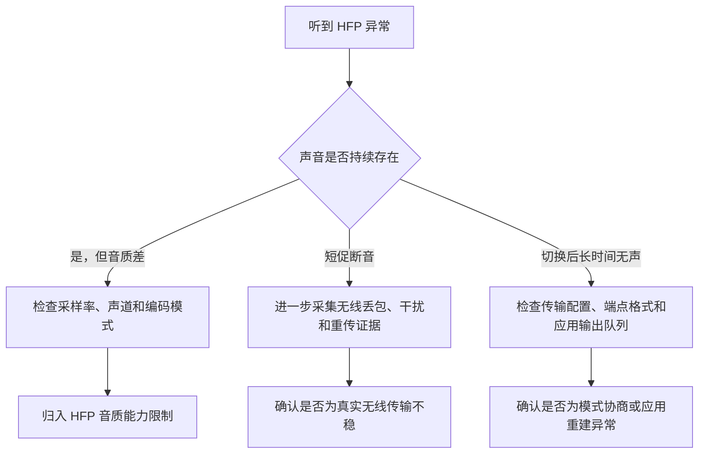

# 为什么 HFP 数据量更小却可能不如 A2DP 稳定

## 问题

切到 HFP（蓝牙双向通话模式）后，采样率、声道数和音频数据量通常都低于 A2DP（蓝牙立体声播放模式）。直觉上，数据更少应该更容易传输，为什么实际听感反而可能比 A2DP 更容易卡顿、断音或长时间无声？

## 结论

数据量小只代表需要传送的声音内容较少，不代表每段声音拥有更宽松的送达期限，也不代表链路允许更多重传。HFP 与 A2DP 的目标不同：

- A2DP 面向连续媒体播放，只有主机到耳机的主要音频方向，可以利用接收端缓冲吸收短时间的到达波动，并在时间预算内重传部分数据。
- HFP 面向实时双向通话，要同时传送耳机播放和麦克风采集；每小段声音必须赶上当前通话时刻。传统同步通话链路的重传机会为零或受一个有限窗口约束，过期数据只能放弃。

因此，“码率更低”和“听起来更连续”之间没有必然关系。低码率主要解释 HFP 的音质上限；卡顿、静音和恢复延迟还要分别检查无线传输、设备模式重协商和应用输出流重建。

## 为什么数据更少仍可能更容易断续

### 1. 数据量和送达期限是两个变量

采样率、声道数描述的是音频端点每秒处理多少声音样本；它们不直接等于无线链路的实际占用，也不说明一个数据包最晚可以什么时候到达。

音乐播放允许用较长缓冲换连续性：数据短暂晚到时，耳机仍可播放已经收到的内容。通话强调低延迟：某段声音即使稍后补到，也已经错过对话中的正确位置。因此，更小的数据包如果具有更严格的截止时间，仍可能比更大的媒体数据更容易表现为缺口。

### 2. A2DP 是单向播放，HFP 是双向通话

A2DP 的主要音频流是主机到耳机。HFP 同时承担：

- 主机到耳机的播放；
- 耳机到主机的麦克风；
- 建立和维持通话连接所需的控制过程。

所以不能只比较“输出音乐的码率”。即使每个方向的数据量较小，HFP 仍要让两个方向都按固定节奏及时完成。

### 3. 两条链路的重传条件不同

Bluetooth Core Specification（蓝牙核心规范）把传统蓝牙传输分为不同的逻辑链路：

- SCO（同步面向连接传输）不会重传数据包。
- eSCO（扩展同步面向连接传输）可以在预留时隙后的有限窗口内重传；窗口结束后，过期数据自动丢弃。
- ACL（异步面向连接传输）对大多数数据包使用重传来保证完整性；A2DP 流媒体运行在这类异步数据路径之上，并可以把接收端应用缓冲纳入传输时间预算。

HFP 1.10（免提协议 1.10）规定其音频连接使用 SCO 或 eSCO，并优先尝试 eSCO。由此可以得到一个受规范支持的解释：HFP 的实时通话数据受同步时隙和有限重传窗口约束，而 A2DP 拥有更灵活的排队、重传和接收端缓冲条件。无线环境出现短暂干扰时，两者即使承载的数据量不同，也可能呈现相反的连续性。

来源：[传统蓝牙逻辑传输原文记录](../raw/bluetooth-sig/core-classic-logical-transports.md)、[HFP 规范目录页](../raw/bluetooth-sig/hfp.md)、[A2DP 规范目录页](../raw/bluetooth-sig/a2dp.md)。

## 采样率不等于无线码率

本项目监视器读到的 16 kHz、单声道，是系统音频端点呈现给应用的格式。它不能直接推出无线链路的精确码率，因为实际传输还包含语音编码、两个方向的数据、数据包头、链路控制以及可能的纠错或重传。

因此，不能用“16 kHz 小于 44.1 kHz”直接推出“HFP 占用更少，所以一定更稳”。要比较实际无线负担，还需要知道编码器、数据包类型、传输间隔、重传设置和当前干扰情况。本项目现有日志没有给出这些参数的完整组合。

## 必须区分三种异常

| 现象 | 更接近的解释 | 当前证据边界 |
| --- | --- | --- |
| 持续有声，但空洞、单声道、细节少 | HFP 的采样率、声道和语音编码限制 | 本机已确认 16 kHz、单声道、立体声关闭 |
| HFP 稳定建立后仍出现短促断音 | 同步通话数据错过时限、无线干扰或设备实现问题 | 机制上成立，但本项目尚未抓到逐包丢失与重传数据 |
| 切换输入后卡顿、长时间无声、播放按钮延迟 | 设备模式重协商与应用输出队列重建不同步 | 本机系统日志与播放器日志直接支持 |

这一区分很重要：听感上的“传输不稳定”不一定都是无线数据包丢失。若应用仍显示播放，但系统正在切换传输配置、改变端点格式或重启输出队列，即使无线信号完全正常，也可能出现静音和控制延迟。

## 本机证据如何落位

在同一台 macOS（苹果电脑操作系统）设备的 K03S 蓝牙实验中，系统日志记录到：

1. 传输配置在 `tacl`（本机日志中的蓝牙立体声传输配置）与 `tsco`（本机日志中的蓝牙通话传输配置）之间切换。
2. 输出在约 44.1 kHz、双声道与 16 kHz、单声道之间变化。
3. QQ音乐收到输出格式改变后，输出队列多次停止和重新启动。
4. 一次实验中，系统转为 `tsco` 后约 4 秒，QQ音乐才重新启动输出队列。

这些记录直接支持“长时间无声和控制延迟至少有一部分发生在模式切换与应用重建阶段”。它们没有记录蓝牙数据包的逐包状态，因此不能把本机每一次卡顿都归因于 HFP 重传能力较弱。

来源：[本机音频设备核对与监视汇总](../../docs/2026-07-16-macos-audio-device-verification.md)、[本机 Bose 与 K03S 实测对照](05-本机K03S与Bose实测对照.md)。

## 判断流程

## 适用范围与限制

- 本文解释的是传统蓝牙 A2DP 与 HFP，不直接套用于 LE Audio（新一代低功耗蓝牙音频）。
- 不同电脑、耳机、蓝牙控制器和系统版本可能协商不同的 SCO 或 eSCO 参数，稳定性不能只按协议名称一概而论。
- 本文没有证明 A2DP 永远不会断音，也没有证明 HFP 的所有异常都来自无线链路。
- 对本机故障，现有最强证据指向模式切换和播放器输出队列重建；若要确认无线传输本身是否丢包，需要新增控制器或空中数据包级别的采集。
