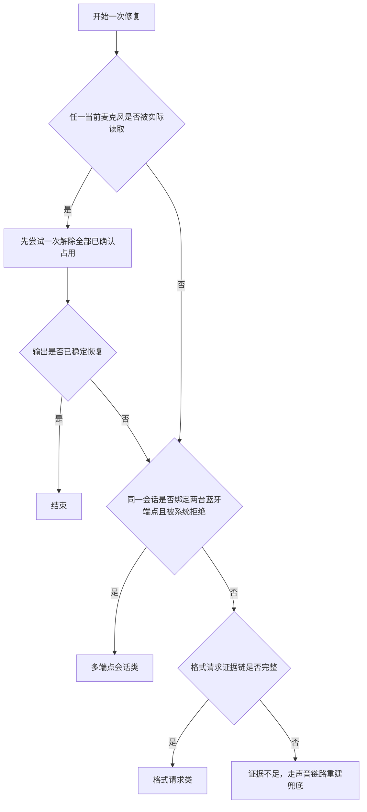

# HFP 一键修复前端实测方法

## 目的与证据边界

本方法用于复现并验证“一键修复”的三条原因路径：麦克风占用类、多端点会话类、格式请求类。每次记录必须区分：用户操作、系统直接证据、前端显示、修复动作、最终声音路由和未能复现的部分。

本轮宿主机为 `andymacbook-air`，型号 MacBookAir10,1，Apple M1，macOS 14.6.1（23G93）。本目录案例只代表该宿主机和对应设备组合，不与 Mac mini 案例合并。

## 三类测试矩阵

| 类别 | 前置路由 | 用户动作 | 必须捕获的直接证据 | 前端验收 |
| --- | --- | --- | --- | --- |
| 占用类 | 任一当前输入设备与低采样率蓝牙输出 | 停留在系统设置“声音 → 输入”或调用语音应用 | 当前任一麦克风的实际读取进程；低采样率输出 | 显示实际占用者和它读取的设备；所有原因都先尝试一次解除；解除后连续三次高于 16 kHz |
| 多端点会话类 | 蓝牙 A 输入、蓝牙 B 输出，且两者不同 | 调用语音功能并在目标进入 HFP 时点击修复 | 点击时目标仍为低采样率 HFP；当前输入输出仍为两台不同蓝牙设备 | 先尝试一次占用解除；自行恢复则立即结束；仍为 HFP 才提供路由组合选择，不要求点名应用 |
| 格式请求类 | 单一低采样率蓝牙输出；没有实际麦克风占用 | 调用微信输入法语音 | `request 0 -> 1`；两秒内 `tsco`；同进程无 `StartIO`；进程号未复用 | 只在完整证据成立时退出请求进程；不得把普通占用误判为格式请求 |

前置边界：模式判定读取每台目标设备自己的最新输出端点事实和独立链路事实；一键修复入口仍只检查当前默认输出。仅作为输入使用的蓝牙麦克风即使正在以 `16 kHz` 工作，也可能是正常输入规格；系统声明但未播放的同名输出端点不证明设备存在物理扬声器，不显示一键修复入口。

模式判定的固定规则：该设备最新链路为 `tsco`，或输出可用采样率包含高于 `16 kHz` 且输出标称或实际采样率不高于 `16 kHz`，判为 HFP/HSP 等低音质语音模式；只有输出实际采样率高于 `16 kHz` 且输出不少于 2 声道，才判为 A2DP 等高音质播放模式；其他情况为模式无法确认。输入是否正在采集只更新运行状态，不直接改变模式。

## 通用执行顺序

1. 记录宿主机、系统版本、已连接设备和测试前默认输入/输出。
2. 先让目标输出处于高质量状态，记录采样率和声道作为基线。
3. 在前端完成路由切换，确认系统状态回读成功。
4. 在触发用户动作前启动带关键词过滤的实时系统声音日志。
5. 执行一次用户动作，不连续重复点击；同步记录前端变化和设备参数。
6. 点击一键修复。无论初始迹象指向哪类原因，都先检查全部当前麦克风的实际读取者并尝试一次解除；解除后目标自行恢复就立即结束。只有目标仍为 HFP，才继续当前双蓝牙组合、格式请求或链路重建。页面实时刷新不自动查询历史会话。
7. 记录按钮的阶段提示、每一步动作和最终采样率；修复结束后在 350、900、1800 毫秒再次回读，确认占用没有被应用立即拉起。
8. 恢复测试前输入/输出，并复核没有残留麦克风占用。

## 输入型设备误触验收

1. 设置蓝牙麦克风 A 为默认输入、另一设备 B 为默认输出，并让 A 正在采集。
2. A 的卡片顶部胶囊只按 A 自己的最新输出端点事实和独立 `tacl/tsco` 判定模式；输入开始或停止采集不能单独改变模式。实际输入采样率放在展开参数区，不得把 `16 kHz` 输入写成输出恢复失败。
3. A 的系统同名输出端点若未播放，应只作为系统声明说明，不展示为当前输出指标，也不显示“一键修复”。
4. B 只有在“当前默认输出、最高支持高于 `16 kHz`、当前不高于 `16 kHz`”同时成立时才显示修复入口。
5. 对 A 的旧页面请求或直接请求应返回“无需修复输出”，不得保存红色失败卡片，不得覆盖 B 的成功结果。

## 多端点界面实时性验收

1. 先确认蓝牙 A 输入和蓝牙 B 输出已稳定回读，页面只显示组合风险，不点名应用。
2. 调用语音应用并录屏。若 8 秒内出现两次“模式改变”或“断开后重连”，页面必须逐次跟随系统事件更新设备卡、模式、连接和麦克风占用；允许频繁变化，不得延迟、合并或丢弃中间状态，但不得自动追查应用身份。
3. 目标进入 HFP 时点击一键修复，确认第一步始终是检查并尝试一次解除当前全部实际麦克风占用。
4. 若会话结束且目标自行恢复，页面立即显示已恢复并停止，不显示组合选择、不查询旧日志、不继续切换或重连。
5. 若占用解除后目标仍为 HFP，且当前输入输出仍来自两台不同蓝牙设备，目标输出卡片自动展开并显示“保留输入”和“保留输出”的可执行组合。应用名可选，不是展示组合的前提。
6. 用户点选前，服务端比对当前系统路由仍与点击现场一致，且目标仍为 HFP。成立时直接执行保存的组合；目标已自行恢复则返回无需修复；路由变化则拒绝旧选择。点选后连续三次确认新路由。

## 声音链路重建兜底回归验收

1. 保存点击前默认输入、默认输出和目标采样率；准备一个非蓝牙中转输入。
2. 让前述三类均无完整证据且目标仍为低采样率，确认先切换到非蓝牙输入，再恢复点击前输入，最后才断开并重连目标。
3. 分别模拟重连正常返回、连接命令超时但设备已经出现、连接命令失败且设备仍断开三种结果。
4. 无论哪种结果，都必须重新读取设备并尝试恢复仍可用的点击前输入输出；底层命令路径和超时异常不得出现在卡片中。
5. 只有点击前输入、点击前输出均恢复，且目标输出连续三次高于 `16 kHz`，才可显示“完全恢复”。目标仍断开时必须提示手动重连。

## 复用命令

设备和路由基线：

```sh
system_profiler SPBluetoothDataType SPAudioDataType
curl -sS http://127.0.0.1:4174/api/devices
```

声音事件实时观察：

```sh
/usr/bin/log stream --style syslog --level debug --predicate 'eventMessage CONTAINS[c] "kBluetoothAudioDevicePropertyFormat request" OR eventMessage CONTAINS[c] "BluetoothHALPlugIn_StartIO" OR eventMessage CONTAINS[c] "Current profile tsco" OR eventMessage CONTAINS[c] "Current profile tacl" OR eventMessage CONTAINS[c] "deviceUIDs" OR eventMessage CONTAINS[c] "more than one BT device connected"'
```

工具自身证据：

```sh
tail -n 200 tools/bluetooth-audio-mode-checker/logs/app.jsonl
```

## 判定顺序



## 本轮案例

- [2026-07-20 占用类前端实测](cases/2026-07-20-占用类前端实测.md)
- [2026-07-20 多端点会话类前端实测](cases/2026-07-20-多端点会话类前端实测.md)
- [2026-07-20 格式请求类前端实测](cases/2026-07-20-格式请求类前端实测.md)
