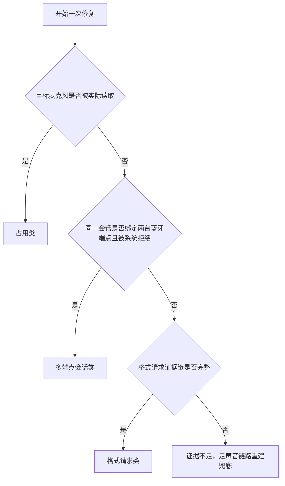

# HFP 一键修复前端实测方法

## 目的与证据边界

本方法用于复现并验证“一键修复”的三条原因路径：麦克风占用类、多端点会话类、格式请求类。每次记录必须区分：用户操作、系统直接证据、前端显示、修复动作、最终声音路由和未能复现的部分。

本轮宿主机为 `andymacbook-air`，型号 MacBookAir10,1，Apple M1，macOS 14.6.1（23G93）。本目录案例只代表该宿主机和对应设备组合，不与 Mac mini 案例合并。

## 三类测试矩阵

| 类别 | 前置路由 | 用户动作 | 必须捕获的直接证据 | 前端验收 |
| --- | --- | --- | --- | --- |
| 占用类 | 同一蓝牙设备输入和输出 | 停留在系统设置“声音 → 输入” | 目标输入正在运行；实际读取进程；低采样率输出 | 显示占用者；独立的一键修复按钮；解除后连续三次高于 16 kHz |
| 多端点会话类 | 蓝牙 A 输入、蓝牙 B 输出，且两者不同 | 调用微信输入法免提语音 | 同一声音会话声明两台蓝牙端点；系统明确拒绝多蓝牙绑定 | 语音前显示组合风险；反复断连或模式切换时保持稳定展示；完整日志命中后点名应用并只提供路由组合选择 |
| 格式请求类 | 单一低采样率蓝牙输出；没有实际麦克风占用 | 调用微信输入法语音 | `request 0 -> 1`；两秒内 `tsco`；同进程无 `StartIO`；进程号未复用 | 只在完整证据成立时退出请求进程；不得把普通占用误判为格式请求 |

## 通用执行顺序

1. 记录宿主机、系统版本、已连接设备和测试前默认输入/输出。
2. 先让目标输出处于高质量状态，记录采样率和声道作为基线。
3. 在前端完成路由切换，确认系统状态回读成功。
4. 在触发用户动作前启动带关键词过滤的实时系统声音日志。
5. 执行一次用户动作，不连续重复点击；同步记录前端变化和设备参数。
6. 点击一键修复，记录原因归并、每一步动作、最终结果和恢复采样率。
7. 恢复测试前输入/输出，并复核没有残留麦克风占用。

## 多端点界面稳定性验收

1. 先确认蓝牙 A 输入和蓝牙 B 输出已稳定回读，页面只显示组合风险，不点名应用。
2. 调用语音应用并录屏。若 8 秒内出现两次“模式改变”或“断开后重连”，页面必须保留最近稳定设备卡，不跟随后续瞬时事件反复重绘。
3. 页面自动执行一次只读证据复核。证据不足时不点名应用、不显示授权选项、不改路由。
4. 证据完整时，页面必须显示经身份复核的应用名和系统拒绝结论，同时显示“保留输入”和“保留输出”的可执行组合。
5. 用户点选前比对系统路由，必须与测试前一致；点选后才允许变更对应的输入或输出，并连续三次确认新路由。

## 复用命令

设备和路由基线：

```sh
system_profiler SPBluetoothDataType SPAudioDataType
curl -sS http://127.0.0.1:4174/api/devices
```

声音事件实时观察：

```sh
/usr/bin/log stream --style syslog --level debug --predicate 'eventMessage CONTAINS[c] "kBluetoothAudioDevicePropertyFormat request" OR eventMessage CONTAINS[c] "BluetoothHALPlugIn_StartIO" OR eventMessage CONTAINS[c] "Current profile tsco" OR eventMessage CONTAINS[c] "Current profile tacl" OR eventMessage CONTAINS[c] "deviceUIDs" OR eventMessage CONTAINS[c] "more than one BT device connected"'
```

工具自身证据：

```sh
tail -n 200 tools/bluetooth-audio-mode-checker/logs/app.jsonl
```

## 判定顺序



## 本轮案例

- [2026-07-20 占用类前端实测](cases/2026-07-20-占用类前端实测.md)
- [2026-07-20 多端点会话类前端实测](cases/2026-07-20-多端点会话类前端实测.md)
- [2026-07-20 格式请求类前端实测](cases/2026-07-20-格式请求类前端实测.md)
