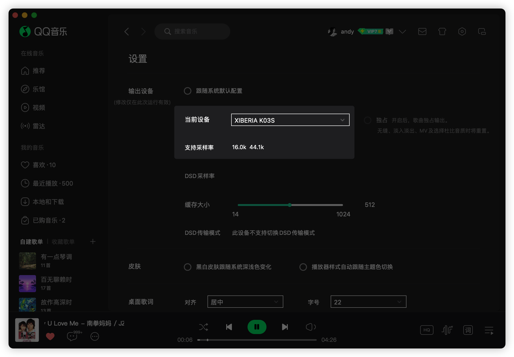

# 2026-07-21 QQ音乐指定非默认 K03S 输出

返回：[防止设备进入 HFP 的方法](../防止设备进入HFP的方法.md)

## 实验目的

观察一台蓝牙音频设备不作为系统默认输入或默认输出，但由单个播放应用直接指定为输出时，是否可以保持 A2DP 而不进入 HFP。

## 实验环境

- 宿主机：`andy的macbook air`；MacBookAir10,1；Apple M1；macOS 14.6.1 / 23G93。
- 目标设备：XIBERIA K03S，蓝牙地址 `50:C0:F0:F3:6A:66`。
- 其他蓝牙设备：DJI Mic Mini-9DC1E8。
- 应用：QQ音乐 9.2.5（内部版本 73236）。
- 实验时间：2026-07-21 04:33–04:39。

## 用户操作与观察

1. K03S 已连接，但不把它设为系统默认输入或默认输出。
2. 在 QQ音乐的“输出设备”设置中，把“当前设备”改为 XIBERIA K03S。QQ音乐界面明确注明该修改仅在本次运行有效。
3. 用户已观察到，系统默认输入和默认输出可以是蓝牙设备，也可以是有线或内置设备，只要不是 K03S，QQ音乐仍可以单独向 K03S 播放。
4. 本轮抓取到两个成功窗口：04:33 和 04:38，K03S 都以 `tacl` / A2DP 播放。
5. 中途 04:35 把 K03S 改成系统默认输出时，K03S 曾进入 `tsco`；随后把系统默认输出移走，K03S 恢复 `tacl` 和 A2DP，QQ音乐继续播放。

## 截图证据

系统默认输出为 MacBook Air 扬声器，默认输入为 DJI Mic Mini，目标 K03S 不在默认输入输出组合中：

QQ音乐内部单独把 K03S 设为当前输出，界面显示支持 `16.0k` 和 `44.1k`：

## 为什么本次没有进入 HFP

本次的直接日志答案不是“非默认设备天然不会进入 HFP”，而是：

- QQ音乐会话类别为 `MediaPlayback`（媒体播放）。
- 会话中只有 `50-C0-F0-F3-6A-66:output`，即 K03S 输出端点。
- `input_running:false`、`output_running:true`，且 QQ音乐会话标记 `Recording = NO`。
- `coreaudiod` 为 K03S 选择 `tacl`，`bluetoothd` 明确记录 A2DP 播放流启动。
- 04:39 端点快照为 `44.1 kHz / 2 声道 / tacl / A2DP`，K03S 同时不是系统默认输入或默认输出。

因此，本次可以说“QQ音乐只对 K03S 发起了播放请求，系统没有为该会话建立双向语音链路”。但不能把“只要非默认就一定避免 HFP”写成已确认系统规则。

完整日志摘要见 [本机原始证据](../../raw/apple/2026-07-21-qqmusic-nondefault-k03s-output-local-evidence.md)。

## 当前结论等级

**单机单次候选绕过方法，未稳定复现。**

当前仅确认该组合在本次 QQ音乐运行中可用。QQ音乐下次启动、系统重启、换机、换蓝牙设备、换播放应用、同时启动其他录音会话后是否仍然有效，都没有验证。

## 后续复现矩阵

| 变量 | 待测条件 | 必须记录 |
| --- | --- | --- |
| QQ音乐进程 | 退出后重开 | 应用是否保留 K03S 选择，会话是否仍仅有输出端点 |
| 系统 | 重启后重测 | 设备连接、默认路由、`tacl/tsco`、实际采样率与声道 |
| 默认输出 | 内置、有线、其他蓝牙设备 | 只改变该变量，目标 K03S 始终不作为默认输出 |
| 默认输入 | 内置、有线、其他蓝牙设备 | 目标 K03S 始终不作为默认输入，确认无进程读取 K03S 麦克风 |
| 设备 | 另一台蓝牙耳机或音箱 | 是否支持应用内单独指定，是否保持 A2DP |
| 应用 | 其他支持指定输出的播放器 | 应用会话是否只声明目标输出端点 |
