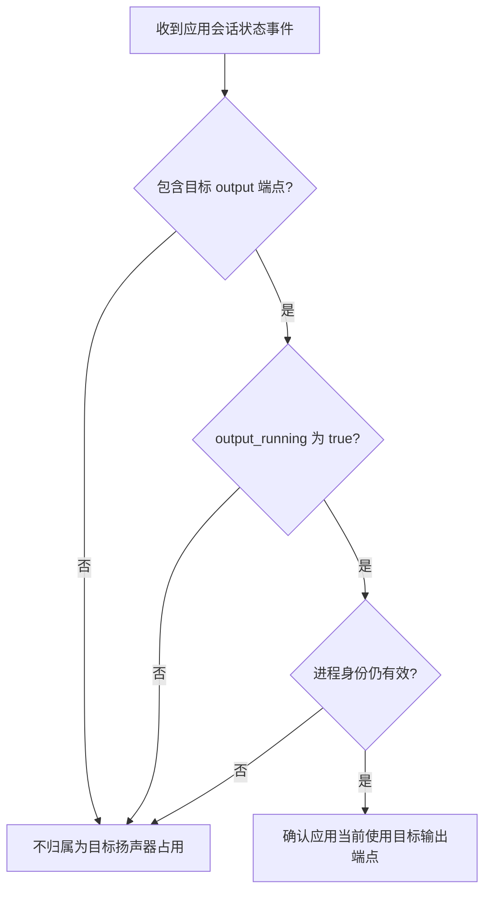

# macOS 应用级音频会话日志解析

## 结论

在本项目已验证的 macOS 14.6.1 现场中，必须把“应用实际运行输出”和“应用设置中选中输出设备”分开：系统声音会话日志能确认前者，但不能可靠读取后者的闲置状态。

确认某应用当前正在使用某个蓝牙输出设备，至少需要同一条 `update_running_state` 事件同时满足：

1. `session.name` 能解析出应用或进程名称与进程号。
2. `deviceUIDs` 包含目标蓝牙地址对应的 `:output` 端点。
3. `output_running` 为 `true`。

这组证据表示应用的输出会话正在目标端点上运行，不等于设备被应用独占，也不保证设备端一定能听见声音。

## 主要字段

| 字段 | 本项目采用的含义 | 不能据此推断 |
| --- | --- | --- |
| `action: update_running_state` | 系统正在发布某个应用声音会话的输入输出运行状态变化。 | 不能单独判断使用了哪台设备。 |
| `session.ID` | 本次系统声音会话的内部编号，用于串联同一轮状态变化。 | 不能当作应用的长期固定身份。 |
| `session.name: QQMusic(4206)` | 会话来自 QQMusic，括号内 4206 是当时的进程号。 | 不能证明该进程正在播放。 |
| `deviceUIDs` | 该次运行状态关联的声音设备端点列表；`50-C0-F0-F3-6A-66:output` 表示该蓝牙地址的输出端点。 | 不能当作应用设置页持久保存的“当前选中设备”。 |
| `implicit_category: MediaPlayback` | 系统把会话归入媒体播放用途。 | 不能单独证明设备处于 A2DP，也不能证明声音可听。 |
| `input_running` | 该应用会话的输入方向是否正在运行。 | `false` 只约束该会话，不能证明其他应用没有使用麦克风。 |
| `output_running` | 该应用会话的输出方向是否正在运行。 | `true` 不能证明音频数据不是静音，也不能证明设备端已经发声。 |
| `Active` | 系统会话当前是否处于活动状态。 | 不能替代具体设备端点归属。 |
| `Playing` | 系统当前是否把应用识别为正在播放。 | 不能单独确认声音送往哪台设备。 |
| `Recording` | 该会话当前是否被系统识别为录音。 | `NO` 不能证明全系统没有其他录音会话。 |
| `deviceID` | 本次共享声音路由请求所指向的设备地址。 | 不能脱离会话运行状态解释为应用长期选择。 |
| `isDoingIO` | 本次路由请求发生时，会话是否正在实际进行声音输入或输出处理。 | 不能说明数据是否可听或录音内容是什么。 |

## QQ音乐时间线

本机实测中，QQ音乐开始播放时出现：

```text
deviceUIDs: ["50-C0-F0-F3-6A-66:output"]
input_running: false
output_running: true
Active: YES
Playing: YES
Recording: NO
```

它直接表示：QQ音乐进程 4206 的媒体播放会话正在运行输出，目标是 K03S 的输出端点，该会话没有运行输入。

暂停后先出现 `Active:NO` 和 `Playing:NO`，约 7.1 秒后才出现：

```text
deviceUIDs: []
input_running: false
output_running: false
```

因此页面不能在用户刚暂停的瞬间立即把最后一条 `deviceUIDs` 当作永久失效；应等待同一会话的新状态事件，同时把这段短暂延迟视为系统清理过程，而不是新的应用输出证据。

## 已选中但未使用的边界

QQ音乐暂停后，用户连续修改两次应用级输出设备；本次 `audiomxd` 和 `audioaccessoryd` 查询没有新增 QQ音乐的端点、运行状态或路由请求记录。

这说明在本次现场中：

- `deviceUIDs` 描述运行中的会话端点，不是QQ音乐设置界面里闲置时保存的输出选择。
- 仅凭系统声音会话日志，无法可靠展示“应用已经选中此设备，但尚未播放”。
- 工具的“扬声器占用”只能显示有完整当前运行证据的应用；没有显示应用不等于没有应用在自己的设置中选中该设备。

## 判定规则



同一会话出现 `output_running:false`、空 `deviceUIDs`、不再包含原目标端点或进程已经退出时，应清除先前归属。

## 适用范围

- 已验证宿主机：`andymacbook-air.local`，MacBookAir10,1，Apple M1。
- 已验证系统：macOS 14.6.1 / 23G93。
- 已验证应用：QQ音乐，标识 `com.tencent.QQMusicMac`。
- 已验证设备：XIBERIA K03S，地址 `50:C0:F0:F3:6A:66`。

## 来源

- [2026-07-21 QQ音乐播放、暂停与闲置切换输出的本机原始证据](../../raw/apple/2026-07-21-qqmusic-session-fields-local-evidence.md)
- [2026-07-21 QQ音乐指定非默认 K03S 输出的本机原始证据](../../raw/apple/2026-07-21-qqmusic-nondefault-k03s-output-local-evidence.md)

## 本项目关联案例

- [QQ音乐播放、暂停与闲置切换输出](cases/2026-07-21-QQ音乐播放暂停与闲置切换输出.md)
- [QQ音乐指定非默认 K03S 输出](../cases/2026-07-21-QQ音乐指定非默认K03S输出.md)
- [扬声器占用与一键断开重连规格](../../../reference/SPEC/扬声器占用与一键断开重连.md)
