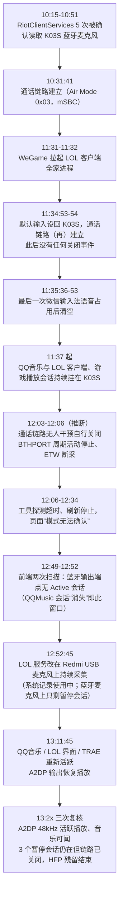

# 蓝牙音频设备进入HFP模式的原因及解决办法

## 文档介绍
本文档由AGENT 根据用户的明确要求进行维护。
根据用户反馈，持续记录和维护任意蓝牙音频设备进入 HFP 模式的实例、原因、关键日志特征、解决方法和恢复结果。

本文档用于指导AGENT如何规划前端的“一键修复”功能，具体规划见 [`../../reference/SPEC/HFP模式一键修复方案.md`](../../reference/SPEC/HFP模式一键修复方案.md)。

文档目录：
```
## 文档介绍
## 总表
## 原因01：麦克风占用类
### C1：Codex 语音输入后进入 HFP
### C2：系统设置输入电平监测后进入 HFP
## 原因02：格式请求类
### C3：微信输入法提交格式请求后进入 HFP
## 原因03：链路残留类
### C10：Codex 语音触发 K03S 进入 HFP 后一键修复
### C11：LOL 客户端占用 K03S 麦克风后语音结束，残留通话链路使设备停留 HFP
## 原因04：多端点会话类
### C7：微信输入法把两个不同蓝牙端点放进同一声音会话后进入 HFP
## 补充说明

......
```

注意事项：
1. 关键日志保留原文，适当添加注释；
2. 未经用户确认，原因只能标记为“待确证”。
## 总表

| 实例 | 原因归并 | 日志特征 | 解决办法 |
| --- | --- | --- | --- |
| C1：Codex 语音输入后进入 HFP；C2：系统设置输入电平监测后进入 HFP | 麦克风占用类 | 进程明确关联实体蓝牙麦克风端点；不要求该麦克风先出现 `tsco` | 结束对应的麦克风占用进程，再观察目标是否恢复 A2DP |
| C3：微信输入法提交格式请求后进入 HFP | 格式请求类 | `kBluetoothAudioDevicePropertyFormat request 0 ->1`；同一存活进程最后一次格式请求为 `0 -> 1` 且没有后续 `1 -> 0` | 结束提交格式请求的对应进程，再观察目标是否恢复 A2DP |
| C10：Codex 语音触发 K03S 进入 HFP 后一键修复；C11：LOL 客户端占用 K03S 麦克风后语音结束，残留通话链路使设备停留 HFP | 链路残留类 | 当前既没有进程明确关联实体蓝牙麦克风端点，也没有存活进程留下未闭合 `0 -> 1`，但目标设备最新链路仍为 `tsco` 且没有后续关闭事件；历史占用或已经闭合的格式请求只能解释触发来源，不能覆盖当前残留路由 | 临时把默认输入切换到其他可用设备，观察目标释放通话链路后恢复原输入；若仍未稳定恢复，则断开并重新连接目标蓝牙设备。Windows 侧 C11 曾以待验证第一候选提出"结束在目标蓝牙麦克风端点上持有暂停（Inactive，已打开未运行）采集会话的进程"；后续复核发现链路在无人干预下自行关闭（约 28 分钟后），届时三个进程的暂停会话仍然存在，该候选已被削弱：链路残留（含暂停会话残留）会随时间自行释放，修复动作可优先提示等待或临时切换默认输入，再考虑断开重连 |
| C7：微信输入法把两个不同蓝牙端点放进同一声音会话后进入 HFP | 多端点会话类 | 当前默认输入和输出来自两台不同蓝牙设备，且目标设备最新链路为 `tsco`；会话中的双蓝牙端点和系统拒绝日志可作为触发来源补充证据 | 日常由前端发现多端点组合后明确提示风险；点击“一键修复”后，直接把默认输入和默认输出调整为同一设备 |


### 填表说明
一、原因归并标准。归并原因时，根据下述释义进行归并，若遇多重原因，让用户决定如何归并。
麦克风占用类：由于任意蓝牙麦克风被实时占用，导致任意蓝牙音频设备进入HFP模式。
解决办法是：杀死对应进程

格式请求类：由于任意进程发送了0-1，导致任意蓝牙音频设备进入HFP模式。
解决办法是：杀死对应进程

多端点会话类：由于任意进程在申请设备A的蓝牙麦克风端点时，把任意设备B的蓝牙扬声器端点也加入申请。macOS系统拒绝此类“多蓝牙设备”的语音会话申请，进程陷入反复申请，系统反复拒绝的死循环，导致任意蓝牙音频设备进入HFP
解决办法是：日常，前端只看看到多端点组合，就已经明确提醒风险（已实现）；点击“一键修复”按钮，直接把默认输入输出端点改为同一设备。

二、格式要求
总表有四列：实例、原因归并、日志特征、解决办法。其中，实例一列的格式为：编号+场景描述；原因归并一列只写抽象的原因归并，而不是具体原因；日志特征一列写该原因类在已确证实例中共同出现、可用于判定的直接特征，不写猜测或尚未证实的上游触发；解决办法一列写该原因类对应的一键修复动作。原因归并相同的多个实例必须合并到同一个实例单元格内，每个实例用中文分号分隔，让阅读器按窗口宽度自动换行。总表中的每个原因归并按顺序建立一个“## 原因编号：原因归并”标题；每条实例直接复用总表中的单条实例文本作为所属原因下的三级标题。
所谓场景描述，就是你从用户反馈自然语言中提取出的"xx（触发条件）之后，设备进入HFP”，示例：按下Codex语音icon之后，设备进入HFP。
所谓原因归并，即每个实例都有具体原因，但多个原因可以归并为一个大类。比如实例C1是进程A占用麦克风a，实例C2是进程F占用麦克风d，这两个原因实际可以归并为“有进程正在占用蓝牙麦克风”。具体的原因，在具体实例展开说明时写明即可。

----


## 原因01：麦克风占用类

### C1：Codex 语音输入后进入 HFP

宿主机：MAC-home02-MacMini；Mac mini（M1）；macOS 15.7.7 / 24G720；环境记录号 `MACMINI9,1-175AC621`

输入设备：
`Redmi电脑音箱-3899`

输出设备：
`Redmi电脑音箱-3899`

问题现象：Codex 语音输入开始后，设备输出从高质量播放链路切入 16 kHz 单声道的 HFP 通话链路。

原因：Codex 实际读取目标蓝牙麦克风，系统为双向通话建立 HFP。

关键日志：

```text
当前文档未保留完整系统日志原文。
## 注释：以下时间线是既有摘要，不是逐字系统日志。
22:18:48.718：Codex (Service) 向蓝牙声音插件注册。
22:18:48.947：Codex 开始读取 tsco 输入端点。
22:18:48.968：当前输出配置由 tacl 切换为 tsco。
22:18:56.643：语音结束后，系统开始断开该设备的 HFP 声音连接。
22:18:56.783：系统明确记录正在断开 SCO。
22:18:56.800：tsco 传输断开完成。
22:18:56.806：当前输出配置重新切换为 tacl。
22:18:56.909：A2DP 声音流重新开始。
```

退出 HFP 的方法：结束 Codex 麦克风读取，等待系统自行释放 SCO 通话链路。
本次恢复结果：`44.1 kHz / 双声道`、`tacl`，用户确认听感正常。该次属于正常释放，不是工具执行的强制恢复。

#### 2026-07-21 同机格式请求对照

宿主机为 `andywudeMac-mini.local`，系统版本与本例相同，输入输出仍为 `Redmi电脑音箱-3899`。触发前输出为 `44.1 kHz / 2 声道`。21:36:47.278，Codex (Service) 进程号 66249 触发 `BluetoothHALPlugIn_StartIO`；21:36:47.289，系统确认该进程开始读取地址为 `50-88-11-07-63-DA:input` 的实体输入端点；21:36:47.413，目标输出进入 `tsco`。21:36:59.373 输入停止，21:37:01.630 目标恢复 `tacl`，随后输出为 `44.1 kHz / 2 声道`。

对 21:36:40 至 21:37:06 的完整日志回查没有发现任何 `kBluetoothAudioDevicePropertyFormat request`。本次因此确认为“实体麦克风占用后进入 HFP”，且没有出现 `0 -> 1`。该事实只适用于本次实测窗口：它证明 `0 -> 1` 不是进入 HFP 的必要条件，也不等同于普通麦克风开始采集；但尚不能证明其他正常麦克风调用绝不会出现该事件。格式请求类若继续使用 `0 -> 1`，必须与“请求进程可归属、随后出现 `tsco`、同进程没有 `StartIO`、现场没有实体麦克风占用”组合判断，不得把它单独作为原因结论。

### C2：系统设置输入电平监测后进入 HFP

宿主机：MAC-home02-MacMini；Mac mini（M1）；macOS 15.7.7 / 24G720；环境记录号 `MACMINI9,1-175AC621`

输入设备：
`Redmi电脑音箱-3899`

输出设备：
`Redmi电脑音箱-3899`

问题现象：打开系统设置“声音 -> 输入”并持续监测输入电平后，目标设备进入 HFP；切走输入后退出。

原因：系统设置为了显示输入电平，实际启动了目标蓝牙麦克风输入。

关键日志：

```text
HFPInputShim StartIO  ## 注释：系统输入电平监测启动了目标蓝牙麦克风输入。
```

退出 HFP 的方法：停止系统设置的输入电平监测，或切换到其他输入设备，等待系统释放 HFP。实测 2026-07-18 07:34:12 开始，07:34:17 切走输入后停止，07:34:19 输出恢复 `44.1 kHz / 双声道`。关键条件是页面确实启动了输入电平采集。

2026-07-20 19:33 在 `andymacbook-air` 对 XIBERIA K03S 再次实测：A2DP 基线的输出可用采样率为 `16 kHz、44.1 kHz`，标称和实际采样率均为 `44.1 kHz`，当前链路为 `tacl`；系统设置输入电平检测启动后，输出的可用采样率列表不变，标称和实际采样率均降为 `16 kHz`，链路切为 `tsco`，输入保持 `16 kHz / 1 声道` 并开始运行。日志于 19:33:48 记录 `HFPInputShimDevice: StartIO`，19:33:51 记录 `Current profile tsco`。关闭系统设置后，19:34:54 停止 `tsco` 输入，19:34:56 记录 `tsco` 断开及 `Current profile tacl`，随后输出连续 12 秒保持 `44.1 kHz`。完整参数表见 [2026-07-20 占用类前端实测](HFP一键修复前端实测/cases/2026-07-20-占用类前端实测.md)。

## 原因02：格式请求类

### C3：微信输入法提交格式请求后进入 HFP

宿主机：MAC-home02-MacMini；Mac mini（M1）；macOS 15.7.7 / 24G720；环境记录号 `MACMINI9,1-175AC621`

输入设备：
`Redmi电脑音箱-3899`

输出设备：
`Redmi电脑音箱-3899`

问题现象：微信输入法没有真正开始录音，但设备从 A2DP 切入 HFP，输出变为 16 kHz 单声道。

关键日志：

```text
09:14:36.254：kBluetoothAudioDevicePropertyFormat request 0 -> 1
09:14:36.287：Current profile tsco
## 注释：09:14:36.255 附近声音核心执行配置切换，选择 16 kHz、单声道通话端点；该句是人工解释，不是逐字系统日志。
```

原因：微信输入法提交蓝牙输入格式请求，是本次进入 `tsco` 的上游原因；请求结束后仍保持 `tsco` 是结果，不再把“链路残留”作为与格式请求并列的独立根因。09:14:36.196 至 09:14:36.200 期间，`audioaccessoryd` 将 Redmi 设为临时默认输入；格式请求进程可反查为微信输入法 `com.tencent.inputmethod.wetype`，同一窗口没有该进程的 `StartIO`。微信输入法为什么产生这条请求仍待确证。修复路由应优先处理仍存在或会重复提交请求的微信输入法进程，再检查 `tsco` 是否解除；只有找不到可归属的上游原因时，“无已确认占用且当前仍为 `tsco`”才作为兜底状态进入链路重建。

#### 2026-07-21 同机重复触发与一键修复失败实证

宿主机、系统和输入输出设备与本例相同。20:47:41.187，微信输入法进程号 `65168` 在设备仍为 `tacl` 时直接提交 `kBluetoothAudioDevicePropertyFormat request 0 ->1`；20:47:41.220，目标设备变为 `tsco`。这 33 毫秒的先后关系再次确认微信输入法是本轮进入 HFP 的直接格式请求者。20:48:14，QQ音乐进程号 `59696` 只是在已经处于 `tsco` 的输出端点上开始播放；它使 HFP 声音流实际启动，但没有触发 20:47:41 的格式切换，因此不是本轮最初进入 HFP 的原因。

20:48:19 用户点击一键修复时，工具没有检测到进程正在读取实体蓝牙麦克风，但目标最新链路仍为 `tsco`，因此该现场归入链路残留类。修复动作本身曾两次短暂成功：

```text
20:48:21.017  微信输入法提交格式请求 1 ->0。
20:48:21.202  临时输入为 MOONDROP Rays 时，目标恢复 tacl、44.1 kHz、2 声道。
20:48:22.584  恢复 Redmi 默认输入后，微信输入法再次提交格式请求 0 ->1。
20:48:22.633  目标再次启动 tsco；一键修复重新判为链路残留类。
20:48:31.834  断开重连后，目标再次短暂恢复 tacl、44.1 kHz、2 声道。
20:48:31.999  微信输入法再次提交格式请求 0 ->1。
20:48:32.024  目标再次进入 tsco；工具最终返回“未恢复”。
```

因此，本次一键修复失败不是临时输入切换或蓝牙重连没有生效，而是微信输入法仍在运行，并在每次原输入组合恢复后重新提交格式请求。当前原因选择规则把已经成立的 `tsco` 残留放在格式请求证据之前，导致重新匹配时仍选择链路残留类，没有进入结束微信输入法及防止重复拉起的处理。这是本次工具未解除直接触发源的具体原因。

20:48:51.689，微信输入法再次提交 `0 ->1`；20:48:51.990，即约 301 毫秒后，同一进程出现 `BluetoothHALPlugIn_StartIO`；20:48:51.996，系统发布微信输入法的实体输入、输出端点和 `Record_WithBluetooth` 录音会话。20:49:08.495 停止读取，20:49:10.819 设备自行恢复 `tacl`，最终输出为 `44.1 kHz / 2 声道`。这段后续占用是同一进程的新声音输入活动，发生在一键修复已经返回失败之后，不能倒填为 20:48:19 点击现场的占用证据。

这条同进程时间线进一步证明，`0 ->1` 不是“不会实际读取麦克风”的专属标记。对微信输入法而言，它既可能只完成格式准备而没有进入实际读取，也可能在格式准备后继续 `StartIO` 并建立正常的录音会话。因此不能把不同表现简单归因于“旧版与新版 macOS 录音接口”：本机日志能够确认两种执行顺序不同，但不能仅凭日志名称确定应用源代码调用了哪个具体函数。格式请求可以用于追踪谁在实际读取前改变了蓝牙格式，是否属于独立原因仍须继续检查同进程是否随后 `StartIO`、是否建立实体麦克风会话，以及请求结束后链路是否残留。

#### 2026-07-22 同机格式请求未释放现场

宿主机仍为 `MAC-home02-MacMini`，系统为 macOS 15.7.7 / 24G720。取证时默认输入是 `REDMI Buds 6 Pro 电竞版`，为 `16 kHz / 1 声道`；默认输出是 `Redmi电脑音箱-3899`，也为 `16 kHz / 1 声道`。这证明当前默认输出已经处于 HFP，而不是只凭历史日志推断。

微信输入法进程号为 `3359`。07:50:50.005，它先提交 `1 ->0`；07:50:50.334 又提交 `0 ->1`。07:50:53.043 再次提交 `1 ->0`，但 07:50:53.382 随即重新提交 `0 ->1`，此后没有新的 `1 ->0`。同一轮日志显示微信输入法先后注册并操作了 `REDMI Buds 6 Pro 电竞版` 和 `Redmi电脑音箱-3899` 对应的蓝牙声音端点，目标输出随后保持 `tsco`。

07:52:43 至 07:53:02 的连续 HFP 链路报告均显示 `AudioInput: 0`、`Received SCO count = 0`。因此取证时没有麦克风声音数据正在传输，但通话链路仍然存在。当前因果归并为：微信输入法最后一次未被配对释放的格式请求是可归属的上游原因；`16 kHz / 1 声道 / tsco` 的链路保持是该原因造成的结果。该现场必须把仍存活的微信输入法计入麦克风占用并优先结束：同一进程的 `0 -> 1` 后没有对应 `1 -> 0`，无需等待 `StartIO`、实体麦克风端点或 `tsco` 才成立。不得重新路由为独立的“链路残留类”，否则会跳过结束或约束微信输入法进程，只反复重建下游链路。

#### 2026-07-22 14:10 同机格式请求与播放维持现场

宿主机、系统和设备与本节相同。取证时默认输入和默认输出均为 `Redmi电脑音箱-3899`；默认输入未实际运行，默认输出为 `16 kHz / 1 声道`，最新独立链路为 `tsco`。`REDMI Buds 6 Pro 电竞版` 是系统声音输出，为 `44.1 kHz / 2 声道`，不得与当前默认输出合并判定。

14:07:39，Codex (Service) 进程号 `68635` 曾启动目标设备通话链路；14:07:44 已出现 `Current profile tacl`，证明该轮已完整恢复，不能把 Codex 倒填为 14:10 之后的当前原因。

14:10:20，微信输入法进程号 `49268` 实际读取 `REDMI Buds 6 Pro 电竞版`，声音会话明确记录 `input_running: true` 和 `Record_WithBluetooth`；14:10:21.414 停止录音并清空端点。随后声音路由切换到 `Redmi电脑音箱-3899`。14:10:50.276，微信输入法依次提交 `1 ->0`、`0 ->1`、`1 ->0`；14:10:50.381 又提交 `0 ->1`，此后没有新的 `1 ->0`。14:10:50.352 至 14:10:50.354，目标设备确认保持 `tsco`。

QQ音乐进程号 `2152` 在 14:10:50.396 才开始通过 `Redmi电脑音箱-3899` 播放，声音会话为 `input_running: false`、`output_running: true`、`Recording = NO`。因此 QQ音乐在本例中是格式已经改变后的播放者，使通话端点继续有输出活动；它没有提交格式请求，也不是进入 HFP 的上游原因。14:11:33 之后的连续链路报告为 `AudioInput: 0`、`Received SCO count = 0`，工具现场也没有检测到实体蓝牙麦克风占用。

本例当前原因是微信输入法存活进程留下未闭合的 `0 ->1`；当前路由应先结束或约束微信输入法，再观察目标是否恢复。QQ音乐只作为下游播放维持者记录，不应替代格式请求者成为原因。`tsco`、`16 kHz / 1 声道` 和持续 HFP 链路是结果，不应另行归并为独立根因。

#### 2026-07-22 17:55 同一修复回合内原因接力与格式请求漏处理

宿主机、系统和设备与本节相同。17:55:14，Codex (Service) 进程号 `68635` 确认正在读取 `Redmi电脑音箱-3899` 实体麦克风，目标链路为 `tsco`。17:55:20，一键修复确认退出该进程；17:55:23 将默认输入临时切到 `MOONDROP Rays` 后，目标恢复 `tacl`。这证明最初的实体麦克风占用已经解除，链路当时具备恢复能力。

恢复原默认输入后出现了新的直接原因。17:55:24.830，微信输入法进程号 `53823` 提交 `0 ->1`；17:55:24.892，目标再次进入 `tsco`。同时切换输入输出时重复出现相同因果顺序：17:55:35 微信输入法提交 `1 ->0` 后目标恢复 `tacl`；17:55:36.694 微信输入法再次提交 `0 ->1`，随后目标再次进入 `tsco`。因此，本轮不是单一原因从头维持到尾，而是“Codex 实体麦克风占用已经解除，微信输入法格式请求随后接力并重新造成同一 HFP 结果”。

一键修复没有处理新的微信输入法请求，是格式请求判断中的设备去重缺陷。系统声音探针同时返回同一台物理 Redmi 的两条记录：`Redmi电脑音箱-3899-2` 和 `Redmi电脑音箱-3899-3`；两条记录的设备名、蓝牙地址和 16 kHz 输出事实相同，只是默认输入、默认输出标记不同。格式请求步骤直接把两条记录映射成两个同名候选，没有按设备名或蓝牙地址去重，因此误判“当前低采样率蓝牙输出不是唯一目标”，跳过了本该结束的微信输入法进程。

后续完整声音链路重建也没有消除触发源：关闭和打开蓝牙两步均在两秒后超时；声音服务重启后，17:56:02.645 微信输入法先提交 `1 ->0`，17:56:02.768 又提交新的 `0 ->1`，约 126 毫秒后目标再次进入 `tsco`。取证结束时微信输入法进程仍存活，最后一次格式请求仍未闭合，目标保持 `16 kHz / 1 声道 / HFP`。

18:18 再次实时复核时，微信输入法仍为同一进程号 `53823`。18:14:32.215 提交 `1 ->0` 后目标恢复 `tacl`；18:14:33.407 再次提交 `0 ->1`，约 87 毫秒后目标进入 `tsco`。18:15:25 又出现 `0 ->1`、`1 ->0`、`0 ->1` 的连续切换，最后一条 `0 ->1` 发生于 18:15:25.975，随后约 76 毫秒目标再次进入 `tsco`。18:15:26 的实时端点快照显示默认输入和默认输出均未运行，系统日志也没有同窗口的实际 `StartIO`；因此当前 HFP 继续归因于微信输入法未闭合的格式请求，而不是实体麦克风声音数据仍在传输。

18:23 进行单变量恢复对照：只向微信输入法旧进程号 `53823` 发送正常退出信号，不切换输入输出，也不重启蓝牙或声音服务。18:23:38 目标恢复 `tacl`，端点恢复 `44.1 kHz / 2 声道 / A2DP`；18:23:39 未闭合格式请求使用者列表清空。系统于 18:23:45 自动拉起微信输入法新进程号 `7766`，但新进程没有重新提交格式请求；截至 18:23:51，目标持续保持 A2DP，麦克风使用者列表为空。该对照直接证明结束留下未闭合请求的旧进程足以解除本轮 HFP，进程被自动拉起本身不等于修复失败，只有新进程再次提交导致 HFP 的请求才算复发。

三条退出路径的代码复核确认，底层退出信号没有差异：一键修复在确定目标进程后，与 18:23 的手动对照一样发送正常退出信号。差异发生在发送前的目标筛选。一键修复的第一步只读取真实声音输入使用者，因此看不到没有 `StartIO` 的格式请求进程；后续格式请求步骤又因同一 Redmi 的两条声音设备记录未去重而拒绝归因，最终没有向微信输入法发送退出信号。设备卡片的“解除麦克风占用”路径虽然能显示由未闭合格式请求合并出的微信输入法，但后端执行前再次只用真实声音输入使用者筛选进程，格式请求进程会被排除，也不会发送退出信号。当前事故窗口的服务日志只记录了 17:55 和 18:14 两次一键修复请求，没有记录“解除麦克风占用”的提交请求；因此无法把该次按钮操作认定为已经到达后端。即使到达，现有真实输入筛选仍会阻止它处理仅格式请求进程。

该差异属于 17:00 固定顺序重构后的回归。16:45 的旧流程曾正确识别微信输入法进程号 `2485` 留下的未闭合 `0 ->1`，向它发送正常退出信号，并在 16:45:21 确认目标稳定恢复 44.1 kHz；17:00 提交 `0f7dbee` 改写原因处理顺序后，17:55 和 18:14 的新流程均没有向当前微信输入法发送退出信号。由此可以排除“相同退出信号偶发无效”，问题位于重构后的原因筛选和设备去重。

本次失败需要区分两层：当前进入并维持 HFP 的直接原因是微信输入法的未闭合格式请求；一键修复漏掉该原因的直接程序缺陷是同一物理设备的重复记录未去重。固定处理顺序还应在每个路由切换和声音链路重建后重新检查是否出现新的已确认原因，不能只沿原步骤继续向后执行。

占用展示和解除规则统一为：同一存活进程最后一次格式请求是未闭合的 `0 ->1` 时，无论是否出现实际声音读取或能否指向具体麦克风，都按“正在占用”处理。能够唯一确定设备时显示在对应设备卡片；不能唯一确定时归入当前默认输入设备卡片，不再单独显示为页面级悬空占用。任何界面位置显示该进程时，名称后统一追加“（格式请求）”。卡片提交解除后，服务端按同一格式请求证据复核并结束旧进程，不得再次用“是否正在读取实体麦克风”将其过滤。

退出 HFP 的方法：退出微信输入法，若它随后自动重启，只要没有再次提交导致 HFP 的格式请求，也不视为失败；必要时断开并重新连接设备。2026-07-18 09:22:32 起连续六次读取为输入 `16 kHz / 单声道`、输出 `44.1 kHz / 双声道`，日志持续显示 `Current profile tacl`。外置键盘唤醒、重复按键和快捷键转换只是尚未确证的上游线索。

#### 2026-07-22 固定流程代码审计与在线回归

本次审计确认，一键修复曾把“旧进程退出后出现同命令新进程”直接判成占用复发，并由此进入流程图之外的授权和后台守护分支。这是工具实现缺陷，不是设备进入 HFP 的原因。判定是否复发只能看新进程是否形成新的实体蓝牙麦克风占用或新的未闭合格式请求；只有同名、同命令或应用被系统重新启动，均不构成占用证据。

当前一键修复严格按六步固定顺序执行。证据完整的应用进程在本轮最多请求退出一次；进程未退出、后来重新出现或再次形成证据时，都不重复结束、不等待授权、不启动后台守护，而是进入流程图下一节点。格式请求步骤保留点击前已经未闭合的请求，并合并点击后的反向恢复、新请求、`tsco` 和 `StartIO`；不能再用“请求早于点击”把当前仍有效的请求排除。

在线回归时，旧守护进程不存在，服务端拒绝除设备名之外的旧授权字段。Redmi 输入和输出分别切到非蓝牙设备再恢复，系统确认耗时约 `67–209` 毫秒；最终默认输入输出均恢复为 `Redmi电脑音箱-3899`，设备为 `44.1 kHz / 2 声道 / A2DP`，麦克风占用为空。

#### 2026-07-23 Mac mini 格式请求恢复后的稳定判定

宿主机：`andywu的Mac mini`；macOS 15.7.7。04:35:52.980，`Redmi电脑音箱-3899` 已出现 `tsco`；04:35:54.183 点击一键修复。04:36:08.767，工具确认退出微信输入法进程号 `87760`；04:36:08.841 目标恢复 `tacl`，04:36:08.860 输出恢复为 `44.1 kHz / 2 声道 / A2DP`。目标随后连续保持 A2DP，但修复流程仍进入完整声音链路重建，并在 04:36:30.007 错误返回“未恢复”。

本例进入 HFP 的直接原因仍为微信输入法格式请求；额外重建不是新的 HFP 原因，而是稳定观察起点早于主服务状态同步造成的程序误判。稳定观察统一改为：步骤结束后最多等待 `3` 秒让目标首次进入 A2DP，首次进入后连续保持 `3` 秒即成功；等待期内没有进入或稳定期间离开 A2DP 才进入下一步骤。

同机使用微信输入法语音时，点击页面一键修复会使文本框失去焦点，语音可能随即结束。对应入口规则为：第一步实时复核没有麦克风进程可解除时，先保持输入输出不变，最多观察 `3` 秒是否出现 A2DP；期间出现后，再从首次出现时刻连续观察 `3` 秒，保持成功便结束，中途离开或首个观察窗内始终没有出现 A2DP 才进入第二步。

## 原因03：链路残留类

### C10：Codex 语音触发 K03S 进入 HFP 后一键修复

宿主机：`andymacbook-air`；MacBookAir10,1；macOS 14.6.1 / 23G93

输入设备：
`XIBERIA K03S`

输出设备：
`XIBERIA K03S`

问题现象：2026-07-20 22:16:30，用户调用 Codex 语音后，Codex (Service) 实际读取 XIBERIA K03S 麦克风，K03S 输出降为 `16 kHz / 1 声道`，声音链路切为 `tsco`。用户随后点击一键修复。

原因：链路残留类。当前没有进程明确关联实体蓝牙麦克风端点，但 K03S 最新链路仍为 `tsco`，因此当前修复原因归为链路残留。本例中 Codex (Service) 此前实际占用 K03S 麦克风并触发 HFP；工具在 7 毫秒内确认该进程已经退出，但随后约 10 秒内 K03S 仍未稳定恢复。历史占用解释了 `tsco` 的触发来源，当前无占用而 `tsco` 仍存在则决定残留类路由。

关键日志：

```text
22:16:30.274  Codex (Service)（进程号 22741）正在读取 XIBERIA K03S。
22:16:34.863  工具向 Codex (Service) 发送正常退出请求。
22:16:34.870  工具确认 Codex (Service) 已退出。
22:16:45.264  工具又向系统进程 replayd 发送正常退出请求。
22:16:47.320  replayd 仍存在；该动作没有解除该进程，也没有形成恢复结果。
22:16:47.736  默认输入临时切到 Redmi 电脑音箱后，K03S 输出恢复 44.1 kHz / 2 声道。
22:16:47.854  K03S 声音链路恢复 tacl。
22:16:48.151  默认输入恢复为 K03S 后，输出再次降到 16 kHz / 1 声道。
22:16:48.272  K03S 声音链路再次进入 tsco。
22:17:04.711  重建 K03S 蓝牙连接后，输出恢复 44.1 kHz / 2 声道。
22:17:04.780  K03S 声音链路恢复 tacl。
22:17:09.494  连续稳定确认完成，结果为完全恢复。
```

退出 HFP 的方法：本次先解除 Codex (Service) 麦克风占用，但该动作单独没有使设备稳定恢复；随后尝试退出 `replayd` 也没有成功。临时切换到非蓝牙输入可以短暂退出 HFP，恢复 K03S 输入后立即复发；最终通过重建 K03S 蓝牙连接，并恢复点击前输入输出，才稳定恢复到 `44.1 kHz / 2 声道 / tacl`。页面只显示“已解除 Codex (Service) 的麦克风占用”是不完整的结果摘要，遗漏了最终实际生效的蓝牙连接重建。

同日 22:30 进行了一次不执行一键修复的输入切换对照。切换前，K03S 同时作为默认输入和默认输出，已经没有本机麦克风占用，但仍保持 `16 kHz / 1 声道 / tsco`。22:30:49 将默认输入切到 Redmi 电脑音箱，默认输出始终没有离开 K03S；约 0.19 秒后，K03S 输出恢复为 `44.1 kHz / 2 声道`。22:30:55 将默认输入切回 K03S，约 0.06 秒后记录到 `tacl`，中间短暂出现一次 `16 kHz / 1 声道`，约 0.15 秒后再次稳定为 `44.1 kHz / 2 声道`；截至 22:32:16 仍保持 A2DP。该对照直接证明本次恢复由“临时解除 K03S 的默认输入绑定”触发，而不是切换输出或等待 Codex 自行释放后立即恢复；它支持输入输出耦合参与了残留 HFP，但一次样本还不能证明所有 K03S 或所有双蓝牙组合都会如此。

### C11：LOL 客户端占用 K03S 麦克风后语音结束，残留通话链路使设备停留 HFP

宿主机：`WinAndyWu`（Windows 新机，2026-09-15 本机第二个实例；同日上午实例见本文末“2026-09-15 Windows 新机 K03S 微信输入法语音输入后进入 HFP”一节；与 2026-09-14 Bose 取证的旧 Windows 机不是同一台，两机实例不得合并）

输入设备：
`XIBERIA K03S`

输出设备：
`XIBERIA K03S`

问题现象：2026-09-15 下午，用户结束微信输入法语音输入后，K03S 长时间停留在 HFP 低音质通话状态。服务与独立探测均确认当前没有任何进程占用麦克风；用户怀疑“撸啊撸LOL”客户端导致。

原因归并：链路残留类（与 C10 同类，Windows 侧实例；归类边界讨论见下）。取证时没有任何进程在 K03S 蓝牙麦克风端点上持有 Active（正在运行）采集会话，通话链路也自 11:34:54 建立后始终没有关闭证据。历史触发来源可归属：LOL 客户端后台服务 `RiotClientServices`（WeGame 拉起的拳头游戏客户端服务进程）在 10:15 至 10:51 间至少 5 次被确认实际读取 K03S 蓝牙麦克风，10:31:41 服务实时捕获到通话链路建立（同窗口也是用户上午的语音实测窗口，见同日上午实例）；11:35:36 至 11:35:53 的微信输入法语音是最后一次 Active 麦克风占用。占用结束后链路未立即释放，但 12:5x 二次取证发现多个进程在蓝牙麦克风上持有 Inactive（已打开、暂停）会话（见下）；13:2x 三次复核确认链路最终在无人干预下自行关闭（约 28 分钟后），届时暂停会话仍在，"暂停持有"不再是维持链路的充分解释，本例维持链路残留类归类。

关键日志（服务日志为 UTC 记录，本机显示时间 +8）：

```text
02:31:43.096Z microphone-occupancy.changed
  microphoneUsers=[{"pid":26096,"name":"RiotClientServices","devices":["XIBERIA K03S"],
  "inputActivityKind":"已确认实体麦克风占用","occupancyEvidenceKinds":["physical-bluetooth-microphone"]}]
  ## 注释：LOL 客户端后台服务实际读取 K03S 蓝牙麦克风（本机 10:31:43；
  ## 同型记录另见本机 10:15、10:18、10:44、10:51）。

03:34:54.4387339Z voiceLinks=[{"address":"50C0F0F36A66","airMode":3}]
  ## 注释：ETW 历史文件中的通话链路建立事件（本机 11:34:54，Air Mode 3 = mSBC 宽带语音）；
  ## 该文件至 12:06:24 停止写入，全程没有链路关闭事件。

03:35:53.501Z microphone-occupancy.changed microphoneUsers=[]
  ## 注释：最后一次微信输入法语音（11:35:36 起）结束，麦克风占用清空（本机 11:35:53）。

03:37:27.956Z speaker-occupancy.changed
  users=[QQMusic(43956)、LeagueClientUxRender(34912)、League of Legends(26084)]
  ## 注释：语音结束仅 94 秒后，QQ音乐与 LOL 客户端、游戏进程的播放会话已挂在 K03S 输出端点
  ## （进程路径 WeGameApps\英雄联盟\LeagueClient\LeagueClientUxRender.exe 等）。

04:06:24.092Z device-state.refresh-failed
  error="Windows 声音探测超时：正在读取 Windows 声音设备"（16.5 秒）
  ## 注释：工具侧探测故障开始；此后页面模式显示“无法确认”，是证据丢失，不是链路恢复。
```

#### 2026-09-15 12:5x-13:1x 二次取证：系统麦克风使用记录与暂停会话（原文误标 19:4x-19:5x，据服务日志 UTC+8 换算与注册表本地时间交叉验证，实际窗口为 12:49-13:11）

本机时间独立复核（生产探测器 + 全状态会话枚举 + 系统麦克风使用注册表）：

1. K03S A2DP 输出端点（48 kHz / 2 声道）上的 Active 会话在 QQ音乐(43956) 与 `LeagueClientUxRender(34912)` 之间随播放状态波动（12:49:15 与 12:52:33 两次扫描时 QQMusic 在该端点上没有任何 Active 会话，13:11:45 复测恢复，机制澄清见下文三次复核）；LOL 全家进程全程未退出。
2. 系统麦克风使用注册表（CapabilityAccessManager `ConsentStore\microphone\NonPackaged`，Windows 记录每个桌面应用最近一次麦克风打开/关闭时刻的权威数据）当日记录：微信本体 Weixin.exe 09:23:52.195-09:23:52.321（126 毫秒）；微信输入法 wetype_update.exe 11:35:36.821-11:35:52.622，与工具检测窗口一致；LOL 客户端服务 RiotClientServices.exe 12:52:45.435 起 Stop=0，系统记录为持续使用中。QQ音乐当日没有任何麦克风使用记录——它自始至终只有输出会话，不是麦克风申请者。
3. 全状态会话枚举（含 Inactive/Expired，含禁用/拔出端点）：RiotClientServices(40276) 在 `麦克风 (Redmi 电脑音箱)`（USB 设备）上持有 Active 采集会话——它当前实际采集的是 Redmi USB 麦克风，不是 K03S 蓝牙麦克风；同时在 K03S 蓝牙免提麦克风端点上持有 Inactive 会话。同在该蓝牙麦克风端点持有 Inactive 会话的还有微信输入法 wetype_update(20048)（它同时在 Redmi USB 麦克风端点上也持有 Inactive 会话）与 WeGame 组件 pallas(49760)。K03S 蓝牙麦克风端点上没有任何 Active 会话。
4. 12:52:45 的使用记录对应 LOL 语音采集设备从 K03S 蓝牙麦克风（上午）转移到 Redmi USB 麦克风（持续 Active 至取证时）。用户已把 LOL 语音从常开改为按键发言，但按键发言只限制发送不限制采集——RiotClientServices 自 12:52:45 起持续采集即为实证。设备转移是否由用户调整 LOL/WeGame 语音输入设备引起，待用户确认。（三次复核补充：12:52:45 起的这段使用后来已结束，13:19:10 重新开始在 Redmi USB 麦克风上采集且 Stop=0——它后续仍不触碰 K03S 蓝牙麦克风。）

二次取证后的维持机制假设（均待单变量对照确证）：第一候选是"暂停采集会话残留"——三个语音相关进程在 K03S 蓝牙免提麦克风端点上的 Inactive 会话可能使通话链路保持打开；第二候选是输出播放会话维持。链路自 12:06 起处于监控故障期，取证时未获实时关闭证据（用户当时反馈处于 HFP/低音质）。

#### 2026-09-15 13:2x 三次复核：QQMusic 会话"消失又恢复"澄清与链路自行关闭

用户质疑：QQ音乐一直在 K03S 上播放音乐，前端也正确把它显示为播放程序之一，与二次取证"QQMusic 会话短暂消失"的说法矛盾。复核结论（服务日志占用时间线 + 全状态会话枚举 + 系统麦克风注册表 + ETW 文件元数据）：

1. 两侧描述的都是真实状态，只是时刻不同：12:49:15 与 12:52:33 两次扫描（用户打开前端页面触发）时，K03S 蓝牙输出端点上没有任何 Active 会话；13:11:45 起 QQMusic(43956)、LeagueClientUxRender(34912)、TRAE SOLO CN(42140) 重新 Active。WASAPI（Windows 的音频会话编程接口）会话状态是瞬时量——"此刻是否正在向该端点渲染"，不是单向的"占用与否"：切歌间隙、暂停、切换输出设备都会翻回 Inactive（当日 09:26-09:34 日志里 QQMusic 会话在切歌间隙出现亚秒级空档，即为同型现象），恢复渲染即翻回 Active。二次取证把瞬时状态表述为"会话自己掉了"属于措辞错误，已修正。
2. 用户全程听到音乐与"蓝牙端点无活跃会话"可以同时成立：K03S 是双通道耳机，除蓝牙（`耳机 (2- XIBERIA K03S)`，A2DP）外还有 USB 2.4G 接收器端点（`扬声器 (XIBERIA K03S)` / `麦克风 (XIBERIA K03S)`）。QQMusic 在 USB 接收器输出端点与 Redmi USB 音箱输出端点上均留有会话，说明它近期渲染过这些端点。若 12:49-13:11 音乐经 USB 接收器出声，用户听到"耳机在放音乐"，而蓝牙侧如实显示"无占用"——两边都对。该路由解释待用户确证（备选：用户当时暂停过播放）。
3. 通话链路已自行关闭：13:2x 复核时 QQMusic、LeagueClientUxRender 在 K03S A2DP 输出端点（48 kHz / 2 声道）Active 播放且音乐可闻，免提端点无活跃会话，蓝牙麦克风端点仅剩三个 Inactive 会话。关闭精确时刻不可考（ETW 恰在断采窗口内），最可能窗口 12:03-12:06：BTHPORT 周期性活动（约 4.7 分钟一次，11:37 起出现）于 12:03:40 后停止，ETL 文件最后写入时间 12:06:24 且与首次探测超时同秒。11:35:53 最后一次麦克风活跃后，残留持续约 28 分钟（至迟 95 分钟），无人执行任何修复动作。
4. "暂停会话残留"第一候选被削弱：链路自行关闭时，微信输入法、RiotClientServices、pallas 在 K03S 蓝牙麦克风端点上的 Inactive 会话仍然存在（13:2x 复核仍可见）。暂停会话至多延长释放时间，不能无限维持链路；第二候选（输出播放会话维持）同样不成立——链路关闭期间 QQMusic 的播放会话一直挂在 A2DP 端点。
5. ETW 采集会话自 12:06:24 起死亡（ETL 文件不再写入，而 A2DP 音乐此刻正在流），这是页面持续显示"模式无法确认"的直接原因，属工具缺陷（见本实例末尾缺陷清单）。

时间线（本机时间）：



退出 HFP 的方法：本例最终结果——未执行任何修复动作，通话链路在 12:03-12:49 间自行关闭（最可能 12:03-12:06），13:11:45 确认 A2DP 恢复播放，用户听感恢复正常。原候选顺序保留作后续同类实例参考：1）结束在 K03S 蓝牙麦克风上持有暂停（Inactive）会话的进程，优先微信输入法（退出后由系统自动拉起的新进程未再形成占用时不算复发），其次 LOL 客户端服务或 WeGame 语音组件——该候选已被本例削弱（链路自行关闭时三个暂停会话仍在，说明等待本身即是有效解法）；2）临时把默认输入或默认输出切换到其他设备再恢复；3）断开并重新连接 K03S。

#### 2026-09-15 15:14 非蓝牙麦克风占用与 HFP 因果边界复核

用户询问：Riot Client 当前显示使用 `麦克风 (Redmi 电脑音箱)`，为什么会让 K03S 进入 HFP。实时复核时，K03S 仍是系统默认输入和默认输出，但其蓝牙输出为 `48 kHz / 2 声道`，免提输出没有活动会话，当前也没有同步语音链路证据；因此本时刻不能确认 K03S 正处于 HFP。系统隐私使用记录只能确认 Riot Client 正在使用某个麦克风，设备名称来自该进程唯一保留的 Redmi 输入端点关联，不能据此反推 Redmi 采集触发了 K03S 通话链路。

因果结论保持为：真正只读取非蓝牙麦克风、并通过 K03S 高音质输出播放，是 Windows 支持的正常分离路由，不需要建立 K03S 的 HFP。若 K03S 此时确实进入 HFP，应继续查找同一程序是否还打开了 K03S 免提输出、是否按系统默认通信设备重新选择了 K03S 输入，或是否为此前蓝牙麦克风占用留下的通话链路残留；不能把“Riot Client 当前使用 Redmi”直接写成 HFP 原因。当前实例已有时间线支持最后一种解释：RiotClientServices 上午曾实际读取 K03S，之后转到 Redmi，而 K03S 通话链路曾在无活动蓝牙采集时继续残留并最终自行关闭。

#### 2026-09-15 Windows 恢复顺序落地

本例归类边界不变：只占用 Redmi 非蓝牙麦克风的 Riot Client 不是 K03S 进入 HFP 的直接原因；目标若仍有明确通话链路而当前没有实体蓝牙麦克风占用，应按链路残留类处理。Windows 一键修复据此补齐与 macOS 相同的“先轻后重”顺序：只解除明确关联目标蓝牙麦克风的占用；若未恢复，先只把默认输入切到另一非蓝牙输入并恢复；仍未恢复，再同时中转输入输出并恢复；最后才重启目标蓝牙物理设备节点。整个流程不会因 Riot Client 正在读取 Redmi 而结束该进程，也不会开关整机蓝牙或重启全机声音服务。

#### 2026-09-16 03:49 同机复现：设为默认输入先建立语音链路，微信输入法短暂占用后形成残留

宿主机仍为 `WinAndyWu`，目标仍为 `XIBERIA K03S`，蓝牙地址为 `50:C0:F0:F3:6A:66`。本轮没有执行断开、切换或修复，只读取运行中服务快照与详细日志。以下日志时间均由服务记录的 UTC 时间加 8 小时换算为本机时间。

03:48:34 的基线中，K03S 是默认输出，默认输入是 Redmi 电脑音箱，K03S 处于高音质流可用状态。03:49:21，本地检查器收到把 K03S 设为默认输入的请求并完成切换；03:49:22.828，系统为同一蓝牙地址建立同步语音链路，同时高音质流停止。因此，本轮语音链路的最早直接触发条件是“把 K03S 设为默认输入”，不是后续程序实际读取麦克风。

03:49:40.675 起，微信输入法进程 `wetype_update.exe`（进程号 20048）实际读取 K03S 实体蓝牙麦克风；03:49:47，占用列表清空。03:52:33 再次读取服务状态时，K03S 仍为默认输入和默认输出，设备仍有同步语音链路，高音质流仍未传输，但当前麦克风占用为空。此时的持续 HFP 应归为链路残留类：微信输入法的短暂占用已经结束，不再是当前维持原因。

同一窗口内，`LeagueClientUxRender.exe`（进程号 58064）只在 K03S 输出端点上保有播放会话；没有证据显示它读取 K03S 麦克风，因此不能把本轮 HFP 归因于 LOL 客户端。当前因果链为：设置 K03S 为默认输入 → 系统建立同步语音链路 → 微信输入法短暂读取并释放 → 同步语音链路未随占用结束而关闭。

用户随后授权结束微信输入法进程，形成了本轮直接对照。首次结束 `wetype_update.exe`、`wetype_server.exe` 与 `wetype_renderer.exe` 后，管理服务仍在，HFP 在约 17 秒观察期内没有解除，随后 `wetype_server.exe` 自动重新出现。使用管理员权限临时停止 `WeType Management Service` 后，再次清空上述三个进程；03:57:29，K03S 的同步语音链路关闭，03:57:32 服务快照已不再判为 HFP。此时高音质流尚未重新开始，因此只能确认“HFP 已解除”，不能确认“A2DP 已恢复”。

03:57:33，同步语音链路再次建立；03:57:50 复核时三个微信输入法进程均已重新出现，设备再次处于 HFP，麦克风占用列表仍为空。这个先后关系一度提示微信输入法重启可能直接重建语音链路，但单次短窗口不能排除系统链路自身波动，后续输入法切换对照已否定“微信输入法进程是当前唯一维持原因”的强结论。管理服务停止后进程仍能由文字输入框架重新出现，因此单次结束进程也不能形成持久退出。

04:05 至 04:08，用户授权临时恢复系统自带微软拼音并完成更严格的对照。系统输入法清单临时同时包含微软拼音与微信输入法，默认输入方式明确切到微软拼音；微信输入法管理服务保持停止，三个微信输入法进程清空并连续 27 秒没有重新出现。观察期间 K03S 始终保持同步语音链路，高音质流未传输、麦克风占用为空。这证明切换到微软拼音并彻底清空微信输入法进程，不能解除已经存在的 HFP；当前维持原因应继续归为“默认蓝牙输入建立后的链路残留”。微信输入法仍是 03:49:40 实际读取 K03S 麦克风的已确认触发程序，但不是此后无人录音时维持链路的必要条件。

上一轮测试结束后曾恢复原始输入法配置：删除临时加入的微软拼音，只保留微信输入法，将微信输入法重新设为默认输入方式，并恢复其管理服务为自动启动且正在运行。04:08:10 复核时，K03S 仍为默认输入和默认输出，HFP 仍在，麦克风占用仍为空。

04:14 至 04:16，用户要求再次恢复并保持微软拼音，同时对默认声音输入执行一次“蓝牙 → 同名有线端 → 蓝牙”往返。04:14:38 基线为 K03S 蓝牙输入默认、HFP。04:15:20 默认输入切到 `麦克风 (XIBERIA K03S)` 有线端；前 5 秒 HFP 仍在，04:15:30 同步语音链路关闭且高音质流恢复。04:15:49 默认输入切回 `XIBERIA K03S` 蓝牙端；04:15:52 同步语音链路重新建立且高音质流停止，至 04:16:08 状态未变。全过程默认输入法均为微软拼音，麦克风占用列表始终为空。

本次往返形成直接对照：把默认输入从 K03S 蓝牙端移到同名有线端，能够在约 10 秒后解除 HFP 并恢复 A2DP；切回 K03S 蓝牙端后约 3 秒便重新进入 HFP。当时据此把默认声音输入路由判断为充分触发条件；04:48 之后的重复实验在相同默认输入下不再复现，证明这个阶段性判断不成立。该往返只证明蓝牙输入路由是异常出现的必要背景之一，不能证明它单独导致 HFP。测试按用户要求结束在“微软拼音保持为默认输入法、K03S 蓝牙端恢复为默认声音输入”的状态。

04:28 至 04:29 又完成一次严格隔离复测：先停止微信输入法管理服务并清空全部微信输入法进程，保持微软拼音为默认输入法；声音输入往返期间每秒检查一次，微信输入法进程始终为零。04:28:51 默认声音输入切到 K03S 同名有线端，04:28:57 HFP 解除且 A2DP 恢复；04:29:25 切回 K03S 蓝牙端，04:29:28 重新进入 HFP，并持续至 04:29:48。全过程麦克风占用列表为空。该复测排除了微信输入法进程瞬时介入，却没有排除系统声音栈中尚未释放的状态，也没有记录当时是否出现了短暂播放流；因此不能据此认定默认输入本身足以触发。观察窗口结束时保持微软拼音为默认输入法，微信输入法服务停止且进程为空，K03S 蓝牙端为默认声音输入并处于 HFP。04:30:27 保存记录期间，微信输入法三个用户进程在管理服务仍停止的情况下再次由系统文字输入框架拉起；04:30:50 已再次清空。这个测试后重启不影响 04:28:51 至 04:29:48 每秒核查均为零的对照结果。

#### 2026-09-16 04:33-04:37 暂停会话与默认输入角色隔离

完整声音端点枚举显示，K03S 蓝牙麦克风端点上有微信本体、`pallas`、`RiotClientServices` 和 `System` 四个暂停会话，没有活动会话。04:33:53 默认输入已切到 K03S 同名有线端，设备为 A2DP；此时上述四个暂停会话仍全部留在蓝牙麦克风端点上，且进程号、状态均未改变。04:34:13 切回 K03S 蓝牙输入后，设备重新进入 HFP；四个暂停会话仍与高音质状态时完全相同。这个快照只能说明“暂停”标记无法区分两种模式，不能证明会话已经释放设备，也不能据此排除这些会话的影响。

随后把普通、媒体、通话三个默认输入角色全部设为有线端，04:36:11 设备恢复 A2DP。在微信输入法进程为零、没有活动录音的前提下，只把普通使用默认输入角色设为 K03S 蓝牙端，04:36:14 即重新进入 HFP；微信输入法直到 04:36:22 才被系统文字输入框架重新拉起，晚于 HFP 建立约 8 秒，不能是本次进入原因。媒体角色单独切回蓝牙端也观察到高音质流停止和随后进入 HFP，但该窗口没有系统声音事件跟踪，无法判断默认设备变化后是否还有其他进程或系统组件重建了声音对象；后续不再把任一默认角色的单独充分性写成已确认结论。

系统麦克风隐私记录显示，`RiotClientServices.exe` 最近一次读取麦克风开始于 03:24:52、结束于 03:25:46，早于 04:36:14 的复现约 70 分钟；`pallas.exe` 的最近记录停留在 2025-03-25。这个证据只能排除两者当时正在录音，不能排除它们持有暂停声音对象。04:48 的系统声音事件跟踪进一步显示，默认设备变化后 `RiotClientServices.exe` 与 `pallas.exe` 都重建了声音对象；因此此前“LOL 相关进程已被排除”的结论撤回。不过，04:53 使用普通系统提示音也能复现相同行为，证明 LOL 不是唯一触发者。

#### 2026-09-16 04:44-04:57 播放流与系统/驱动层隔离

04:44:20 与 04:44:29 两次确认微信输入法实际占用蓝牙麦克风，录音停止后 HFP 均会释放。04:44:55 `LeagueClientUxRender.exe` 开始播放，04:44:56 建立 HFP；04:45:28 播放停止，04:45:30 释放 HFP。最初怀疑 LOL 播放流具有特殊性质，但 04:53、04:54、04:55、04:57 使用普通 Windows 提示音重复实验，均在播放开始约 1 秒后建立 HFP、停止后约 2 秒释放，因此 LOL 只是在 04:44 的时间窗口内恰好出声，不是唯一根因。

04:57 的 Windows 声音事件跟踪给出关键边界：系统只在 K03S 高音质输出端点 `{e0ddbe4e-91f1-40ba-bf50-ac58458a603d}` 上创建了播放流，类别为普通媒体；没有在 K03S 蓝牙采集端点 `{cdea81d7-95db-4adf-8b40-8dfc445e12b7}` 上创建录音流。尽管如此，蓝牙控制器约 1 秒后仍建立了同步双向语音链路。暂停本项目检测进程后重复实验，结果不变，排除了检测工具自触发。

因此本实例已经定位到的功能根因是：K03S 蓝牙麦克风作为默认输入时，Windows 蓝牙声音策略或适配器驱动错误地把“仅有高音质播放流”判定为需要双向通话链路，导致 HFP 在播放期间被拉起；应用没有发起录音。尚未在 Windows 组件与英特尔适配器驱动之间完成二分。当前系统为 Windows 11 25H2 26200.8246，微软 HFP 驱动为 `10.0.26100.8115`；英特尔 AX200 蓝牙驱动为 2022-11-08 的 `22.190.0.2`，明显早于当前系统。英特尔已为 AX200 提供适配 Windows 11 25H2 的新驱动，微软后续的 26200.9539 更新也明确包含传统蓝牙麦克风兼容性与蓝牙声音稳定性改进。区分两层需要先只更新英特尔驱动并重做同一播放对照；若仍复现，再更新 Windows 后复测。

#### 2026-09-16 05:04-05:20 AX200 驱动更新与同条件复测

从[英特尔 AX200 官方驱动页面](https://www.intel.com/content/www/us/en/download/874349/intel-wireless-bluetooth-driver-for-intel-wi-fi-6-ax200.html)下载 `BT-24.10.0-64UWD-Win10-Win11.exe`。安装前校验文件大小为 `69,549,728` 字节，SHA-256 为 `85290A3196CB87D9E24D92D28550E8409507E81A3AE122C829D798E9D22EC061`，与英特尔公布值一致。静默安装后，系统实际绑定的英特尔无线蓝牙驱动从 `22.190.0.2`（2022-11-08，`oem168.inf`）变为 `24.10.0.4`（2025-11-10，`oem496.inf`），设备状态正常；组件服务和系统更新均没有本次安装产生的待重启标记。系统中原有的待重命名项目来自阿里防护、浏览器、办公软件、字体和打印组件，与本次蓝牙驱动无关。

安装完成后，`RiotClientServices.exe` 一度实际占用 K03S 蓝牙麦克风，不能直接拿来做驱动复测。确认没有游戏对局进程后，结束英雄联盟客户端、Riot 客户端、`pallas` 和 WeGame 相关进程；05:17:40 麦克风占用清空，05:17:41 同步语音链路释放。该时序说明当时的 HFP 是真实录音占用的正常结果，不能算作更新后异常复现。

05:19:35-05:19:43 与 05:19:49-05:19:57 做了两轮和更新前相同的普通 Windows 提示音测试。测试期间三个默认输出角色始终指向 K03S 蓝牙高音质端，三个默认输入角色仍全部指向 K03S 蓝牙麦克风，没有通过切换输入规避问题。两份独立蓝牙事件跟踪均返回 `voiceLinks=[]`，应用日志也始终没有出现 `tsco`；测试后输出端为 `48 kHz / 2 声道`，麦克风占用为空。与更新前 04:53-04:57 四轮“播放开始约 1 秒必建立同步语音链路”的结果形成直接反转。

在这组前后唯一有意改变英特尔蓝牙驱动版本的同条件对照中，异常随旧驱动被替换而消失。现有证据因此把本机根因从“Windows 蓝牙声音策略或适配器驱动”进一步收敛为：`22.190.0.2` 版 AX200 蓝牙驱动与 Windows 11 25H2 当前声音策略不兼容，错误地把仅有高音质播放的场景升级为 HFP；`24.10.0.4` 已消除本次可重复触发。英雄联盟和微信输入法都曾在真实使用麦克风时正常触发 HFP，英雄联盟播放也曾撞上异常窗口，但二者都不是这次“普通播放也进 HFP”的根本原因。若以后在 `24.10.0.4` 上再次出现相同的无录音复现，应重新打开系统组件、耳机固件和瞬时链路状态三个方向，而不能继续把一次更新后的短期稳定当成永久证明。

本实例暴露的工具侧缺陷（不属于 HFP 原因，修复另行立项）：

1. Windows 声音探测于 12:06:24、12:19:54 两次超时（16.5 秒、17.0 秒）后，服务刷新循环自 12:34:06 的最后一次快照起不再更新，HTTP 接口持续返回陈旧快照，页面停留在“模式无法确认”，无自动恢复。
2. watcher 进程于 12:19:54 重启并回放历史时，`TrimHistoryOlderThan` 按绝对时间清除超过 30 分钟未更新的链路记录，把 11:34:54 建立且实际仍打开的通话链路从证据中抹掉，形成“链路已不存在”的假象。链路关闭属于边沿事件、无法事后补查；仍处于打开状态的链路不应因“最后事件时间过旧”被清除。
3. 本机 PowerShell 探测超时的根因（音频系统卡顿或会话枚举阻塞）未定位。

## 原因04：多端点会话类

### C7：微信输入法把两个不同蓝牙端点放进同一声音会话后进入 HFP

宿主机：`andymacbook-air`；MacBookAir10,1；系统版本未在本实例摘要中固定

输入设备：
`DJI Mic Mini-9DC1E8`

输出设备：
`XIBERIA K03S`

问题现象：微信输入法语音输入短暂出现波形，随后耳机反复提示“已断开、已连接”，输入没有声音，XIBERIA 输出进入 HFP/HSP。

关键日志：

```text
15:28:17.939653  session: WeType(61338)
details:
  deviceUIDs:
    - 50-C0-F0-F3-6A-66:output  ## 注释：同一声音会话里声明了一台蓝牙输出设备。
    - 58-B8-58-9D-C1-E8:input  ## 注释：同一声音会话里又声明了另一台蓝牙输入设备。
  implicit_category: Record
  input_running: true
  output_running: false

There was an error setting the deviceUUIDs as there are more than one BT device connected = (
    "50:C0:F0:F3:6A:66",
    "58:B8:58:9D:C1:E8"
)
## 注释：系统返回多个蓝牙设备不能同时绑定到该会话的错误。
```

原因：微信输入法在申请蓝牙麦克风时，错误地同时声明并绑定了另一台蓝牙扬声器；调用麦克风本身不需要绑定蓝牙扬声器，但该应用发送了“蓝牙输入 A + 蓝牙输出 B”的跨设备绑定申请。macOS 拒绝这组双蓝牙端点配置，随后格式请求反复切换。失败窗口约为 2026-07-18 15:28:17 至 15:28:22；XIBERIA 输出在 16 kHz 和 44.1 kHz 之间反复切换。微信应用内置语音转文字使用 DJI 输入、BOSE 输出时成功，微信输入法输入输出都使用 XIBERIA 时也成功。

退出 HFP 的方法：只要当前确认有进程读取任意实体蓝牙麦克风，先结束该进程并观察目标输出；目标恢复 A2DP 时不再改变声音路由。目标未恢复且当前已无确认占用时，再改变输入输出组合，避开“两个不同蓝牙设备分别承担输入和输出”：1. 输出改成非蓝牙扬声器，输入继续使用原蓝牙麦克风；2. 输入改成非蓝牙麦克风，输出继续使用原蓝牙扬声器；3. 输出改成当前蓝牙麦克风所在设备；4. 输入改成当前蓝牙扬声器所在设备。若只是改成替代组合后稳定，结果应写为绕过成功或原组合不可用，不得写成原组合已完全修复。

#### 2026-07-20 前端实测补充

同一台 `andymacbook-air` 上再次使用 DJI 输入与 XIBERIA K03S 输出进行前端测试。真实双蓝牙路由写入成功，微信输入法第一次调用实际读取 DJI 麦克风；但当时 K03S 仍处于上一轮 16 kHz 状态，因此该次不能作为新的干净 C7 样本。结束微信输入法后，新进程没有恢复免提语音快捷键，后续 C7 与 C3 均未重新触发。

本轮新增的直接事实是：系统设置“声音 → 输入”会实际读取 XIBERIA K03S；一键修复确认占用类并将输出从 16 kHz 稳定恢复到 44.1 kHz。完整测试过程、未复现边界和后续方法见 [HFP 一键修复前端实测方法](HFP一键修复前端实测/00-HFP一键修复前端实测方法.md)。

产品结论：前端发现输入输出来自两台不同蓝牙设备时提示风险；用户点击一键修复后，服务端仍按统一六步顺序处理。第五步仅在当前默认输入、输出来自两台不同蓝牙设备时进入；只有日志同时证明系统拒绝、两台蓝牙端点和唯一有效会话进程时才结束该进程，随后自动执行“当前输入 → 非蓝牙中转输入 → 当前输入”。页面不提供人工组合选择，也不自动发起修复。

##### 同一拒绝条件下偶发可用的证据边界

2026-07-20 的同机后续测试证明，C7 的系统拒绝与微信输入法能否实际返回文字不是同一个结论。用户现场确认至少有一次在前端显示多端点证据时，语音输入仍持续可用；用户观察是文字结果的直接来源，macOS 统一日志和本工具日志只负责核对声音链路。

直接系统事实如下：

- 14:24:05 至 14:24:08 的三次尝试均在约 22 毫秒至 1.52 秒内记录空 `deviceUIDs` 并停止录音。
- 14:27:57.041，微信输入法声明 K03S 输出与 DJI 输入；14:27:57.045，系统仍明确拒绝多蓝牙端点绑定。尽管如此，本工具于 14:27:57.680 确认 `WeType(16971)` 实际读取 DJI，K03S 没有读取者；该录音状态保持至 14:32:51，约 4 分 54 秒。
- 14:32:52 至 14:32:57，多次录音状态在约 13 至 279 毫秒内被空 `deviceUIDs` 清除。14:32:59.111 的下一次双蓝牙声明仍被系统拒绝，但其后没有立即清空，DJI 采集持续至 14:40:19；K03S 在 14:33、14:35、14:38 的实际输出复核均为 44.1 kHz 且未播放。

因此，能够权威确认的“偶发可用原因”只到这一层：双蓝牙端点申请仍然失败，但声音会话有时没有在拒绝后立即被清空，微信输入法实际保留了对 DJI 的持续读取；失败时则紧接着清空端点并停止录音。不能把偶发可用写成“系统接受了两台蓝牙设备”，也不能把“应用自动回退”“等待足够久即可成功”或“系统服务竞争”写成已确认根因。

为什么同样的拒绝后会出现两种会话结果，当前日志没有给出内部判定依据，微信输入法也没有可核对的应用源代码或诊断记录，因此保持未知。14:27:57 的稳定采集是立即开始的，排除了“必须等待一分钟”的说法；14:32:59 的稳定采集出现在约 7 秒反复尝试之后，只能说明保持语音界面可能增加尝试次数，不能证明等待具有确定效果。完整时间线见 [2026-07-20 多端点会话类前端实测](HFP一键修复前端实测/cases/2026-07-20-多端点会话类前端实测.md)。按本轮用户决定，暂不因此修改功能。

## 补充说明

### 当前固定处理门槛

同一台 `andymacbook-air` 的实测说明，目标输出为 XIBERIA K03S 时，声音输入活动可能来自另一台设备，也可能来自无法归属实体麦克风的系统声音采集。当前原因不能只按目标设备名过滤，也不能把所有运行中的声音输入进程都当作麦克风占用。

一键修复不再按原因类别跳转，统一执行六步固定顺序：实体蓝牙麦克风占用、只切输入、同时切输入输出、格式请求、不同蓝牙输入输出、完整声音链路重建。设备列表为空、内置输入、系统声音采集、虚拟输入和回环输入都不算第一步的实体蓝牙麦克风占用，也不会阻止后续固定步骤。

本次还观察到微信输入法在退出后迅速由新进程重新读取 DJI。前端必须把这种情况显示为“曾短暂释放、现在已重新占用”，不能只保留解除成功消息。完整证据与前端验收见 [2026-07-20 占用类前端实测](HFP一键修复前端实测/cases/2026-07-20-占用类前端实测.md)。

同日 22:02 和 2026-07-21 00:21，`andymacbook-air` 上的 XIBERIA K03S 处于 HFP，声音输入活动列表出现 `replayd`（进程号 80530，路径 `/usr/libexec/replayd`），但系统返回的设备列表为空。空设备列表不能证明它读取了 K03S 或其他实体麦克风，因此第一步不得结束该进程；目标仍为 HFP 时继续后续固定步骤。

2026-07-20 23:47 起的系统日志进一步确认，UU远程的 `UURemoteServer` 请求屏幕与系统声音采集，`replayd` 随后为该调用创建 44.1 kHz 的 `AudioTap（系统声音抓取通道）`，系统权限日志中的目标进程号也直接指向 `UURemoteServer`。该活动不属于任何具体设备的麦克风占用；完整进程与触发方证据见[进程映射表](进程映射表.md)。进程映射表只保存知识，不作为前端必须显示触发 App 的产品要求。

### 2026-07-20 输入链路与输出故障的界面边界

DJI Mic Mini 作为默认输入运行时，输入端点可以显示 `16 kHz`；这只说明输入端点处于运行状态。进程明确关联该实体蓝牙麦克风端点时即可确认麦克风占用，不要求该设备最新链路为 `tsco`。单独的输入采样率不参与设备音频模式判定，也不等于 DJI 的输出音质发生了需要修复的降级。

macOS 还会为这类麦克风暴露同名输出端点。若该端点不是当前默认输出、没有实际播放，便不能仅凭它显示 `16 kHz` 推断设备具有物理扬声器或已经进入 HFP。模式胶囊统一按该设备输出端点的可用、标称、实际采样率、输出声道和独立 `tacl/tsco` 事实判定；麦克风占用状态由占用区域单独显示，不追加到模式胶囊。但模式判定功能一旦独立确认设备处于 HFP，一键修复就必须进入原因处理，不得再因设备当前仅承担输入、不是默认输出或输出采样率不可读而跳过。每个实际修复步骤结束后最多等待 `3` 秒让目标首次进入 A2DP；首次进入后连续保持 `3` 秒即成功，稳定期间离开或等待期内始终没有进入才执行下一步骤，全部步骤失败后结束并报错。案例见 [2026-07-20 占用类前端实测](HFP一键修复前端实测/cases/2026-07-20-占用类前端实测.md)。

### 2026-07-20 `tacl` 与 `tsco` 的时序边界

同一台 `andymacbook-air` 的完整时间窗复核未发现“目标设备稳定处于 HFP，但整段日志只有 `tacl`、完全没有任何 `tsco` 证据”的已确认案例。已复核的 16:05、16:25、16:32、17:44 和 18:13 等切换窗口，在输出进入 16 kHz 后都能找到 `Current profile tsco` 或 `Starting IO on profile tsco`。

但日志与端点状态不是原子同步的，短时间内可以出现表面矛盾：

```text
16:32:30.829  K03S: Current profile tacl
16:32:31      工具读到 K03S 输出已为 16 kHz
16:32:36.156  K03S: Starting IO on profile tsco
```

这证明端点参数可以先变，链路日志稍后才出现；不能把中间约五秒的“最后一条仍是 `tacl`”写成稳定使用 `tacl` 承载 HFP。另外，多端点会话中可同时出现 K03S 的 `tacl` 和 DJI 的 `tsco`；任何链路标记都必须按蓝牙地址归属到具体设备，不得用全局最后一条标记覆盖所有设备。

20:04 的新规则真机回归再次验证了这组时序：K03S 于 20:04:35 启动 `tsco`，页面收到该地址的最新链路事实，并同时显示输出标称和实际 `16 kHz`、1 声道；20:06:28 系统记录该地址恢复 `tacl`，输出恢复标称和实际 `44.1 kHz`、2 声道，页面无需重载即恢复高音质播放模式。该证据同时验证了链路日志按设备地址归属和端点事实独立采集。完整时间见 [2026-07-20 占用类前端实测](HFP一键修复前端实测/cases/2026-07-20-占用类前端实测.md)。

### 2026-07-21 QQ音乐指定非默认 K03S 输出的未进入 HFP 对照

该对照是“没有进入 HFP”的负样本，不在总表新增原因编号。

在 `andymacbook-air` 上，用户让 XIBERIA K03S 保持非系统默认输入、非系统默认输出，然后在 QQ音乐 9.2.5 内单独把 K03S 选为输出。04:33 与 04:38 两个播放窗口中，QQ音乐会话只声明 `50-C0-F0-F3-6A-66:output`，同时记录 `input_running:false`、`output_running:true`、`Recording = NO`；系统为 K03S 建立 `tacl` 和 A2DP 播放流。04:39 端点快照为 `44.1 kHz / 2 声道 / tacl / A2DP`。

同一轮对照中，04:35 将 K03S 改成系统默认输出、保留 DJI Mic Mini 为默认输入后，K03S 曾从 `tacl` 进入 `tsco`；移出系统默认输出组合后，系统关闭 K03S HFP 流并重建 A2DP。这说明本次避免 HFP 的直接可观测条件是“QQ音乐对 K03S 建立输出专用会话，不在该会话中启动输入”。尚不能把“非默认设备”单独写成充分原因。

当前仅完成一台 Mac、一台 K03S、QQ音乐本次运行内的实测。QQ音乐下次启动、系统重启、换机、换蓝牙设备、换应用或其他进程读取 K03S 麦克风时是否仍有效，均未验证。方法边界见 [防止设备进入 HFP 的方法](防止设备进入HFP的方法.md)，实验时间线与截图见 [QQ音乐指定非默认 K03S 输出案例](cases/2026-07-21-QQ音乐指定非默认K03S输出.md)。

### 2026-09-14 Windows Bose 音质降级反馈：原因待核实

本次设备为 Windows 电脑上的 Bose QC Headphones，与本文 macOS 案例分开记录。用户反馈启用此前被禁用的耳机麦克风后听感降级。

#### 11:15 至 11:17 微信输入法语音对照

本机 11:15:34 基线：默认输入输出均为 Bose，系统提示音输出仍为 DJI。Bose 无活动录音会话，模式未知。用户随后使用微信输入法语音输入。11:16:40.391 捕获 Bose 成功语音连接；11:16:42.071 服务快照同时包含 HFP 模式、输入活动及明确关联 Bose 麦克风的进程 26704。独立原生探测确认该进程为微信输入法安装目录内的 wetype_update.exe（本次微信输入法的录音进程），录音会话归属 Bose 输入端点。11:17:01.146 服务快照中录音占用清除，模式仍为 HFP；11:17:07.674 语音连接证据清除，模式回到未知，不能据此宣称已确认恢复 A2DP。

三个阶段中，输出格式支持查询、设备格式及混音采样率始终为 48 kHz，混音声道始终为 2；输入对应采样率始终为 16 kHz，混音声道始终为 1；端点实际运行采样率始终未取得。本次记录支持微信输入法实际读取 Bose 与进入语音连接的时序关联，不能用格式列表变化作为此次模式切换证据。

服务连续记录与独立原生快照保存在本机 artifacts/bose-wechat-comparison-20260914-111534.jsonl 和 artifacts/bose-wechat-native-20260914-1115.jsonl。前端代码已有模式、连接类型、输入活动标题及麦克风占用者的显示映射；本次未保存语音期间的浏览器画面，不能把服务数据送达等同于视觉验收。原生快照还记录到 Bose 播放会话，而服务扬声器占用为空，此项归属传递需要另外排查。

本机 03:44:47 的跟踪及 03:54:38 的新实时事件均捕获目标地址对应的同步语音连接。03:54:40 页面通过共同模式规则识别 Bose 为 HFP 等低音质语音模式；输入占用仍未被本机检测到。完整取证见 [同步语音事件实机取证](../../reference/SPEC/Windows适配.md#同步语音事件实机取证)。

页面输出系统设置为 48 kHz、2 声道，输入为 16 kHz、1 声道；实际运行采样率尚未取得。采集来源和判定边界以 [Windows 适配规格与设计](../../reference/SPEC/Windows适配.md#模式证据) 为原文，具体查询结果见 [本机运行参数查询记录](../../reference/SPEC/Windows适配.md#本机运行参数查询记录)。

已确认的是语音链路及页面识别。具体触发程序、启用麦克风是否为直接原因仍待核实，不归入已确认原因类别。截图中的重建设备连接操作因管理员权限不足失败，未完成连接重建或音质恢复验收。

同日 11:00:12 读取运行中服务，Bose 的设备级语音连接时间为本机 10:59:39.335（系统返回时间为 02:59:39.335Z），地址与该 Bose 一致，模式为 HFP。用户同时确认页面及低音质听感。代码核对表明此次命中独立语音连接条件：原生探测接受成功连接事件，按地址关联设备，再进入共同判定规则。此时输出已验证格式、系统设置及混音采样率仍为 48 kHz、2 声道，输入已验证及设置采样率为 16 kHz；未检测到活动录音会话。此次确认实时连接证据可以在输出格式仍为 48 kHz 时识别 HFP，不证明格式查询能区分模式，也未验证启动前连接补读或 A2DP 恢复。具体触发原因仍未确认。

### 2026-09-14 Bose 重连后的实际协商取证

用户在两路事件采集开启后重连 Bose、播放 QQ 音乐并调用微信输入法语音。原始文件位于本机 artifacts/bose-negotiation-20260914-114148-A2dp.etl 与对应 Port.etl，以及各自 .etl.xml。以下时间使用转换文件显示的本机时分秒；转换器输出偏移为 +07:59，不能据此直接重算 UTC，跨记录绝对时间比较应回读原始事件时间。

- 11:43:47.354，AvdtpSetConfigInfo（高音质声音配置事件）明确返回 ResultCode=0、SampleRate=48000、ChannelCount=2、A2dpStandardCodecId=2，远端地址十进制 251069766369511 转十六进制为 Bose 的 E458BC3D00E7。相邻 AAC（高音质声音编码）配置事件返回 48000、2 声道及编码配置码率 204000；该相邻事件不含设备地址，归属依赖同会话上下文，不独立作为设备身份依据。
- 11:43:49.729，目标地址出现 A2dpStreamingStart（高音质声音传输开始事件）。
- 11:44:12.405，原始数据包含 +BCS: 2；11:44:12.421 包含 AT+BCS=2（通话编码选择及双方确认），同一普通连接编号 0x0033 已通过连接成功事件归属 Bose。11:44:12.441，同步语音连接成功事件再次包含 Bose 地址。HFP 编码编号 2 对应 mSBC（宽带语音编码），规范参数为 16 kHz、单声道；此处为实际协商编号按规范解码，不是直接读取到名为 SampleRate 的 HFP 数值字段。
- 11:44:29.171，通话连接编号 0x0e00 断开；11:44:29.255，目标再次出现 A2dpStreamingStart。此次捕获了高音质播放、通话和返回高音质播放的时序。

编号映射依据：Bluetooth SIG 的 HFP 编码参数表 https://docs.bluetooth.com/download/hfp_v1-10_showing_changes_since_hfp_v1-9/ 。本次仅证明取证路径可行，尚未接入常驻采集和页面；当前代码没有完成对应能力。

### 2026-09-15 Windows 新机 K03S 微信输入法语音输入后进入 HFP

宿主机：`WinAndyWu`（换机后的 Windows 新机，2026-09-15 首次在本机运行工具；与 2026-09-14 Bose 取证的旧 Windows 机不是同一台，两机实例不得合并）。

输入设备：
`XIBERIA K03S`

输出设备：
`XIBERIA K03S`

问题现象：09:49:40 重连后设备处于 A2DP，协商参数（AAC、48 kHz、2 声道）已实时落库。用户使用微信输入法语音输入后，09:50:14 目标出现同步语音链路、A2DP 流停止，页面格式显示"低音质通话"，编码、采样率、声道显示"尚未取得"。09:50:59 语音结束，链路清除、流恢复。

原因归并：麦克风占用类（与 C1 同类，Windows 侧实例）。两次服务快照均确认微信输入法进程明确关联 K03S 实体蓝牙麦克风端点，满足"进程明确关联实体蓝牙麦克风端点"的判定特征。

关键日志：

```text
01:50:22.479Z microphone-occupancy.changed source=low-output-state
  pid=20048 name=wetype_update devices="XIBERIA K03S"
  inputActivityKind="已确认实体麦克风占用" occupancyEvidenceKinds="physical-bluetooth-microphone"
01:50:33.002Z microphone-occupancy.changed source=occupancy-still-present microphoneUsers=[]
01:50:42.226Z microphone-occupancy.changed（pid=20048 同进程再次占用）
01:50:55.007Z microphone-occupancy.changed microphoneUsers=[]
## 注释：时间为服务日志 UTC 记录，本机显示时间 +8 小时。
```

退出 HFP 的方法：本次语音结束后系统自行释放语音链路并恢复 A2DP，属正常释放，未调用修复功能。

本次附带事实：语音链路期间协商参数行为符合 Windows 适配规格——语音链路活跃时格式行显示“低音质通话”。2026-09-15 10:31 本机第二次语音输入实测（服务已接入 Air Mode 解析）：同步语音连接事件的 Air Mode 字节被实时读取为 `0x03`，页面编码、采样率、声道数按 HFP 标准映射显示 `mSBC（宽带语音）、16 kHz、单声道`，实测验收通过。AT+BCS 原始数据的取证级解析尚未接入。

同日下午同机出现 LOL 客户端触发并维持的通话链路残留实例，原因归并为链路残留类 C11，见上文“原因03”一节。RiotClientServices 的占用记录同时说明：上午 10:31 实测窗口内，LOL 客户端后台服务也在读取 K03S 麦克风，该窗口的链路建立不能只归因于用户发起的语音输入。
