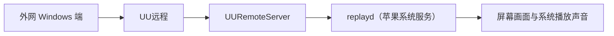

# 进程与 App 触发原因映射表

## 用途

本表用于区分以下三件事：

1. 进程本身属于谁。
2. 哪个 App 在具体现场触发了该进程工作。
3. 该 App 为什么需要触发它。

系统进程名称不能直接当作触发 App 名称。同一个系统进程可以先后或同时服务多个 App，因此每条映射都必须绑定宿主机、时间和直接证据。

## 新增条目规则

- 只有用户明确要求“记录”“新增到映射表”或“沉淀”时，才可以新增条目。
- 普通排查、聊天分析、临时判断和自动扫描都不构成新增授权。
- 不得仅凭进程名称建立映射。至少要取得进程路径，以及调用方的进程号、路径、系统日志或应用日志中的一种直接归属证据。
- 同一个进程由不同 App 触发时，分别记录具体现场，不得用新条目覆盖旧条目。
- “进程归属”与“本次触发方”必须分列；苹果系统进程被第三方 App 调用，不代表该进程属于第三方 App。
- 证据只能支持到实际观测范围，不得把单次现场推广为该进程永远只由某个 App 触发。

## 映射总表

| 进程 | 进程归属 | 本次触发 App | 触发原因 | 宿主机与时间 | 证据状态 |
| --- | --- | --- | --- | --- | --- |
| `replayd` | macOS 苹果系统服务 | UU远程（`UURemote`） | 外网 Windows 端通过 UU远程连接本机后，UU远程请求采集屏幕画面和本机播放声音 | `andymacbook-air`；2026-07-20 23:47 起 | 已确认 |

## 条目：`replayd` ← UU远程

### 结论

本次现场中的 `replayd` 属于 macOS，不属于 Codex，也不属于 UU远程。真正发起采集请求的是 UU远程；`replayd` 作为苹果系统服务，代它执行屏幕与系统声音采集。

### 直接证据

1. `replayd` 的可执行文件是 `/usr/libexec/replayd`，系统签名标识是 `com.apple.replayd`，签名链属于 Apple（苹果）。
2. 2026-07-20 23:47:04，`UURemoteServer（UU远程服务进程）` 日志记录外网 Windows 客户端已经连接，并执行 `startVideoCapture（开始画面采集）` 和 `startAudioCapture（开始声音采集）`。
3. 同一时间，`UURemoteServer` 调用了 ScreenCaptureKit（苹果提供的屏幕与系统声音采集能力）和 ReplayKit（苹果提供的录屏与共享能力）。
4. 2026-07-20 23:47:05，`replayd` 创建 `AudioTap（系统声音抓取通道）`，采样率为 44.1 kHz。
5. 2026-07-20 23:47:06 至 23:47:07，`replayd` 的系统权限请求连续记录目标 `PID（进程编号）` 为 `79812`。
6. 进程号 `79812` 对应 `/Applications/UURemote.app/Contents/Helpers/UURemoteServer`；其父进程 `79773` 对应 `/Applications/UURemote.app/Contents/MacOS/UURemoteService -agent`。

### 触发原因

用户正在通过外网 Windows 设备使用 UU远程连接本机。UU远程需要把本机画面和本机播放声音传给远端，因此调用苹果的系统采集能力，再由 `replayd` 执行底层采集。

### 判定边界

- 本条确认的是这一次 UU远程会话，不能据此把所有 `replayd` 活动都归属为 UU远程。
- `replayd` 出现在声音输入活动中，不等于它正在读取某个实体麦克风。
- 本次创建的是 44.1 kHz 的 `AudioTap` 系统声音抓取通道；当前没有直接证据表明它读取了 XIBERIA K03S 或其他蓝牙设备的麦克风端点。
- 不能仅凭 `replayd` 存在，就把现场归为“麦克风占用”，也不能据此终止或阻止它重新启动。这样做可能中断 UU远程的画面或声音传输。

## 与本项目其他知识的关系

- 蓝牙设备进入 HFP 的具体原因仍由[蓝牙音频设备进入HFP模式的原因](蓝牙音频设备进入HFP模式的原因.md)记录。
- 本表只负责“系统进程属于谁、具体由哪个 App 触发、为什么触发”的现场映射，不承担 HFP 原因分类。
