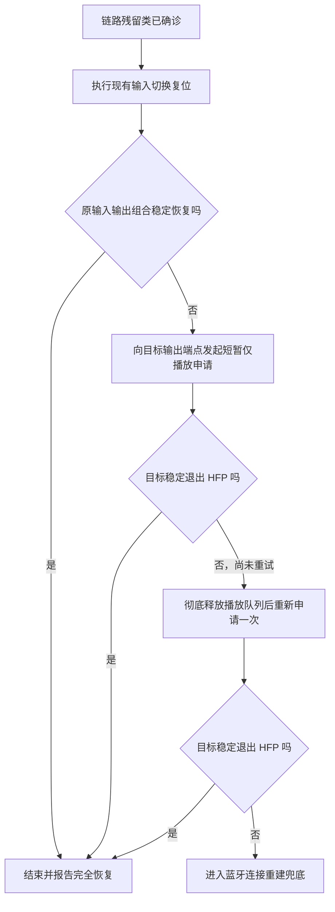

# 针对链路残留类的一键修复备用方案

## 落地状态

**截至 2026-07-21：未落地。**

本文记录候选的一键修复备用方案，不代表当前产品已经具备该能力，也不代表该方案已经通过跨设备验证。当前正式原因判定和修复路由仍以 [`蓝牙音频设备进入HFP模式的原因.md`](蓝牙音频设备进入HFP模式的原因.md) 与 [`../../reference/SPEC/HFP模式一键修复方案.md`](../../reference/SPEC/HFP模式一键修复方案.md) 为准。

## 适用条件

仅在现场已经归为“链路残留类”时考虑本方案：

1. 当前输入输出没有命中“不同蓝牙设备 + 目标最新链路为 `tsco`”的多端点会话类。
2. 当前不存在“进程明确关联实体麦克风端点 + 该麦克风所属蓝牙设备最新链路为 `tsco`”的已确认麦克风占用。
3. 目标蓝牙设备最新独立链路事实仍为 `tsco`。
4. 正式方案中的“切到非蓝牙输入后立即切回原输入”已经执行，但原输入输出组合仍未稳定恢复。

本方案应插在输入切换复位失败之后、断开并重新连接目标蓝牙设备之前。它是低扰动备用动作，不改变链路残留类的归因标准。

## 候选原理

向目标蓝牙设备的输出端点主动发起一次短暂的“仅播放”申请，让 macOS（苹果电脑操作系统）重新评估该设备的输出链路，并尝试从 `tsco` 切换到 `tacl`。

该动作不是强制切换蓝牙模式的系统接口，也不保证每次成功。它利用的是本机已观察到的系统行为：当播放程序重新打开 K03S 输出端点时，系统可能重新选择 `tacl`。

## 当前本机观察

在 `andymacbook-air` 的 K03S 现场中，QQ音乐仅打开该设备的输出端点时，系统并非第一次就切换成功：

- 03:31:02，QQ音乐打开 K03S 输出，系统仍在 `tsco` 上启动输出。
- 03:31:11，QQ音乐停止本次输出。
- 03:31:22，QQ音乐再次打开 K03S 输出，系统选择 `tacl`。
- 之后再次启动播放时，系统继续使用 `tacl`。

这组观察支持“仅播放申请可能触发系统重新选择输出链路”，同时也说明单次申请不保证成功。当前证据只能支持把它列为候选自动化绕过，不能写成确定的系统机制或根因修复。

2026-07-21 补充了一个更明确的输出专用会话对照：K03S 不是系统默认输入或输出时，QQ音乐只声明 K03S 输出端点，系统建立 `tacl` 和 A2DP 流；同轮把 K03S 改成系统默认输出时，它曾进入 `tsco`。该方法当前仍只是未稳定复现的候选绕过，详见 [防止设备进入 HFP 的方法](防止设备进入HFP的方法.md) 和 [QQ音乐实测案例](cases/2026-07-21-QQ音乐指定非默认K03S输出.md)。

## 最轻量实现

使用一个按需启动的原生命令行辅助程序，不制作完整 App（应用程序），也不使用会改变全局默认输出的纯脚本。

建议实现：

1. 使用 Objective-C（苹果原生开发语言）编写单文件辅助程序。
2. 使用 AudioQueue（苹果提供的轻量播放队列）直接指定目标输出端点的 UID（设备唯一编号）。
3. 创建 `44.1 kHz / 双声道` 的 PCM（未压缩原始声音数据）输出队列。
4. 提交一小段全零静音数据并启动播放申请，不产生可听内容。
5. 停止并彻底释放队列。
6. 若目标仍为 `tsco`，只允许重新创建队列并再申请一次；不得无限循环。
7. 第二次仍未恢复时结束本动作，继续现有的蓝牙连接重建兜底。

辅助程序只在一键修复执行到该步骤时短暂运行，用完立即退出；不常驻、不安装驱动、不增加第三方依赖，也不改变系统默认输入或默认输出。

## 建议路由

## 验收边界

- 目标是当前默认输出时，必须连续三次确认模式为 A2DP，且实际输出采样率高于 `16 kHz`；每次间隔 `500 ms`。
- 目标不是当前默认输出时，必须连续三次确认模式不再是 HFP/HSP；每次间隔 `500 ms`。
- 仅看到一条 `tacl`、一次高采样率或中间瞬态，不得报告修复成功。
- 辅助程序不得更改点击前的默认输入、默认输出和用户选择的路由。
- 第一次恢复即进入稳定确认，不再执行第二次申请或后续重连。
- 两次仅播放申请均失败时，必须停止尝试并按正式规格进入蓝牙连接重建兜底。

## 方案性质与限制

- 这是促使系统重新评估输出链路的自动化绕过，不是协议级强制切换，也不是对链路残留根因的修复。
- 当前只有 K03S 的单机观察，尚未证明适用于其他耳机、其他 Mac 或所有 K03S 固件和连接组合。
- 系统为什么在第二次输出申请时选择 `tacl`，当前没有系统内部决策证据，不能表述为“探测到某个固定条件后必然切换”。
- 正式落地前必须补充辅助程序测试、失败超时、两次上限、路由不变验证，以及 K03S 和至少一台其他蓝牙声音设备的真机验收。

## 关联资料

- [蓝牙音频设备进入 HFP 模式的原因](蓝牙音频设备进入HFP模式的原因.md)
- [HFP 与 A2DP 链路建立及恢复接口边界](08-HFP与A2DP链路建立及恢复接口边界.md)
- [HFP 模式一键修复方案](../../reference/SPEC/HFP模式一键修复方案.md)
