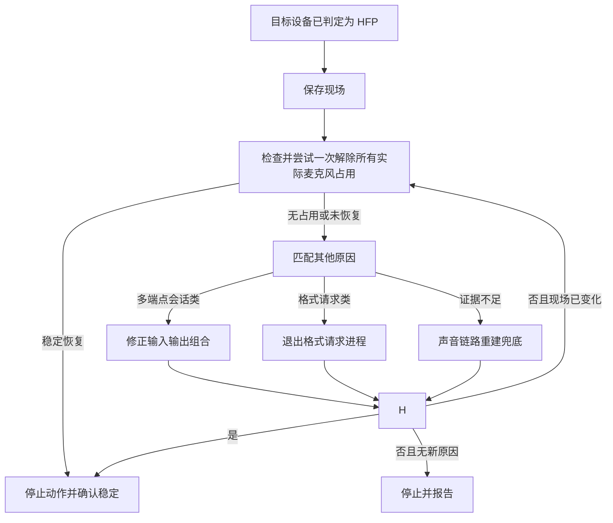

# HFP 模式一键修复方案

## 定位

本文规定：设备已经被判定为 HFP/HSP 后，用户点击“一键修复”时如何判定设备本次为什么进入 HFP、路由子方案、执行动作和验收结果。

本功能处理的是“当前默认输出从已证明支持的高采样率降到不高于 `16 kHz`”，不是修复麦克风输入格式。蓝牙麦克风输入最高只支持 `16 kHz` 可以是正常规格；系统为麦克风设备声明同名输出端点，也不能证明设备具有物理扬声器。

本文是“一键修复”功能必须持续满足的目标规格；实现、测试和用户文档不得弱化本文规定的路由、兜底、授权与验收流程。

依赖文档：

- 模式判定：[`如何判定蓝牙音频设备的音频模式.md`](如何判定蓝牙音频设备的音频模式.md)
- 进入 HFP 的原因归并、实例和日志特征：[`../../knowledge/wiki/蓝牙音频设备进入HFP模式的原因.md`](../../knowledge/wiki/蓝牙音频设备进入HFP模式的原因.md)

实现位置：[`tools/bluetooth-audio-mode-checker/features/a2dp-recovery/`](../../tools/bluetooth-audio-mode-checker/features/a2dp-recovery/)。

## 总原则

点击后立即保存：默认输入、默认输出、目标设备、当前采样率、点击时间和当前所有实际麦克风读取者的最新快照。占用快照不得只取目标输出设备同名的麦克风；例如输出为 K03S、实际输入为 DJI 时，DJI 的实际占用仍必须先处理。前端只提交目标设备身份；服务端使用同一份实时状态判定设备本次为什么进入 HFP，不依赖页面文字反推原因。

一键修复入口只属于同时满足以下条件的设备：当前默认输出；已经证明最高输出采样率高于 `16 kHz`；当前实际输出不高于 `16 kHz`。仅作为当前输入使用的设备不显示修复入口，即使它的经典蓝牙麦克风链路正在运行。未播放的系统输出端点不参与判断，也不得因其显示 `16 kHz` 就把麦克风设备当成待修复耳机。

总流程：

1. 复核目标仍为低采样率的 HFP 输出；若现场已恢复，直接结束。唯一例外是：页面已观察到同一双蓝牙输入输出组合反复断连或在 A2DP/HFP 间切换时，允许只复核最近的多端点会话证据，不执行其他修复动作。
2. 不论最终属于哪类原因，先检查并尝试一次解除当前所有已确证的本机麦克风占用。若目标输出因此稳定恢复，立即结束。
3. 没有实际占用，或解除一次后仍未恢复，才按原因实例文档中的日志特征匹配多端点会话、格式请求或证据不足兜底。
4. 每个动作后立即观察目标输出；初步恢复即停止后续破坏性动作，再完成稳定性确认。
5. 若当前原因已经消失但仍未恢复，基于新状态再判定剩余原因；不得把上一次结论继续套用到变化后的现场。

## 原因匹配与性能

- 默认只在目标仍为低采样率 HFP 输出时匹配原因。对页面已观察到的双蓝牙路由抖动，可在目标短暂回到高采样率后只复核最近多端点证据；该例外不得扩大到格式请求类、进程处理或声音链路重建。
- 先使用最新的全部麦克风占用快照；快照不早于点击前 `2` 秒时直接使用，过期时只补做一次全部占用检查。
- 明确有进程实际读取任一当前麦克风时，不限于目标输出设备同名麦克风，立即尝试一次解除占用，不先查询系统声音日志。
- “先解除占用”是真正一键修复的固定第一步。双蓝牙抖动触发的自动证据复核是只读预判，不属于用户已授权的修复，不得借此结束进程。
- 没有有效占用时，优先使用服务端已有声音事件；缓存不足时只允许执行一次带关键词过滤的日志查询。
- 以点击时间查询系统声音日志时，必须把内部时间转换成系统日志命令接受的本地 `年-月-日 时:分:秒`，不得直接传带 `T` 和 `Z` 的标准时间字符串；查询失败必须作为证据缺口返回，不得静默当成“没有日志”。
- 格式请求类的“唯一低采样率蓝牙输出目标”只统计当前默认输出；非默认设备的待机或上次活动采样率不得扩大候选目标，否则会把已经明确对应当前输出的格式请求误降为证据不足。
- 用户主动修复时，多端点会话和格式请求必须使用同一份声音事件匹配，多端点完整特征优先于其后派生的格式请求。前端自动发起的多端点只读复核是性能例外：查询条件只包含声音会话端点声明和“拒绝多台蓝牙设备”两类必要日志，不读取格式请求、输入启动或模式切换；这份窄查询结果不得用于格式请求类判断。
- 只有完整命中原因实例文档中的已确证特征，才能自动进入对应处理；证据不足时不得结束猜测出来的进程。
- 使用现成快照时不得增加人为等待，原因路由应在 `100 ms` 内完成；补充检查必须有超时，一个修复回合不得重复读取同一日志时间窗。

执行规则：

- 不等待固定时长才判断；收到高采样率事件后立即停止后续动作。
- 不盲试所有方案。
- 不在每步前重新查完整系统日志。
- 中途可以临时切换输入、重建设备连接；最终不得把“换成别的输入/输出”当作完全修复。
- 初步恢复：首次观察到目标输出高于 `16 kHz`，立即向用户显示“正在确认稳定”。
- 稳定恢复：首次恢复后每 `500 ms` 复查一次，连续三次高于 `16 kHz`，且没有再次进入 HFP。
- 稳定确认失败：停止沿用旧结论，按最新占用、声音事件和设备状态重新判定一次；仍无新结论则停止并报告。

完全恢复：目标输出稳定高于 `16 kHz`，并尽量恢复点击前默认输入和默认输出。

绕过成功：只有替代输入、替代输出、同一蓝牙设备组合或非蓝牙组合稳定。

## 交互与授权协议

- 第一次点击时，网页只提交目标设备身份，不提交页面推断出的原因、进程或修复动作。
- 当前默认输入和默认输出分别来自两台不同的经典蓝牙设备时，页面必须在用户发起语音操作前显示风险提示；固定文案为“⚠️注意：当前输入和输出来自两个不同的蓝牙设备，微信输入法等App的语音功能可能无法正常处理这种组合。”提示只陈述当前组合和可能失败，不得在没有系统日志证据时提前冒充“多端点会话类”确诊。
- 当同一双蓝牙输入输出组合在短时间内反复断连，或目标输出在 A2DP 与 HFP 间反复切换时，前端仍必须跟随每一次实时事件立即刷新设备卡片、模式、连接和麦克风占用状态。页面允许在断连、重连、A2DP 和 HFP 之间频繁变化，不得为了稳定视觉展示而延迟、合并或丢弃中间状态。
- 前端观察到上述抖动后，或双蓝牙组合中的默认蓝牙输入从空闲变为实际采集后，可自动发起一次只读的最近多端点证据复核；后一条件即使输出仍保持高采样率也成立。复核请求必须携带页面刚刚实际观察到的双蓝牙输入、输出和观察时间；即使系统在请求到达前已经自行改成同一设备或恢复高采样率，只要观察时间距服务端开始复核不超过 15 秒，仍须按该现场快照核对最近系统日志，不能提前返回“无需修复”。实时触发从观察时间前 2 秒开始窄范围查询；如果页面首次扫描时输入已经处于采集状态，可回看最多 5 分钟以恢复服务重启或页面刷新前已开始的会话，但不得继续读取固定 10 分钟的大窗口。日志命令超时或失败必须作为证据缺口明确展示，不能伪装成“最近没有发生”。未确诊时只报告“尚不能确认具体应用”，不结束进程、不切换设备、不进入声音链路重建。自动只读复核不改变用户主动点击一键修复时“先检查并尝试解除实际麦克风占用”的固定优先级。
- 完整命中多端点证据后，提示必须显示经启动时间和路径复核的应用名，说明“该应用提交的跨蓝牙组合被系统拒绝”，并请用户授权保留输入或保留输出。用户点选前不得改动路由；点选后直接切换对应设备并验证。
- 模式展示和修复动作必须是两个独立控件；“一键修复”使用始终可见的原生按钮，不得把修复动作藏在模式文字的悬停态中，也不得在一个按钮内部嵌套另一个交互控件。
- 服务端必须以点击时保存的现场启动本轮修复；不得信任网页自行拼出的进程身份或设备路径。
- 不需要用户选择时，按钮直接完成原因路由、处理和验收，不再用一次笼统确认阻挡整个流程。
- 多端点会话类命中后，页面必须显示原因说明和当前可执行的输入输出组合，只在用户选定组合后继续。
- 进程自动重启并再次触发同一问题时，页面必须单独请求“仅限本次开机”的阻止授权；未授权时停止，不得擅自结束再次启动的进程。
- 修复过程中首次观察到高于 `16 kHz` 时，页面立即把进行中提示改为“正在确认稳定”，不得等整个请求结束后才显示。
- 点击后必须在发送请求前同步显示进行中状态并禁用重复提交；同一浏览器标签页刷新后，最近一次已完成或等待用户处理的结果必须仍可查看，进行中的临时状态不得被误恢复成仍在执行。
- 自动双蓝牙只读复核与用户主动的一键修复必须使用不同的前端忙碌状态。自动复核只在路由提示中显示“正在确认应用”，不得把“一键修复”按钮变成长时间转圈或阻止用户主动修复。
- “高于 `16 kHz`”的稳定恢复阈值只检查目标默认输出，不检查麦克风输入。输入采样率不高于 `16 kHz` 不得单独产生失败结果。
- 对非默认输出、未证明支持高采样率输出或只有系统声明输出端点的设备，前端不得显示一键修复入口。旧页面或直接请求仍传入此类设备时，服务端返回“无需修复输出”，不得记作“未恢复”，也不得覆盖真正目标输出的成功结果。
- 一键修复和单独解除占用都必须显示当前阶段，不得只显示无变化的旋转状态。动作完成后立即显示结果，再在后台主动复查麦克风占用；复查期间不继续锁住按钮。
- 若应用在解除后很快重新读取麦克风，占用卡必须显示最新的“已重新占用”而不是停留在旧占用者，结果文字不得把短暂释放写成持续恢复。
- 标签页刷新后，已完成的历史结果保留在设备详情中，但不自动展开，避免与当前路由风险互相抢占注意力；只有“等待组合选择”或“等待授权”的结果在刷新后自动展开。历史结果必须标记为“最近一次修复”，新结果还应记录显示时间。
- 授权或组合选择属于同一项一键修复功能的后续步骤；继续执行时仍要复核实时现场，旧结论失效时不得强行执行旧动作。
- 若处理对象是输入法等常驻进程，结果必须提示“进程重新启动不等于语音快捷键已经恢复”；未重新验证快捷键前不得声称应用功能已完全恢复。

对外结果必须使用以下一种明确状态：

- `无需修复`：点击后复核发现目标已恢复。
- `完全恢复`：原输入输出组合已恢复，且目标输出通过稳定确认。
- `绕过成功`：替代组合稳定，但原组合没有被证明完全恢复。
- `原组合复发`：恢复原输入输出组合后再次进入 HFP。
- `未恢复`：自动动作完成后仍未恢复，或现场不足以安全继续。
- `等待选择`：多端点会话类等待用户选择组合。
- `等待授权`：重复触发等待本次开机授权。

## 麦克风占用类

进入条件：完整命中原因实例文档中的“麦克风占用类”特征。

处理：

1. 直接解除当前所有已确证进程的麦克风占用，不限于目标输出同名设备，不先查系统声音日志。
2. 等待系统释放通话链路。
3. 复查目标麦克风占用和目标输出采样率。

若解除后未恢复，先复查一次占用状态：

- 同一应用或同一进程族短时间内自动重启并继续占用：告知用户该进程反复重启，询问是否授权阻止它在本次开机期间继续自动拉起；不得无限结束进程。
- 占用已经消失但仍处于 HFP：重新按原因实例文档匹配，使用现有声音事件判断多端点会话类或格式请求类。

授权只限本次开机期间；不得修改登录项、开机自启、永久禁用、删除应用或改变下次重启后的长期配置。

## 格式请求类

进入条件：完整命中原因实例文档中的“格式请求类”特征。

处理：

1. 正常退出提交请求的进程。
2. 短观察目标输出是否恢复。
3. 必要时可断开并重连目标设备；只能记录为重建本次声音链路，不得写成根因修复。

若进程退出后恢复成功，即使随后重启，只要没有再次触发低采样率，就允许它存在。只有重启后再次触发低采样率，才询问用户是否授权阻止本次开机期间自动拉起。

## 多端点会话类

进入条件：完整命中原因实例文档中的“多端点会话类”特征。

产品边界：这是具体应用与跨蓝牙输入输出组合不兼容，不是本工具可以修改的应用内部故障。本工具的修复责任只是识别拒绝证据、实时呈现冲突，并在用户授权后改成可用路由组合。

先报告用户：经进程身份复核的具体应用在申请蓝牙麦克风时，同时声明并绑定了另一台蓝牙扬声器，该跨设备组合被系统拒绝。

该原因不能在保持原输入输出组合不变的前提下自动消除。先让用户选择希望保留输入还是输出，再执行以下一种组合：

1. 输出改成非蓝牙扬声器，输入继续使用原蓝牙麦克风。
2. 输入改成非蓝牙麦克风，输出继续使用原蓝牙扬声器。
3. 输出改成当前蓝牙麦克风所在设备。
4. 输入改成当前蓝牙扬声器所在设备。

不要把“临时停止触发应用的语音会话”列为主要修复方法。若只靠替代组合稳定，结果是绕过成功，不是原组合完全修复。

## 声音链路重建兜底

进入条件：没有完整命中任何已确证原因的日志特征，或已处理的原因消失、重新匹配仍无其他已确证原因，但目标输出仍不高于 `16 kHz`。

动作顺序：

1. 将默认输入临时切到任意可用的非蓝牙输入，再恢复点击前默认输入。可用中转包括内置麦克风、USB 麦克风、2.4G 接收器声音输入或其他非蓝牙声音输入。没有可用非蓝牙输入就跳过；不得切到另一台蓝牙麦克风作为中转。
2. 若未恢复，断开并重新连接目标蓝牙设备。
3. 若仍未恢复，停止自动处理，报告仍处于低采样率和本轮已执行动作，不再猜测或继续结束进程。

本流程是兜底恢复动作，不得写成新的已确证原因。

## 检查清单

- 是否在所有真正的一键修复中都先汇总全部实际麦克风占用，有占用时先尝试解除一次，无效后才匹配多端点、格式请求或兜底。
- 修复按钮是否只显示在可处理的当前默认输出上；蓝牙麦克风的 `16 kHz` 输入和未播放的同名系统输出端点是否均未被误判为待修复输出。
- 反复占用或反复提交格式请求时，是否先请求用户授权。
- 多端点会话是否只提供路由组合修复。
- 双蓝牙路由反复断连或模式切换时，前端是否仍跟随每次瞬时事件立即刷新，不延迟、合并或丢弃麦克风占用等中间状态。
- 是否只在系统拒绝、两个蓝牙端点和进程身份都完整命中后才点名应用，并在用户点选前保持只读。
- 兜底是否只在前三类之后执行，并且成功即停。
- 修复结果是否区分完全恢复、绕过成功、原组合复发和未恢复。
