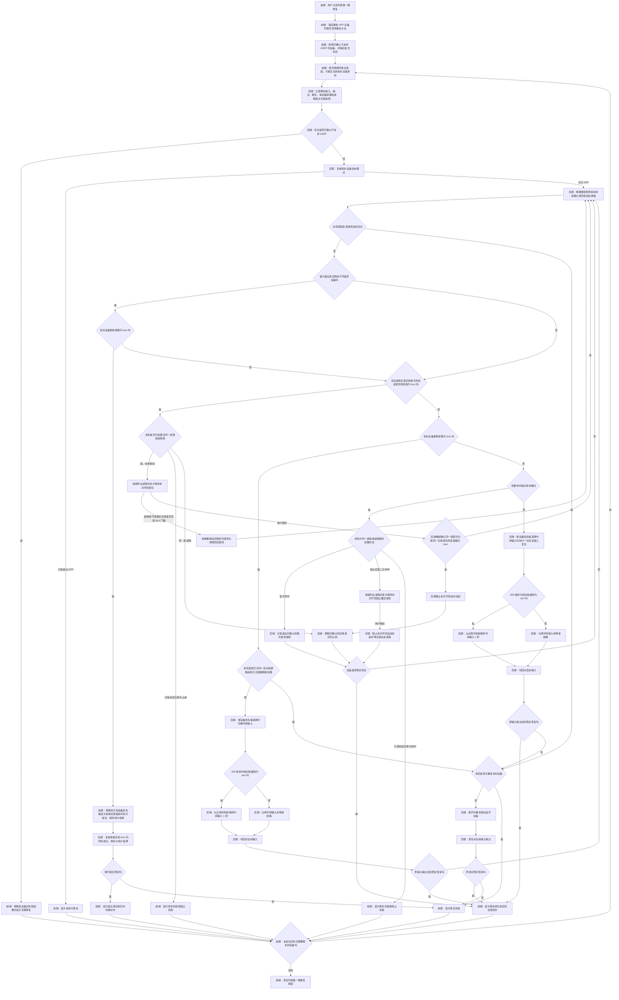

# HFP 模式一键修复方案

## 定位

本文规定：设备已经被判定为 HFP/HSP 后，用户点击“一键修复”时如何判定设备本次为什么进入 HFP、路由子方案、执行动作和验收结果。

本功能处理的是“设备已经被模式判定功能真实判定为 HFP/HSP 后，尝试解除触发通话链路的原因并让设备稳定退出 HFP/HSP”。目标是当前默认输出时，还必须继续验证其恢复为高于 `16 kHz` 的高音质播放；目标仅承担输入或当前没有播放时，不能把 `16 kHz` 输入本身当作故障，但仍必须处理已经独立确认的 HFP/HSP 链路。

本文是“一键修复”功能必须持续满足的目标规格；实现、测试和用户文档不得弱化本文规定的路由、兜底、授权与验收流程。

依赖文档：

- 模式判定：[`如何判定蓝牙音频设备的音频模式.md`](如何判定蓝牙音频设备的音频模式.md)
- 进入或停留在 HFP 的原因归并、实例和日志特征：[`../../knowledge/wiki/蓝牙音频设备进入HFP模式的原因.md`](../../knowledge/wiki/蓝牙音频设备进入HFP模式的原因.md)

实现位置：[`tools/bluetooth-audio-mode-checker/features/a2dp-recovery/`](../../tools/bluetooth-audio-mode-checker/features/a2dp-recovery/)。

## 总原则

点击后立即保存：默认输入、默认输出、目标设备、当前采样率、点击时间、每台蓝牙设备最新 `tacl/tsco` 链路事实，以及当前声音输入进程与实体输入端点的关联快照。前端只提交目标设备身份；服务端使用同一份实时状态判定设备本次为什么进入 HFP，不依赖页面文字反推原因。

“声音输入进程正在运行”不等于“麦克风被占用”。仅当进程明确关联到某个实体麦克风端点，并且该端点所属蓝牙设备的最新独立链路事实为 `tsco` 时，才能确认“该进程正在占用该麦克风”。设备列表为空、只关联 `AudioTap（系统声音抓取通道）`、虚拟输入、回环输入或无法确认物理端点的声音输入活动，不得进入麦克风占用类，不得结束进程、请求阻止自动拉起或保留占用授权。

一键修复使用设备列表级统一入口，不在单个设备卡片内重复放置按钮。状态栏在“更新于……”字段后只显示可修复 HFP 设备数；只有至少一台可修复设备时才显示“一键修复”按钮。入口和服务端都使用模式判定功能给出的权威模式与 A2DP 支持能力：模式为 `HFP_HSP` 且支持能力不是 `UNSUPPORTED` 的设备才计入 HFP 数量并进入修复；支持能力为 `UNSUPPORTED` 的设备任何时候都不得计入 HFP 数量，不得出现“其中 0 个需要修复”等二次统计文案，其模式胶囊仍只显示当前模式，胶囊外紧靠其右侧弱化显示“该设备不支持A2DP，无法修复，也无需修复”，不得进入修复或产生“修复失败”。仅有 `16 kHz` 输入、但模式没有被判为 `HFP_HSP` 的设备不得计入数量；未播放的同名输出端点也不能单独构成 HFP/HSP 证据。

不支持 A2DP 的设备仍参与其他目标设备的全局原因判断。例如它作为当前蓝牙输入使另一台支持 A2DP 的蓝牙输出进入 HFP 时，受影响的输出设备仍须进入修复；原因匹配仍可使用该输入设备的端点、链路和占用事实。禁止因为影响来源本身无需修复，就跳过被影响设备。

用户点击列表级按钮后，前端取该时刻最新设备列表中全部“模式为 `HFP_HSP` 且 A2DP 支持能力不是 `UNSUPPORTED`”的设备，按列表顺序逐台建立独立修复回合，禁止并行修改声音路由。每台设备开始处理时仍须立即保存该设备的点击现场并执行本文完整路由。某台设备进入等待授权或等待组合选择时，批次暂停；用户完成该设备的选择后自动继续其余仍需要修复的设备。前一个设备的处理已经使后续设备退出 HFP 时，后续设备不再执行修复动作。每台设备的结果、授权和组合选择仍显示在对应设备卡片详情内。

批次暂停时，前端必须把目标设备列表、总数、已完成数量和当前等待设备保存到当前标签页的浏览器会话存储。用户刷新当前标签页后，等待卡片与原批次状态必须一起恢复；完成授权或组合选择后，继续处理原批次剩余设备。不得只恢复等待卡片而丢失剩余队列。

总流程：

1. 用户点击列表级“一键修复”后，前端锁定本批次最新的可修复 HFP 设备列表并禁用重复点击；已确认不支持 A2DP 的设备不进入列表。每台目标开始处理时，后端立即保存当时的默认输入、默认输出、目标设备、当前采样率、处理开始时间、每设备链路事实和进程到实体输入端点的关联快照，不得先复核再保存。
2. 保存现场后，复核目标仍被最新模式结论判为 HFP/HSP；若现场已退出 HFP/HSP，直接结束，不查询已经结束的会话，也不继续任何修复动作。
3. 实际修复首先检查当前默认输入和默认输出是否来自两台不同的蓝牙设备，再检查目标设备最新链路是否为 `tsco`；两个条件同时成立时，才归为多端点会话类并进入组合选择。页面提前显示的多端点风险提示不等于原因确诊。
4. 未命中多端点会话类时，检查是否存在“进程明确关联实体麦克风端点，且该端点所属蓝牙设备最新链路为 `tsco`”的完整证据；只有完整命中时才归为麦克风占用类并解除该已确认占用。
5. 没有已确认的实体麦克风占用、但目标设备最新链路为 `tsco` 时，归为链路残留类并执行输入切换复位；不得因为存在设备列表为空的声音输入进程而改判占用类。
6. 目标最新链路不是 `tsco` 或链路事实缺失时，才继续匹配格式请求类或证据不足类；格式请求证据不得覆盖当前已经明确成立的多端点、实体麦克风占用或 `tsco` 残留。
7. 每个动作后立即观察目标输出；初步恢复即停止后续破坏性动作，再完成稳定性确认。
8. 若当前原因已经消失但仍未恢复，基于新状态从“多端点 + `tsco`”门槛开始重新判定；不得把上一次结论继续套用到变化后的现场。

路由图维护约束：路由图必须同时体现前端和后端的关键行为，不得只画服务端处理步骤，也不得遗漏前端发起、展示、授权、选择和结果反馈等会影响用户操作与路由继续条件的关键节点。

本图是“一键修复”路由的唯一权威图。后续审阅先直接修改本图，再同步正文、代码和测试；其他文档只引用本图，不维护删减版或另一套走向。

防循环约束：

- 每次进入“多端点 → 实体麦克风占用 → `tsco` 残留 → 格式请求或证据不足”的完整匹配都计为一次原因复查；一次点击最多执行四次原因复查。授权后的继续操作属于同一修复回合，不重置次数。
- 后端必须记录本轮已经尝试的原因对象、进程或进程族、目标设备、点击前路由、执行动作、授权状态和结果。匹配器不得把已经失败且没有更高一级处理的同一动作再次返回。
- 同一目标设备和点击前路由的链路残留处理最多执行一次；再次匹配为链路残留时，不得重复切换输入，只能进入尚未执行的单次蓝牙重连。
- 麦克风占用类和格式请求类只允许“首次处理一次、用户授权后再处理一次”；授权后仍再次命中必须结束并报告，不得再次申请授权。
- 麦克风占用类的等待授权只在所列进程仍明确关联同一实体麦克风端点、且该端点所属蓝牙设备最新链路仍为 `tsco` 时有效。任一条件消失，前端必须撤销过时授权并沿用原修复回合继续原因匹配；用户点击授权时后端仍须独立补做一次实时复核，不能仅凭页面保存的等待状态阻止进程。设备列表为空或只发现系统声音采集活动时，授权从一开始就不得建立。
- 多端点会话类的用户选择只执行一次；替代组合验证失败后结束，不自动重复切换。
- 证据不足类的中转输入切换只执行一次，目标蓝牙设备重连也只执行一次。
- 达到四次原因复查上限后，不再进入任何原因动作：尚未执行过蓝牙重连时只允许重连一次；已经重连过则结束并报告未恢复。

## 原因匹配与性能

- 只在目标当前仍被最新模式结论判为 HFP/HSP 时匹配和处理原因。目标已经自行退出 HFP/HSP 时立即结束，不使用历史路由抖动或旧日志把已结束会话重新判成待修复。
- 先使用最新的默认输入输出、每设备链路和进程端点关联快照；快照不早于点击前 `2` 秒时直接使用，过期时只补做一次对应实时检查。
- 第一优先级是多端点门槛：当前默认输入和默认输出来自两台不同蓝牙设备，并且目标设备最新链路为 `tsco`，两个条件同时成立才归为多端点会话类。前端风险提示只基于设备组合提前告警，不参与服务端确诊。
- 第二优先级是实体麦克风占用门槛：进程必须明确关联实体麦克风端点，并且该端点所属蓝牙设备最新链路为 `tsco`。完整命中后才允许解除占用；仅有运行中的声音输入流、进程身份或空设备列表均不足。
- 第三优先级是链路残留门槛：没有已确认实体麦克风占用，但目标设备最新链路为 `tsco`，直接归为链路残留类。此前是否抓到占用进程可以作为案例证据，但不是当前路由的必要条件。
- 只有前三层均未命中时，才使用服务端已有声音事件匹配格式请求；缓存不足时只允许执行一次带关键词过滤的日志查询。
- 以点击时间查询系统声音日志时，必须把内部时间转换成系统日志命令接受的本地 `年-月-日 时:分:秒`，不得直接传带 `T` 和 `Z` 的标准时间字符串；查询失败必须作为证据缺口返回，不得静默当成“没有日志”。
- 格式请求类的“唯一低采样率蓝牙输出目标”只统计当前默认输出；非默认设备的待机或上次活动采样率不得扩大候选目标。目标最新链路已经是 `tsco` 时，当前修复原因按前三层门槛处理，不再由历史格式请求覆盖。
- 链路残留类以“当前没有已确认实体麦克风占用 + 目标设备最新链路为 `tsco`”为完整进入条件。进程设备列表为空、`AudioTap`、虚拟输入或未归属声音输入活动均视为“没有已确认实体麦克风占用”，不得阻挡残留类路由。
- 用户主动修复时，当前双蓝牙输入输出组合本身只构成风险；必须再确认目标设备最新链路为 `tsco`，才进入多端点设备组合选择。应用名只是可选展示，不是允许切换设备的证据门槛。
- 只有完整命中原因实例文档中的已确证特征，才能自动进入对应处理；证据不足时不得结束猜测出来的进程。
- 使用现成快照时不得增加人为等待，原因路由应在 `100 ms` 内完成；补充检查必须有超时，一个修复回合不得重复读取同一日志时间窗。
- 原因匹配必须同时读取本轮处理记录；复查次数达到四次、同一动作已经耗尽或蓝牙重连已经执行时，必须按权威路由图升级或结束，不得仅凭当前原因名称回到旧动作。
- 新修复回合已经携带点击时目标采样率、模式、默认输入输出和占用快照时，不得在保存现场阶段立即重复执行全量声音设备扫描；首次原因匹配只允许按门槛补做一次当前设备读取。
- 判断已确认占用是否来自蓝牙输入时，优先使用主服务持续维护的每设备输入传输类型；该事实已经存在时不得仅为重复确认蓝牙属性再执行全量声音设备扫描。
- 稳定确认优先读取主服务每 `100 ms` 向修复进程同步的最新模式、实际输出采样率、输出声道和默认输出事实。连续三次、间隔 `500 ms` 的验收次数和阈值保持不变；实时快照缺少实际输出事实时，单次确认最多补做一次全量声音设备读取，不得在同一次确认内重复读取。
- 生成最终结果和结果文案时必须复用已经通过验收的采样率，不得为了重复取得同一数值再执行全量声音设备扫描。

执行规则：

- 凡是修复流程需要自动选择或向用户提供替代输入、输出设备，必须统一使用以下优先级：内置设备 ＞ 明确标记的其他有线或接收器设备（包括 USB、2.4G 接收器等）＞ 其他未标记为蓝牙的设备 ＞ 其他蓝牙设备。
- `built-in` 归为内置；USB、显示器声音、HDMI、雷雳、火线、PCI、线路和数字声音等明确有线传输归为其他有线；只要没有被标记为蓝牙且不属于前两级，即使传输类型不明，也归为其他非蓝牙；`bluetooth` 和 `bluetooth-le` 归为其他蓝牙。
- 只有当前更高优先级没有可用候选，或同级候选均无法完成切换，才允许降到下一优先级；不得在内置设备可用时选择“iPhone 麦克风”等传输类型不明的设备。
- 自动切换按优先级逐级尝试，同一级保留系统设备顺序；多端点组合选择只展示当前最高可用优先级的候选，同级有多个时全部展示。用户提交后候选已不可用时，必须基于最新设备列表重新计算，不得直接降级使用旧的低优先级候选。
- 除中转输入的链路等待与保持规则外，不用固定等待代替状态判断；收到高采样率事件后立即进入稳定确认。
- 链路残留和声音链路重建切到中转输入后，最多等待 `500` 毫秒观察目标独立链路是否转为 `tacl`。若出现，从出现时刻起固定保持中转输入 `1` 秒再切回；若未出现，记录本次中转未释放链路并立即切回。中转状态只决定切回时机，不作为最终恢复结果。
- 不盲试所有方案。
- 不在每步前重新查完整系统日志。
- 中途可以临时切换输入、重建设备连接；最终不得把“换成别的输入/输出”当作完全修复。
- 初步恢复：目标是当前默认输出时，首次观察到实际输出高于 `16 kHz`；目标不是当前默认输出时，首次观察到模式退出 HFP/HSP。命中后立即向用户显示“正在确认稳定”。
- 稳定恢复：首次恢复后每 `500 ms` 复查一次。目标是当前默认输出时，必须连续三次实际输出高于 `16 kHz` 且模式为 A2DP；目标不是当前默认输出时，必须连续三次确认模式不再是 HFP/HSP。
- 稳定确认失败：停止沿用旧结论，按最新占用、声音事件和设备状态重新判定一次；仍无新结论则停止并报告。

### 中转输入等待参数依据

切换默认输入的命令完成，只能证明系统已经接受新的输入路线，不能证明蓝牙设备已经异步释放通话链路。若在独立链路刚转为 `tacl` 后立即切回原输入，系统可能还没来得及把输出端点同步到高采样率和双声道；过早切回会重新触发 `tsco`。因此中转输入分支必须分成两个等待阶段：先等待独立链路释放信号，再给输出端点固定的同步时间。中转期间的状态只决定何时切回，不代替恢复原输入后的最终稳定验收。

当前参数来自 `2026-07-21` 本机对 `XIBERIA K03S` 的四次有效手动切换记录。计时起点均为默认输入切到非蓝牙输入；“链路出现”是目标独立链路首次转为 `tacl`；“输出跟随”是目标输出首次变成高于 `16 kHz` 且至少双声道：

| 有效记录 | 链路出现耗时 | 输出跟随耗时 | 链路出现后到输出跟随 |
| --- | ---: | ---: | ---: |
| 1 | `246 ms` | `248 ms` | `2 ms` |
| 2 | `339 ms` | `1,220 ms` | `881 ms` |
| 3 | `405 ms` | `351 ms` | 输出已提前 `54 ms` 跟随 |
| 4 | `430 ms` | `375 ms` | 输出已提前 `55 ms` 跟随 |

参数取值规则：

- 链路等待上限取 `500 ms`：四次有效记录中，链路出现的最长耗时为 `430 ms`；向上取到 `500 ms`，保留 `70 ms` 给事件投递、轮询和系统调度波动。实现每 `50 ms` 检查一次，并在 `500 ms` 边界再检查一次。
- 链路出现后固定保持 `1 s`：最慢一次输出端点比 `tacl` 晚 `881 ms` 才完成高采样率跟随；取 `1 s` 可覆盖该样本，并保留 `119 ms` 的同步余量。这个阶段不能因为先看到高采样率就提前切回。
- 历史上曾有一次切换后约 `10.357 s` 才出现高采样率，但该中转窗口内独立链路没有转为 `tacl`，不满足“链路已经释放”的计时口径，因此不用于扩大等待上限。
- `500 ms` 和 `1 s` 是当前机器、当前目标设备和现有有效日志校准出的参数，不是蓝牙协议常数。后续只有同一计时口径下的新成功样本超过现有上限时，才更新本节证据并重新计算参数；其他设备、长期停留在别的输入或只有高采样率而没有 `tacl` 的记录不得混入。

完全恢复：目标已按上述规则稳定退出 HFP/HSP，且点击前默认输入和默认输出均已恢复；目标是当前默认输出时还必须满足实际输出稳定高于 `16 kHz`。任一路由未恢复时不得报告“完全恢复”。

绕过成功：只有替代输入、替代输出、同一蓝牙设备组合或非蓝牙组合稳定。

## 交互与授权协议

- 第一次点击时，网页只提交目标设备身份，不提交页面推断出的原因、进程或修复动作。
- 当前默认输入和默认输出分别来自两台不同的经典蓝牙设备时，页面必须在用户发起语音操作前显示风险提示；固定文案为“⚠️注意：当前输入和输出来自两个不同的蓝牙设备，微信输入法等App的语音功能可能无法正常处理这种组合。”提示只陈述当前组合和可能失败，不得在没有系统日志证据时提前冒充“多端点会话类”确诊。
- 当同一双蓝牙输入输出组合在短时间内反复断连，或目标输出在 A2DP 与 HFP 间反复切换时，前端仍必须跟随每一次实时事件立即刷新设备卡片、模式、连接和麦克风占用状态。页面允许在断连、重连、A2DP 和 HFP 之间频繁变化，不得为了稳定视觉展示而延迟、合并或丢弃中间状态；但这些实时事件只更新展示，不自动发起修复或历史会话复核。
- 设备卡片名称下方的胶囊显示 A2DP、HFP/HSP 或“模式无法确认”，具体判定统一遵守 [`如何判定蓝牙音频设备的音频模式.md`](如何判定蓝牙音频设备的音频模式.md)。只有进程明确关联该实体麦克风端点、且该麦克风所属蓝牙设备最新链路为 `tsco` 时，才附加显示“麦克风使用中”；卡片右侧只保留展开图标。
- 用户点击时若目标仍为 HFP，服务端先检查当前输入输出是否来自两台不同的经典蓝牙设备，再确认目标设备最新链路是否为 `tsco`；两项同时成立后，提示“当前双蓝牙输入输出组合仍使设备处于 HFP”，并请用户选择保留输入或保留输出。用户点选前不得改动路由；点选后直接切换对应设备并验证。
- 模式展示保留在各设备卡片内，修复动作只放在设备列表状态栏内，两者必须是独立控件。“一键修复”使用原生按钮；有 HFP 设备且当前没有修复批次或待处理选择时显示，执行期间禁用并显示当前批次进度，不得把修复动作藏在模式文字的悬停态中，也不得在设备卡片内重复放置修复按钮。
- 列表级批次必须逐台执行，不得同时对多台设备结束进程、切换输入输出或重连蓝牙。某台设备等待授权或等待组合选择时，统一按钮保持禁用；用户完成该选择后沿用原批次自动处理剩余目标。批次中每台设备的结果分别落在对应卡片，不能用一条汇总结果覆盖具体设备结果。
- 服务端必须以点击时保存的现场启动本轮修复；不得信任网页自行拼出的进程身份或设备路径。
- 服务端必须为每次点击建立独立修复回合，并在等待授权或等待组合选择时保存原点击现场、原因复查次数、已处理原因对象、已执行动作、授权状态和结果。前端续接时只提交用户选择或授权，不得生成新的点击时间、替换原现场或重置防循环计数。
- 等待授权和等待组合选择最多保留 `30` 分钟；过期后前端必须提示重新点击一键修复，服务端不得执行旧动作。
- 不需要用户选择时，按钮直接完成原因路由、处理和验收。
- 多端点会话类命中后，页面必须显示原因说明和当前可执行的输入输出组合，只在用户选定组合后继续。
- 多端点设备组合和目标 `tsco` 同时成立并等待选择时，目标输出卡片必须自动展开。若另有满足“实体麦克风端点 + `tsco`”门槛的已确认占用，也不得用占用卡片的自动展开覆盖或藏起路由选择；允许两类信息同时展示。
- 原因进程未退出，或退出后再次启动并触发同一问题时，页面必须先列出涉及的全部进程名称，再单独请求“仅限本次开机”的继续处理与阻止重新启动授权；确认提示中也必须重复列出进程名称。未授权时停止，不得擅自继续结束进程。
- 麦克风占用类进入等待授权后，页面收到晚于等待结果的新快照时，必须核对所列进程是否仍明确关联同一实体麦克风端点，以及该端点所属蓝牙设备最新链路是否仍为 `tsco`。两项仍成立才保留授权；任一项不成立就立即撤销授权，并自动请求服务端沿用原点击现场、原因复查次数和动作记录继续匹配，不得生成新的修复回合。
- 修复过程中首次观察到高于 `16 kHz` 时，页面立即把进行中提示改为“正在确认稳定”，不得等整个请求结束后才显示。
- 点击后必须在发送请求前同步显示进行中状态并禁用重复提交；同一浏览器标签页刷新后，最近一次已完成或等待用户处理的结果必须仍可查看，进行中的临时状态不得被误恢复成仍在执行。
- 页面不得为了点名应用而自动追查已经结束的声音会话。应用身份只来自点击时仍有效、且满足对应原因门槛的进程证据；身份缺失不影响已经同时满足“不同蓝牙设备 + 目标 `tsco`”的多端点组合处理。
- “高于 `16 kHz`”的稳定恢复阈值只检查目标作为当前默认输出时的输出端点，不检查麦克风输入。输入采样率不高于 `16 kHz` 不得单独产生失败结果，但独立模式证据已经判为 HFP/HSP 时必须进入修复。
- 非默认输出、仅承担输入、实际输出采样率不可读或未证明支持高采样率，都不得覆盖模式判定功能给出的 `HFP_HSP` 结论，也不得成为服务端跳过修复的理由。只有点击后最新模式已经不再是 `HFP_HSP` 时才返回“无需修复”。
- 一键修复和单独解除占用都必须显示当前阶段，不得只显示无变化的旋转状态。动作完成后立即显示结果，再在后台主动复查麦克风占用；复查期间不继续锁住按钮。
- 进程存在运行中的声音输入流、但系统没有返回实体输入设备时，不得记为麦克风占用，也不得放入任一具体设备的“麦克风占用”区域。设备列表为空、`AudioTap` 等系统声音采集、虚拟输入和回环输入统一只作为页面级其他声音输入活动展示，不得提供解除占用按钮、保留等待授权或参与占用类原因路由。产品不读取知识库中的进程映射表，也不承担显示触发 App 的职责。
- 若应用在解除后很快重新读取麦克风，占用卡必须显示最新的“已重新占用”而不是停留在旧占用者，结果文字不得把短暂释放写成持续恢复。
- 标签页刷新后，已完成的历史结果保留在设备详情中，但不自动展开，避免与当前路由风险互相抢占注意力；只有“等待组合选择”或“等待授权”的结果在刷新后自动展开。历史结果必须标记为“最近一次修复”，新结果还应记录显示时间。
- 授权或组合选择属于同一项一键修复功能的后续步骤；继续执行时仍要复核实时现场，旧结论失效时不得强行执行旧动作。
- 用户点击麦克风占用类授权时，服务端必须实时重读进程、实体麦克风端点和每设备链路，确认待授权的同一进程或进程族仍关联同一实体麦克风，且该麦克风所属蓝牙设备最新链路仍为 `tsco`。无法归属实体设备、链路不再是 `tsco` 或已经停止读取时，不启动本次开机阻止任务，直接沿用原回合重新匹配当前原因。
- 多端点等待选择后，服务端必须保存本次点击时的原输入、原输出和已核准组合。用户选择时复核当前默认输入输出仍是两台不同蓝牙设备、仍与点击现场一致，并且目标最新链路仍为 `tsco`：成立则直接执行服务端保存的组合，不查询历史声音日志；任一门槛失效则拒绝旧选择并重新匹配；目标已经自行恢复则返回“无需修复”并清除待办，不得再切换设备。
- 用户已经点击某个多端点替代组合，但执行前目标自行恢复时，前端必须明确显示“未执行输入输出切换：目标已自行恢复”，不得使用绿色成功态或任何暗示设备已经切换的文案。
- 已完成结果区域只显示两行：第一行左侧为“修复成功 / 修复失败 / 未执行修复”，右侧为完整时间；第二行仅在成功时显示实际生效的动作，例如解除某进程的麦克风占用、结束某进程的声音格式请求、切换输入、切换输出或重建目标蓝牙连接。不得显示采样率、工作流、诊断证据、执行步骤或“查看处理详情”。等待用户选择的操作按钮仍直接显示。
- 若处理对象是输入法等常驻进程，结果必须提示“进程重新启动不等于语音快捷键已经恢复”；未重新验证快捷键前不得声称应用功能已完全恢复。

对外结果必须使用以下一种明确状态：

- `无需修复`：点击后复核发现目标已经退出 HFP/HSP。
- `完全恢复`：原输入输出组合已恢复，且目标按其当前角色通过稳定确认。
- `绕过成功`：替代组合稳定，但原组合没有被证明完全恢复。
- `原组合复发`：恢复原输入输出组合后再次进入 HFP。
- `未恢复`：自动动作完成后仍未恢复，或现场不足以安全继续。
- `等待选择`：多端点会话类等待用户选择组合。
- `等待授权`：重复触发等待本次开机授权。

## 麦克风占用类

进入条件：完整命中以下全部特征：

1. 当前输入输出没有先命中“不同蓝牙设备 + 目标最新链路 `tsco`”的多端点会话类。
2. 某进程明确关联到一个实体麦克风端点，而不是设备列表为空、虚拟输入、回环输入或系统声音抓取通道。
3. 该实体麦克风所属蓝牙设备的最新独立链路事实为 `tsco`。

三个条件完整成立，才能确认“某进程占用某麦克风”，进而归为麦克风占用类。进程存在、进程有声音输入流或能够读取进程路径，都不能代替实体麦克风端点与 `tsco` 的关联证据。

处理：

1. 只解除完整满足上述进入条件的已确认实体麦克风占用，不限于目标输出同名设备，不处理未归属声音活动和系统声音采集进程。
2. 等待系统释放通话链路。
3. 复查目标麦克风占用和目标输出采样率。

若解除后未恢复，先复查一次占用状态：

- 同一应用或同一进程族短时间内自动重启，并再次满足“同一实体麦克风端点 + `tsco`”：告知用户该进程反复重启，询问是否授权阻止它在本次开机期间继续自动拉起；不得无限结束进程。
- 进程未能退出，且仍满足“同一实体麦克风端点 + `tsco`”：告知用户该进程未退出，不得写成“退出后再次启动”或“再次读取”；仍须在用户授权前实时确认完整占用门槛没有消失。
- 占用已经消失但目标仍为 `tsco`：回到“匹配当前原因”，在未命中多端点类时归为链路残留类。

授权只限本次开机期间；不得修改登录项、开机自启、永久禁用、删除应用或改变下次重启后的长期配置。

## 链路残留类

进入条件：当前输入输出没有先命中多端点会话类；当前没有任何满足“进程明确关联实体麦克风端点 + 该麦克风所属蓝牙设备最新链路为 `tsco`”的已确认占用；目标设备最新独立链路事实为 `tsco`。三项成立即归为链路残留类并路由处理。

此前是否抓到过实际占用进程可以补充解释“`tsco` 如何被触发”，但不是当前残留类路由的必要条件。设备列表为空的声音输入进程、`AudioTap`、虚拟输入、回环输入或无法归属实体麦克风的活动均不算当前占用，不得阻止残留类命中。

处理：

1. 按统一设备优先级选择中转输入并切换默认输入，解除原蓝牙输入端点与当前声音路由的绑定；没有更高优先级可用时才允许使用其他蓝牙输入。
2. 切换命令完成后，最多等待 `500` 毫秒观察目标独立链路是否转为 `tacl`。若出现，从出现时刻起固定保持中转输入 `1` 秒；若未出现，记录“中转输入未释放链路”，不再额外等待。等待原因和当前数值依据统一见[中转输入等待参数依据](#中转输入等待参数依据)。
3. 无论是否观察到 `tacl`，都必须恢复点击前默认输入；中转期间出现的 `tacl` 或 A2DP 只用于决定切回时机，不作为最终恢复结果。
4. 只在恢复点击前输入后，按 A2DP 模式和高采样率连续确认原输入输出组合是否稳定。
5. 若原组合仍未恢复或再次进入 HFP，才回到“匹配当前原因”，继续处理多端点会话、格式请求或执行重连等其他方法。
6. 最终必须恢复点击前输入输出并通过稳定确认，才能报告完全恢复。

## 格式请求类

进入条件：多端点会话类、麦克风占用类和链路残留类均未命中，目标设备当前没有可用的最新 `tsco` 事实，并且完整命中原因实例文档中的格式请求证据。历史格式请求不能覆盖当前已经明确存在的 `tsco` 残留。

处理：

1. 正常退出提交请求的进程。
2. 短观察目标输出是否恢复。
3. 必要时可断开并重连目标设备；只能记录为重建本次声音链路，不得写成根因修复。

匹配器必须保留本轮已经处理过的进程或进程族记录，禁止只按“格式请求类”循环处理：

- 首次命中：正常退出一次，然后检查是否稳定恢复。
- 同一进程或进程族退出后第二次命中：不得再次无条件退出，也不得回到格式请求类形成循环；前端必须列出具体进程并进入“等待授权”，请求用户授权阻止它在本次开机期间自动拉起。
- 用户授权后：后端先启用本次开机阻止自动拉起，再次退出该进程并检查是否稳定恢复。
- 已授权后仍再次命中：停止自动处理，报告阻止失败和未恢复；不得重复申请同一授权。
- 不同进程首次命中：按新的原因对象处理，不继承其他进程的已处理次数。

若进程退出后恢复成功，即使随后重启，只要没有再次触发低采样率，就允许它存在。

## 多端点会话类

进入条件：实际修复时先确认当前默认输入和默认输出来自两台不同的蓝牙设备，再确认目标设备最新独立链路事实为 `tsco`；两项必须同时成立，才归为多端点会话类。该类在当前原因匹配中优先于占用类、残留类和格式请求类。

产品边界：这是具体应用与跨蓝牙输入输出组合不兼容，不是本工具可以修改的应用内部故障。本工具的修复责任只是识别拒绝证据、实时呈现冲突，并在用户授权后改成可用路由组合。

前端在发现输入输出来自两台不同蓝牙设备时先显示风险提示；风险提示已经存在不等于完成确诊。用户实际点击一键修复后，只有服务端再次确认该组合仍存在且目标最新链路为 `tsco`，才报告“当前双蓝牙输入输出组合仍使设备处于 HFP”并提供组合选择。

该原因不能在保持原输入输出组合不变的前提下自动消除。先让用户选择希望保留输入还是输出：替代输出和替代输入分别按统一设备优先级筛选，只展示各自当前最高可用优先级的候选；只有不存在内置、有线或其他非蓝牙候选时，才展示改用其他蓝牙设备的组合。

不要把“临时停止触发应用的语音会话”列为主要修复方法。若只靠替代组合稳定，结果是绕过成功，不是原组合完全修复。

## 声音链路重建兜底

进入条件：没有完整命中“多端点 + `tsco`”、实体麦克风占用、`tsco` 链路残留或格式请求中的任何已确证原因，但目标仍被模式判定功能判为 HFP/HSP。

动作顺序：

1. 按统一设备优先级选择中转输入并临时切换，最多等待 `500` 毫秒观察目标独立链路是否转为 `tacl`；若出现，从出现时刻起固定保持中转输入 `1` 秒，若未出现则记录失败并立即恢复点击前默认输入。只验收恢复后的原输入输出组合，不验收中转状态。内置、明确有线或接收器、其他非蓝牙输入均不可用时，才允许尝试其他蓝牙输入；所有候选都不可用才跳过。等待原因和当前数值依据统一见[中转输入等待参数依据](#中转输入等待参数依据)。
2. 若未恢复，断开并重新连接目标蓝牙设备。
3. 若仍未恢复，停止自动处理，报告低采样率现场和本轮已执行动作。

重连动作必须有内部时限，底层连接调用不得无限阻塞。无论连接命令正常返回、超时或报错，工作流都必须重新读取目标设备：若目标输出已经重新出现，立即恢复点击前默认输入和默认输出，再按连续三次高采样率验收；若目标仍未出现，也要恢复仍然可用的点击前路由，并明确提示“目标设备仍断开，需要手动重连”。底层命令路径、进程调用原文和超时异常不得直接展示给用户。

本流程只用于没有完整命中四类原因的现场，不得把兜底动作本身写成新的已确证原因。

## 检查清单

- 实际修复是否先检查多端点组合，再检查目标最新链路；是否只有“两台不同蓝牙设备 + 目标 `tsco`”同时成立才进入多端点会话类。
- 是否只有“进程明确关联实体麦克风端点 + 该麦克风所属蓝牙设备最新链路为 `tsco`”同时成立，才确认占用、归为占用类并执行解除。
- 没有已确认实体麦克风占用、但目标最新链路为 `tsco` 时，是否归为链路残留类并执行输入切换复位。
- 所有自动选择和多端点替代组合是否严格遵守“内置 ＞ 其他有线或接收器 ＞ 其他非蓝牙 ＞ 其他蓝牙”，是否只有高优先级没有候选或同级候选均无法切换时才降级。
- 链路残留类和声音链路重建切到中转输入后，是否最多等待 `500` 毫秒观察目标 `tacl`；出现后是否固定再保持 `1` 秒，未出现是否记录失败并立即切回；是否始终只验收恢复后的原组合。
- 状态栏是否在更新时间后只显示可修复 HFP 设备数，已确认不支持 A2DP 的设备是否完全不计入且不出现“其中 0 个需要修复”；是否只在计数大于零时显示唯一的列表级“一键修复”按钮；设备卡片内是否不再重复显示按钮。
- 已确认不支持 A2DP 的设备是否明确显示“该设备无需修复”、不进入批次且不产生失败结果；它的端点和链路事实是否仍能参与其他受影响设备的原因判断。
- 多台 HFP 设备是否按列表顺序逐台处理，等待用户选择时是否暂停并在选择完成后继续；蓝牙麦克风的 `16 kHz` 输入和未播放的同名系统输出端点是否不会单独触发 HFP/HSP 判定。
- 原因进程未退出或再次触发时，是否先显示具体进程名称并请求用户授权。
- 麦克风占用类等待授权后占用消失时，前端是否撤销过时授权并沿用原回合继续；用户点击授权时后端是否再次确认同一进程仍在读取，未确认时是否避免启动阻止任务。
- 声音输入进程无法归属实体设备时，是否只显示为页面级“未归属声音输入活动”；已确认的 `AudioTap` 等系统声音采集是否与麦克风占用分开展示，且两者均没有解除占用或授权按钮。
- 多端点会话是否同时满足设备组合和目标 `tsco`，并且只提供路由组合修复。
- 双蓝牙路由反复断连或模式切换时，前端是否仍跟随每次瞬时事件立即刷新，不延迟、合并或丢弃麦克风占用等中间状态。
- 是否只在两个蓝牙端点和目标 `tsco` 同时成立后才确诊多端点会话；能够点名应用时是否只把应用身份作为补充信息，并在用户点选前保持只读。
- 多端点确诊后是否立即停止显示“正在确认”，并在持续麦克风占用的同时仍自动展开、持续展示路由选择。
- 等待授权或等待组合选择后继续时，是否沿用原点击现场和本轮处理记录，而不是创建新修复回合或重置次数。
- 等待授权或组合选择时刷新页面，是否同时恢复原批次队列、完成数量和暂停设备，并在操作完成后继续剩余设备。
- 原因复查、进程处理、链路残留切换、多端点选择和蓝牙重连是否均遵守防循环次数限制。
- 兜底是否只在多端点、占用、残留和格式请求均未命中后执行，并且成功即停。
- 兜底重连无论成功、超时或失败，是否都复核设备并恢复仍可用的点击前路由；是否只有原输入、原输出和高采样率三项都通过才报告完全恢复。
- 修复结果是否区分完全恢复、绕过成功、原组合复发和未恢复。
