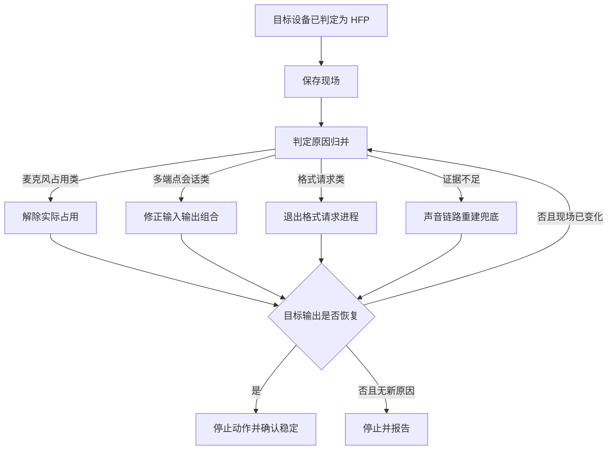

# HFP 模式一键修复方案

## 定位

本文规定：设备已经被判定为 HFP/HSP 后，用户点击“一键修复”时如何判定设备本次为什么进入 HFP、路由子方案、执行动作和验收结果。

本文是重写“一键修复”功能时必须达到的目标规格；当前代码尚未完整实现本文全部路由、兜底和授权流程。

依赖文档：

- 模式判定：[`如何判定蓝牙音频设备的音频模式.md`](如何判定蓝牙音频设备的音频模式.md)
- 进入 HFP 的原因归并、实例和日志特征：[`../../knowledge/wiki/蓝牙音频设备进入HFP模式的原因.md`](../../knowledge/wiki/蓝牙音频设备进入HFP模式的原因.md)

实现位置：[`tools/bluetooth-audio-mode-checker/features/a2dp-recovery/`](../../tools/bluetooth-audio-mode-checker/features/a2dp-recovery/)。

## 总原则

点击后立即保存：默认输入、默认输出、目标设备、当前采样率、点击时间和最新麦克风占用快照。前端只提交目标设备身份；服务端使用同一份实时状态判定设备本次为什么进入 HFP，不依赖页面文字反推原因。

总流程：

1. 复核目标仍为低采样率的 HFP 输出；若现场已恢复，直接结束。
2. 按原因实例文档中的日志特征匹配原因归并、触发进程和证据。
3. 已确证时进入对应子方案；证据不足时进入声音链路重建兜底。
4. 每个动作后立即观察目标输出；初步恢复即停止后续破坏性动作，再完成稳定性确认。
5. 若当前原因已经消失但仍未恢复，基于新状态再判定剩余原因；不得把上一次结论继续套用到变化后的现场。

## 原因匹配与性能

- 只在目标仍为低采样率 HFP 输出时匹配原因。
- 先使用最新麦克风占用快照；快照不早于点击前 `2` 秒时直接使用，过期时只补做一次定向占用检查。
- 明确有进程实际读取目标蓝牙麦克风时，立即匹配麦克风占用类，不先查询系统声音日志。
- 没有有效占用时，优先使用服务端已有声音事件；缓存不足时只允许执行一次带关键词过滤的日志查询。
- 多端点会话和格式请求必须使用同一份声音事件匹配。多端点完整特征优先于其后派生的格式请求。
- 只有完整命中原因实例文档中的已确证特征，才能自动进入对应处理；证据不足时不得结束猜测出来的进程。
- 使用现成快照时不得增加人为等待，原因路由应在 `100 ms` 内完成；补充检查必须有超时，一个修复回合不得重复读取同一日志时间窗。

执行规则：

- 不等待固定时长才判断；收到高采样率事件后立即停止后续动作。
- 不盲试所有方案。
- 不在每步前重新查完整系统日志。
- 中途可以临时切换输入、重建设备连接；最终不得把“换成别的输入/输出”当作完全修复。
- 初步恢复：首次观察到目标输出高于 `16 kHz`，立即向用户显示“正在确认稳定”。
- 稳定恢复：首次恢复后每 `500 ms` 复查一次，连续三次高于 `16 kHz`，且没有再次进入 HFP。
- 稳定确认失败：停止沿用旧结论，按最新占用、声音事件和设备状态重新判定一次；仍无新结论则停止并报告。

完全恢复：目标输出稳定高于 `16 kHz`，并尽量恢复点击前默认输入和默认输出。

绕过成功：只有替代输入、替代输出、同一蓝牙设备组合或非蓝牙组合稳定。

## 麦克风占用类

进入条件：完整命中原因实例文档中的“麦克风占用类”特征。

处理：

1. 直接解除已确证进程的占用，不先查系统声音日志。
2. 等待系统释放通话链路。
3. 复查目标麦克风占用和目标输出采样率。

若解除后未恢复，先复查一次占用状态：

- 同一应用或同一进程族短时间内自动重启并继续占用：告知用户该进程反复重启，询问是否授权阻止它在本次开机期间继续自动拉起；不得无限结束进程。
- 占用已经消失但仍处于 HFP：重新按原因实例文档匹配，使用现有声音事件判断多端点会话类或格式请求类。

授权只限本次开机期间；不得修改登录项、开机自启、永久禁用、删除应用或改变下次重启后的长期配置。

## 格式请求类

进入条件：完整命中原因实例文档中的“格式请求类”特征。

处理：

1. 正常退出提交请求的进程。
2. 短观察目标输出是否恢复。
3. 必要时可断开并重连目标设备；只能记录为重建本次声音链路，不得写成根因修复。

若进程退出后恢复成功，即使随后重启，只要没有再次触发低采样率，就允许它存在。只有重启后再次触发低采样率，才询问用户是否授权阻止本次开机期间自动拉起。

## 多端点会话类

进入条件：完整命中原因实例文档中的“多端点会话类”特征。

先报告用户：该应用在申请蓝牙麦克风时，错误声明并绑定了蓝牙扬声器；调用麦克风不需要绑定蓝牙扬声器。

该原因不能在保持原输入输出组合不变的前提下自动消除。先让用户选择希望保留输入还是输出，再执行以下一种组合：

1. 输出改成非蓝牙扬声器，输入继续使用原蓝牙麦克风。
2. 输入改成非蓝牙麦克风，输出继续使用原蓝牙扬声器。
3. 输出改成当前蓝牙麦克风所在设备。
4. 输入改成当前蓝牙扬声器所在设备。

不要把“临时停止触发应用的语音会话”列为主要修复方法。若只靠替代组合稳定，结果是绕过成功，不是原组合完全修复。

## 声音链路重建兜底

进入条件：没有完整命中任何已确证原因的日志特征，或已处理的原因消失、重新匹配仍无其他已确证原因，但目标输出仍不高于 `16 kHz`。

动作顺序：

1. 将默认输入临时切到任意可用的非蓝牙输入，再恢复点击前默认输入。可用中转包括内置麦克风、USB 麦克风、2.4G 接收器声音输入或其他非蓝牙声音输入。没有可用非蓝牙输入就跳过；不得切到另一台蓝牙麦克风作为中转。
2. 若未恢复，断开并重新连接目标蓝牙设备。
3. 若仍未恢复，停止自动处理，报告仍处于低采样率和本轮已执行动作，不再猜测或继续结束进程。

本流程是兜底恢复动作，不得写成新的已确证原因。

## 检查清单

- 是否先按原因实例文档匹配设备本次进入 HFP 的原因，再按“占用；无占用时多端点优先于格式请求；证据不足走兜底”路由。
- 占用明确时，是否先解除占用而不是先查日志。
- 反复占用或反复提交格式请求时，是否先请求用户授权。
- 多端点会话是否只提供路由组合修复。
- 兜底是否只在前三类之后执行，并且成功即停。
- 修复结果是否区分完全恢复、绕过成功、原组合复发和未恢复。
