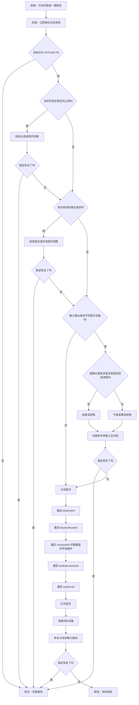

# HFP 模式一键修复方案

## 定位

本文规定：设备已经被判定为 HFP/HSP 后，用户点击“一键修复”时，系统必须按照固定顺序逐步处理，任一步确认稳定恢复后立即结束，不再进入复杂原因路由或循环复查。

本项目采用 FCMA（按用户功能组织代码的模块化应用架构），详细内容见项目根目录 [`Architecture.md`](../../Architecture.md)。本功能实现归属 [`tools/bluetooth-audio-mode-checker/features/a2dp-recovery/`](../../tools/bluetooth-audio-mode-checker/features/a2dp-recovery/)。

依赖文档：

- 模式入口：[`如何判定蓝牙音频设备的音频模式.md`](如何判定蓝牙音频设备的音频模式.md)
- 原因证据：[`../../knowledge/wiki/蓝牙音频设备进入HFP模式的原因.md`](../../knowledge/wiki/蓝牙音频设备进入HFP模式的原因.md)
- 详细日志：[`工具详细日志.md`](工具详细日志.md)

本文是目标规格。代码、测试、页面说明和验收记录必须以本文的线性顺序为准。

## 固定处理顺序

每台目标设备只允许按下列顺序向后执行：

1. 检查实时蓝牙麦克风占用；若存在，结束占用进程并观察。
2. 未恢复时，检查仍有效的格式请求；若存在，结束请求进程并观察。
3. 未恢复时，检查默认输入和默认输出是否来自两台不同蓝牙设备；若是，再检查是否存在触发 `more than one BT device connected` 的应用进程。能确认进程时先结束该进程；随后执行一次中转输入切换并切回，再观察。
4. 未恢复时，严格执行一次完整声音链路重建：关闭蓝牙 → 重启 `bluetoothd（管理全机蓝牙连接的系统进程）` → 重启 `bluetoothuserd（管理当前用户蓝牙状态的系统进程）` → 重启 `coreaudiod（系统核心声音后台进程，同时重载蓝牙声音插件）` → 重启 `audioaccessoryd（管理声音配件状态和路由协作的系统进程）` → 重启 `audiomxd（管理应用声音会话的系统进程）` → 打开蓝牙 → 连接目标设备 → 恢复点击前路由并完成最终观察。
5. 仍未恢复时结束本轮并报告错误，不回到前面的步骤，不重复同一动作。

固定流程如下，本文其他章节不得维护另一套顺序：

## 点击现场与入口条件

- 一键修复使用设备列表级统一入口，不在单个设备卡片内重复放置按钮。
- 只有模式为 `HFP_HSP` 且支持能力不是 `UNSUPPORTED` 的设备才进入批次。已确认不支持 A2DP 的设备不计数、不进入修复，也不产生“修复失败”。
- 多台可修复设备按页面列表顺序逐台处理，禁止并行结束进程、切换路由、重启服务或重连设备。
- 每台设备开始处理时，后端必须立即保存：点击时间、目标设备、默认输入、默认输出、实际输出采样率、当前模式、每台蓝牙设备最新 `tacl/tsco` 链路、声音输入进程与实体输入端点关联、当前存活格式请求、当前声音会话端点和进程身份。
- 快照不早于点击前 `2` 秒时可以直接使用；过期时只补做一次对应实时检查。页面只提交目标设备身份，不得替后端拼装原因或进程身份。
- 每个动作前都复核目标仍为 HFP/HSP。若目标已经恢复，跳过该动作并结束本设备回合。

## 第一步：实时蓝牙麦克风占用

实时占用必须同时满足：

1. 进程仍存活，且进程启动时间与快照一致，没有发生进程号复用。
2. 进程当前具有声音输入活动。
3. 进程明确关联实体蓝牙麦克风端点。

设备列表为空、内置输入、虚拟输入、回环输入、`AudioTap（系统声音抓取通道）`或无法归属实体设备的声音输入活动，都不算本步骤的实时蓝牙麦克风占用。格式请求也不再并入实时占用，统一留到第二步单独判断。

处理规则：

- 对全部已确认占用进程发送正常退出请求，不结束仅凭应用名称猜测的进程。
- 最多等待 `2` 秒确认原进程退出，每 `100` 毫秒检查一次。
- 进程退出后立即执行稳定恢复观察；稳定恢复则结束，未恢复则进入第二步。
- 若进程未退出或自动重新启动并再次形成同一占用，页面列出进程名称并请求“仅限本次开机”的阻止自动拉起授权。等待授权最多保留 `30` 分钟；过期后必须重新点击一键修复。
- 获得授权后只允许再处理一次；仍无法解除时继续第二步，不循环申请授权。

## 第二步：格式请求

格式请求与实时麦克风占用分开。必须完整满足以下条件才允许结束请求进程：

1. 同一存活进程最后一次 `kBluetoothAudioDevicePropertyFormat request` 为 `0 -> 1`，其后没有该进程对应的 `1 -> 0`。
2. 当前进程启动时间不晚于请求时间，排除进程号复用。
3. 请求后 `2` 秒内出现目标设备对应的 `tsco`；当前低采样率蓝牙输出只有所选目标。
4. 同一进程在该 `2` 秒窗口内没有 `StartIO（真正开始读写声音数据）`；有则不得把它归为“只有格式请求”。

处理规则与第一步相同：发送正常退出请求，最多等待 `2` 秒确认退出，然后执行稳定恢复观察。进程不退出或再次提交同类请求时，可以请求一次“仅限本次开机”的阻止自动拉起授权，等待最多 `30` 分钟；授权后仍失败就进入第三步。

系统日志查询必须限定到本次点击后的时间窗；查询最长 `7.5` 秒。查询失败是证据缺口，不得当作“没有格式请求”，但也不得因此结束猜测进程。

## 第三步：不同蓝牙输入输出与切换复位

进入条件只有一个：当前默认输入和默认输出都来自蓝牙设备，且不是同一台设备。目标最新链路是否为 `tsco` 只作为观察证据，不再决定是否允许执行本步骤。

先检查多蓝牙拒绝进程：

- 系统日志必须出现原文 `more than one BT device connected`。
- 同一声音会话必须记录来自两台不同蓝牙设备的输入、输出端点。
- 日志必须能锁定唯一声音会话进程，且当前进程的启动时间与日志匹配。
- 完整满足时先结束该应用进程；证据不完整时不结束任何猜测进程，但仍继续执行切换复位。

随后固定执行一次中转输入切换并切回：

1. 只切换默认输入，不永久改变默认输出。
2. 中转输入候选优先级固定为：内置设备 ＞ 明确标记的其他有线或接收器设备（包括 USB、2.4G 接收器、显示器声音、HDMI、雷雳、火线、PCI、线路和数字声音）＞ 其他未标记为蓝牙的设备 ＞ 其他蓝牙设备。
3. 同一级保留系统设备顺序；候选无法切换时才尝试下一个。每次等待候选成为默认输入最多 `2` 秒，每 `100` 毫秒检查一次。
4. 切换成功后，最多等待 `500` 毫秒观察目标链路转为 `tacl`，每 `50` 毫秒检查一次，并在边界再检查一次。
5. 若观察到 `tacl`，从出现时刻起继续保持中转输入 `1` 秒；若没有观察到，记录“中转输入未释放链路”，不再额外等待。
6. 无论是否观察到 `tacl`，都必须切回点击前默认输入；最多等待 `2` 秒确认切回成功。
7. 只验收切回后的原输入输出组合。中转状态不能算修复成功。

`500` 毫秒链路等待与 `1` 秒保持时间来自 `2026-07-21` 本机 XIBERIA K03S 的四次有效切换：链路释放最慢 `430` 毫秒，链路释放后输出跟随最慢 `881` 毫秒。这两个参数是当前机器与设备的实测值，不是蓝牙协议常数。

第三步只执行一次，不再显示“保留输入还是保留输出”的组合选择，也不因观察失败回到前三步重新匹配。

## 第四步：完整声音链路重建

前三步均未恢复时，只执行一次下列固定序列，不在任意两个节点之间插入恢复观察，也不因中间某项失败而回到前三步：

1. 关闭系统蓝牙，等待系统报告蓝牙已关闭。
2. 重启系统级 `com.apple.bluetoothd` 服务，确认旧进程退出且新进程以不同进程号运行。
3. 重启当前用户的 `com.apple.bluetoothuserd` 服务，确认旧进程退出且新进程以不同进程号运行。
4. 重启系统级 `com.apple.audio.coreaudiod` 服务，确认旧进程退出且新进程以不同进程号运行；该动作同时重新加载蓝牙声音插件，不再单独重启插件。
5. 重启当前用户的 `com.apple.BTServer.cloudpairing` 服务，其实际进程为 `audioaccessoryd`；确认旧进程退出且新进程以不同进程号运行。
6. 重启系统级 `com.apple.audiomxd` 服务，确认旧进程退出且新进程以不同进程号运行。
7. 打开系统蓝牙，等待系统报告蓝牙已打开。
8. 连接目标设备。若目标已经自动连接，不得先断开再重连；只有目标尚未连接时才发起连接。
9. 等待目标输入或输出端点重新出现，恢复仍可用的点击前默认输入和默认输出，然后执行统一恢复观察。

执行与等待规则：

- 服务必须严格按照上列顺序重启。系统级服务和当前用户服务必须使用各自真实服务身份，不得用模糊进程名误伤其他用户会话。
- 关闭和打开蓝牙各最多等待 `5` 秒，每 `100` 毫秒检查一次蓝牙电源状态。
- 每个服务重启最多等待 `5` 秒，每 `100` 毫秒检查一次旧进程消失和新进程出现。该上限是实现前暂定安全值，真实验收后必须按本机样本校准。
- 任一服务重启失败、权限不足或新进程未出现时，必须记录失败，但仍继续执行剩余服务，并保证最终尝试重新打开蓝牙和连接目标设备，不能把电脑留在蓝牙关闭状态。
- 目标连接调用内部时限保持 `18` 秒；超时或报错后仍须继续读取实时设备状态，不得让工作流卡住。
- 连接调用结束后最多等待 `3` 秒确认目标输入或输出端点出现，每 `100` 毫秒检查一次。
- 目标出现后恢复仍可用的点击前默认输入和默认输出；每个方向最多等待 `2` 秒确认切换成功。
- 目标仍未出现时，恢复其他仍可用的点击前路由，并报告“目标设备仍断开，需要手动连接”。
- 完整序列只在恢复点击前路由后进行一次最终稳定观察。失败即结束本轮，不再额外执行一次“断开并重连”。

## 统一恢复观察

- 初步恢复：目标是当前默认输出时，首次观察到实际输出高于 `16 kHz` 且模式为 A2DP；目标不是当前默认输出时，首次观察到模式退出 HFP/HSP。
- 初步恢复后，页面立即显示“正在确认稳定”。
- 最多观察 `10` 次，每次间隔 `500` 毫秒；只有连续 `3` 次满足恢复条件才算稳定恢复。完整观察窗口最长约 `4.5` 秒。
- 任一次观察失败，连续计数归零，但本步骤仍继续到本次观察上限。
- 目标作为当前默认输出时，只检查输出端点；蓝牙麦克风自身不高于 `16 kHz` 不能单独判失败。
- 只有点击前默认输入、默认输出都已恢复，且目标通过稳定观察，才能报告“完全恢复”。

## 交互、批次与结果

- 点击后前端立即把列表级按钮改为进行中并禁用重复点击。
- 普通进行态和最终结果只显示在列表级胶囊内；设备卡片只在等待“仅限本次开机”授权时显示操作区。
- 某台设备等待授权时批次暂停。前端把目标队列、总数、已完成数量、当前设备和原修复回合保存到当前标签页会话存储；刷新后恢复等待状态并继续原批次。
- 授权等待最多 `30` 分钟；过期后清除旧现场并提示重新点击。续接操作不得生成新点击时间或重置已执行步骤。
- 当前设备进入下一步之前，先保存上一动作结果；同一步骤每次点击最多执行一次。
- 批次全部结束后只显示“成功”或“错误”，保留 `10` 秒后清除；仍有可修复设备时恢复“一键修复”按钮，否则胶囊消失。
- 页面不展示系统命令、内部进程调用原文或底层异常堆栈。

## 防误杀与失败边界

- 前三步只能结束已由实时端点、格式请求或多蓝牙拒绝日志明确归属的应用进程。
- `audioaccessoryd`、`audiomxd`、`bluetoothd`、`bluetoothuserd`、`coreaudiod`、系统启动管理器和系统核心进程不得作为普通原因进程结束。
- 第四步只允许按固定顺序和真实服务身份重启这五个服务；蓝牙重新打开后只连接当前目标设备，不得再次先断开目标。
- 任何证据读取失败都必须写入详细日志。证据不足意味着“不结束进程”，不意味着跳过后续安全步骤。
- 每一步成功即停；每一步失败只向后走；禁止回跳、循环复查、重复授权或盲试全部动作。

## 检查清单

- 是否严格执行“实时占用 → 格式请求 → 不同蓝牙设备与切换复位 → 完整声音链路重建”。
- 格式请求是否已经与实时麦克风占用分开，不再共用一个门槛。
- 多蓝牙拒绝是否只有在唯一进程、双设备端点和拒绝原文同时成立时才结束进程。
- 双蓝牙步骤是否取消组合选择，并始终只执行一次中转输入切换和切回。
- 中转设备是否遵守“内置 ＞ 其他有线或接收器 ＞ 其他非蓝牙 ＞ 其他蓝牙”。
- 是否保留 `2` 秒进程退出、`500` 毫秒链路等待、`1` 秒中转保持、连续三次且间隔 `500` 毫秒的稳定观察、`30` 分钟授权有效期、`10` 秒结果展示和 `18` 秒目标连接时限。
- 完整重建是否严格执行“关闭蓝牙 → `bluetoothd` → `bluetoothuserd` → `coreaudiod`及蓝牙声音插件 → `audioaccessoryd` → `audiomxd` → 打开蓝牙 → 连接目标设备”。
- 每个服务是否确认新旧进程号变化；任一步失败后是否仍保证重新打开蓝牙并尝试连接目标。
- 目标已经自动连接时是否避免再次断开；最终是否没有额外的独立断开重连步骤。
- 每步是否最多一次、恢复即停、失败只向后走，最终不再回到原因匹配。
- 多台设备是否串行处理，等待授权时是否能在刷新后恢复原批次。
- 最终是否恢复仍可用的点击前输入输出，并以原组合完成稳定验收。
