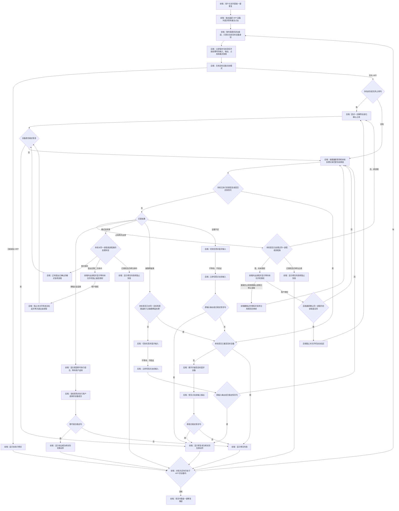

# HFP 模式一键修复方案

## 定位

本文规定：设备已经被判定为 HFP/HSP 后，用户点击“一键修复”时如何判定设备本次为什么进入 HFP、路由子方案、执行动作和验收结果。

本功能处理的是“设备已经被模式判定功能真实判定为 HFP/HSP 后，尝试解除触发通话链路的原因并让设备稳定退出 HFP/HSP”。目标是当前默认输出时，还必须继续验证其恢复为高于 `16 kHz` 的高音质播放；目标仅承担输入或当前没有播放时，不能把 `16 kHz` 输入本身当作故障，但仍必须处理已经独立确认的 HFP/HSP 链路。

本文是“一键修复”功能必须持续满足的目标规格；实现、测试和用户文档不得弱化本文规定的路由、兜底、授权与验收流程。

依赖文档：

- 模式判定：[`如何判定蓝牙音频设备的音频模式.md`](如何判定蓝牙音频设备的音频模式.md)
- 进入或停留在 HFP 的原因归并、实例和日志特征：[`../../knowledge/wiki/蓝牙音频设备进入HFP模式的原因.md`](../../knowledge/wiki/蓝牙音频设备进入HFP模式的原因.md)

实现位置：[`tools/bluetooth-audio-mode-checker/features/a2dp-recovery/`](../../tools/bluetooth-audio-mode-checker/features/a2dp-recovery/)。

## 总原则

点击后立即保存：默认输入、默认输出、目标设备、当前采样率、点击时间和当前所有实际麦克风读取者的最新快照。占用快照不得只取目标输出设备同名的麦克风；例如输出为 K03S、实际输入为 DJI 时，DJI 的实际占用仍必须先处理。前端只提交目标设备身份；服务端使用同一份实时状态判定设备本次为什么进入 HFP，不依赖页面文字反推原因。

一键修复使用设备列表级统一入口，不在单个设备卡片内重复放置按钮。状态栏在“更新于……”字段后显示“识别到 X 个设备处于 HFP”和“一键修复”按钮；没有设备被判为 `HFP_HSP` 时显示“识别到 0 个设备处于 HFP”，不显示按钮。入口和服务端都只使用模式判定功能给出的权威结论，不得再用“是否为当前默认输出”“是否只承担输入”“实际输出采样率是否可读”或“是否证明支持高采样率”等附加条件跳过修复。仅有 `16 kHz` 输入、但模式没有被判为 `HFP_HSP` 的设备不得计入数量；未播放的同名输出端点也不能单独构成 HFP/HSP 证据。

用户点击列表级按钮后，前端取该时刻最新设备列表中全部 `HFP_HSP` 设备，按列表顺序逐台建立独立修复回合，禁止并行修改声音路由。每台设备开始处理时仍须立即保存该设备的点击现场并执行本文完整路由。某台设备进入等待授权或等待组合选择时，批次暂停；用户完成该设备的选择后自动继续其余仍处于 HFP 的设备。前一个设备的处理已经使后续设备退出 HFP 时，后续设备不再执行修复动作。每台设备的结果、授权和组合选择仍显示在对应设备卡片详情内。

总流程：

1. 用户点击列表级“一键修复”后，前端锁定本批次最新的 HFP 设备列表并禁用重复点击；每台目标开始处理时，后端立即保存当时的默认输入、默认输出、目标设备、当前采样率、处理开始时间和全部实际麦克风占用快照，不得先复核再保存。
2. 保存现场后，复核目标仍被最新模式结论判为 HFP/HSP；若现场已退出 HFP/HSP，直接结束，不查询已经结束的会话，也不继续任何修复动作。
3. 不论最终属于哪类原因，先检查并尝试一次解除当前所有已确证的本机麦克风占用。若目标输出因此稳定恢复，立即结束；解除占用没有修改输入输出路由，不得在成功后多做一次“恢复点击前输入输出”。
4. 没有实际占用，或解除占用后仍未稳定恢复，都必须进入“匹配当前原因”。匹配器使用最新现场决定当前属于链路残留、多端点会话、格式请求还是证据不足；不得从“解除占用后未恢复”直接硬跳到某个原因类。
5. 每个动作后立即观察目标输出；初步恢复即停止后续破坏性动作，再完成稳定性确认。
6. 若当前原因已经消失但仍未恢复，基于新状态再判定剩余原因；不得把上一次结论继续套用到变化后的现场。

路由图维护约束：路由图必须同时体现前端和后端的关键行为，不得只画服务端处理步骤，也不得遗漏前端发起、展示、授权、选择和结果反馈等会影响用户操作与路由继续条件的关键节点。

本图是“一键修复”路由的唯一权威图。后续审阅先直接修改本图，再同步正文、代码和测试；其他文档只引用本图，不维护删减版或另一套走向。

防循环约束：

- 每次从复查上限判断进入“匹配结果”都计为一次原因复查；一次点击最多执行四次原因复查，对应四类原因均有机会被重新识别。授权后的继续操作属于同一修复回合，不重置次数。
- 后端必须记录本轮已经尝试的原因对象、进程或进程族、目标设备、点击前路由、执行动作、授权状态和结果。匹配器不得把已经失败且没有更高一级处理的同一动作再次返回。
- 同一目标设备和点击前路由的链路残留处理最多执行一次；再次匹配为链路残留时，不得重复切换输入，只能进入尚未执行的单次蓝牙重连。
- 麦克风占用类和格式请求类只允许“首次处理一次、用户授权后再处理一次”；授权后仍再次命中必须结束并报告，不得再次申请授权。
- 麦克风占用类的等待授权只在所列进程仍被最新全局占用检查确认为读取者时有效。更新的全局占用快照确认所列进程均已停止读取时，前端必须撤销过时授权并沿用原修复回合继续原因匹配；用户点击授权时后端仍须独立补做一次实时占用确认，不能仅凭页面保存的等待状态阻止进程。设备卡因无法把读取者归属到具体设备而显示空列表，不等于全局占用已经消失。
- 多端点会话类的用户选择只执行一次；替代组合验证失败后结束，不自动重复切换。
- 证据不足类的非蓝牙输入切换只执行一次，目标蓝牙设备重连也只执行一次。
- 达到四次原因复查上限后，不再进入任何原因动作：尚未执行过蓝牙重连时只允许重连一次；已经重连过则结束并报告未恢复。

## 原因匹配与性能

- 只在目标当前仍被最新模式结论判为 HFP/HSP 时匹配和处理原因。目标已经自行退出 HFP/HSP 时立即结束，不使用历史路由抖动或旧日志把已结束会话重新判成待修复。
- 先使用最新的全部麦克风占用快照；快照不早于点击前 `2` 秒时直接使用，过期时只补做一次全部占用检查。
- 明确有进程实际读取任一当前麦克风时，不限于目标输出设备同名麦克风，立即尝试一次解除占用，不先查询系统声音日志。
- “先解除占用”是一键修复的固定第一步。页面实时刷新和双蓝牙风险提示不自动发起原因复核，也不结束进程。
- 没有有效占用时，优先使用服务端已有声音事件；缓存不足时只允许执行一次带关键词过滤的日志查询。
- 以点击时间查询系统声音日志时，必须把内部时间转换成系统日志命令接受的本地 `年-月-日 时:分:秒`，不得直接传带 `T` 和 `Z` 的标准时间字符串；查询失败必须作为证据缺口返回，不得静默当成“没有日志”。
- 格式请求类的“唯一低采样率蓝牙输出目标”只统计当前默认输出；非默认设备的待机或上次活动采样率不得扩大候选目标，否则会把已经明确对应当前输出的格式请求误降为证据不足。
- 链路残留类以同一修复回合的状态变化为首要证据：先确认进程实际读取蓝牙输入端点，再确认占用结束且没有新的读取者，最后确认目标设备或其他蓝牙设备仍保持 HFP。解除占用后必须先进入统一原因匹配，再由该证据链命中链路残留类。只有旧日志中存在输入启动和 `tsco`、但无法对应当前设备或确认占用已经结束时，只能标为高度疑似。
- 用户主动修复时，当前双蓝牙输入输出组合且目标仍处于 HFP，已经足以进入多端点设备组合选择；应用名仅作为当前占用信息的可选展示，不是允许切换设备的证据门槛。只有不属于当前多端点组合时，才查询声音事件匹配格式请求类。
- 只有完整命中原因实例文档中的已确证特征，才能自动进入对应处理；证据不足时不得结束猜测出来的进程。
- 使用现成快照时不得增加人为等待，原因路由应在 `100 ms` 内完成；补充检查必须有超时，一个修复回合不得重复读取同一日志时间窗。
- 原因匹配必须同时读取本轮处理记录；复查次数达到四次、同一动作已经耗尽或蓝牙重连已经执行时，必须按权威路由图升级或结束，不得仅凭当前原因名称回到旧动作。

执行规则：

- 不等待固定时长才判断；收到高采样率事件后立即停止后续动作。
- 不盲试所有方案。
- 不在每步前重新查完整系统日志。
- 中途可以临时切换输入、重建设备连接；最终不得把“换成别的输入/输出”当作完全修复。
- 初步恢复：目标是当前默认输出时，首次观察到实际输出高于 `16 kHz`；目标不是当前默认输出时，首次观察到模式退出 HFP/HSP。命中后立即向用户显示“正在确认稳定”。
- 稳定恢复：首次恢复后每 `500 ms` 复查一次。目标是当前默认输出时，必须连续三次实际输出高于 `16 kHz` 且模式为 A2DP；目标不是当前默认输出时，必须连续三次确认模式不再是 HFP/HSP。
- 稳定确认失败：停止沿用旧结论，按最新占用、声音事件和设备状态重新判定一次；仍无新结论则停止并报告。

完全恢复：目标已按上述规则稳定退出 HFP/HSP，且点击前默认输入和默认输出均已恢复；目标是当前默认输出时还必须满足实际输出稳定高于 `16 kHz`。任一路由未恢复时不得报告“完全恢复”。

绕过成功：只有替代输入、替代输出、同一蓝牙设备组合或非蓝牙组合稳定。

## 交互与授权协议

- 第一次点击时，网页只提交目标设备身份，不提交页面推断出的原因、进程或修复动作。
- 当前默认输入和默认输出分别来自两台不同的经典蓝牙设备时，页面必须在用户发起语音操作前显示风险提示；固定文案为“⚠️注意：当前输入和输出来自两个不同的蓝牙设备，微信输入法等App的语音功能可能无法正常处理这种组合。”提示只陈述当前组合和可能失败，不得在没有系统日志证据时提前冒充“多端点会话类”确诊。
- 当同一双蓝牙输入输出组合在短时间内反复断连，或目标输出在 A2DP 与 HFP 间反复切换时，前端仍必须跟随每一次实时事件立即刷新设备卡片、模式、连接和麦克风占用状态。页面允许在断连、重连、A2DP 和 HFP 之间频繁变化，不得为了稳定视觉展示而延迟、合并或丢弃中间状态；但这些实时事件只更新展示，不自动发起修复或历史会话复核。
- 设备卡片顶部胶囊显示 A2DP、HFP/HSP 或“模式无法确认”，具体判定统一遵守 [`如何判定蓝牙音频设备的音频模式.md`](如何判定蓝牙音频设备的音频模式.md)。麦克风运行状态附加显示为“麦克风使用中”。
- 用户点击时若目标仍为 HFP，完成一次占用解除后仍未恢复，并且当前输入输出仍来自两台不同的经典蓝牙设备，提示“当前双蓝牙输入输出组合仍使设备处于 HFP”，并请用户授权保留输入或保留输出。能读到当前占用应用名时可以附带展示；读不到时不得阻止设备组合选择。用户点选前不得改动路由；点选后直接切换对应设备并验证。
- 模式展示保留在各设备卡片内，修复动作只放在设备列表状态栏内，两者必须是独立控件。“一键修复”使用原生按钮；有 HFP 设备且当前没有修复批次或待处理选择时显示，执行期间禁用并显示当前批次进度，不得把修复动作藏在模式文字的悬停态中，也不得在设备卡片内重复放置修复按钮。
- 列表级批次必须逐台执行，不得同时对多台设备结束进程、切换输入输出或重连蓝牙。某台设备等待授权或等待组合选择时，统一按钮保持禁用；用户完成该选择后沿用原批次自动处理剩余目标。批次中每台设备的结果分别落在对应卡片，不能用一条汇总结果覆盖具体设备结果。
- 服务端必须以点击时保存的现场启动本轮修复；不得信任网页自行拼出的进程身份或设备路径。
- 服务端必须为每次点击建立独立修复回合，并在等待授权或等待组合选择时保存原点击现场、原因复查次数、已处理原因对象、已执行动作、授权状态和结果。前端续接时只提交用户选择或授权，不得生成新的点击时间、替换原现场或重置防循环计数。
- 等待授权和等待组合选择最多保留 `30` 分钟；过期后前端必须提示重新点击一键修复，服务端不得执行旧动作。
- 不需要用户选择时，按钮直接完成原因路由、处理和验收。
- 多端点会话类命中后，页面必须显示原因说明和当前可执行的输入输出组合，只在用户选定组合后继续。
- 多端点设备组合等待选择时，目标输出卡片必须自动展开。即使另一台输入设备仍被应用持续占用，也不得用占用卡片的自动展开覆盖或藏起路由选择；允许占用卡片与等待选择卡片同时展开。
- 原因进程未退出，或退出后再次启动并触发同一问题时，页面必须先列出涉及的全部进程名称，再单独请求“仅限本次开机”的继续处理与阻止重新启动授权；确认提示中也必须重复列出进程名称。未授权时停止，不得擅自继续结束进程。
- 麦克风占用类进入等待授权后，页面收到晚于等待结果的占用快照时必须核对所列进程：仍有任一所列进程读取麦克风则保留授权；所列进程均已停止读取则立即撤销授权，并自动请求服务端沿用原点击现场、原因复查次数和动作记录继续匹配，不得生成新的修复回合。
- 修复过程中首次观察到高于 `16 kHz` 时，页面立即把进行中提示改为“正在确认稳定”，不得等整个请求结束后才显示。
- 点击后必须在发送请求前同步显示进行中状态并禁用重复提交；同一浏览器标签页刷新后，最近一次已完成或等待用户处理的结果必须仍可查看，进行中的临时状态不得被误恢复成仍在执行。
- 页面不得为了点名应用而自动追查已经结束的声音会话。应用身份只来自点击时仍有效的当前占用快照；身份缺失不影响当前双蓝牙设备组合的处理。
- “高于 `16 kHz`”的稳定恢复阈值只检查目标作为当前默认输出时的输出端点，不检查麦克风输入。输入采样率不高于 `16 kHz` 不得单独产生失败结果，但独立模式证据已经判为 HFP/HSP 时必须进入修复。
- 非默认输出、仅承担输入、实际输出采样率不可读或未证明支持高采样率，都不得覆盖模式判定功能给出的 `HFP_HSP` 结论，也不得成为服务端跳过修复的理由。只有点击后最新模式已经不再是 `HFP_HSP` 时才返回“无需修复”。
- 一键修复和单独解除占用都必须显示当前阶段，不得只显示无变化的旋转状态。动作完成后立即显示结果，再在后台主动复查麦克风占用；复查期间不继续锁住按钮。
- 全局占用检查确认某进程正在读取麦克风、但系统没有返回可对应当前设备的名称时，设备卡必须显示“存在未归属读取”并列出进程，同时明确“无法确认是否正在读取本设备”；不得显示“未被本机占用”或“没有本机程序”。未归属读取者可用于保留等待授权，但不得冒充当前设备的确定占用。
- 若应用在解除后很快重新读取麦克风，占用卡必须显示最新的“已重新占用”而不是停留在旧占用者，结果文字不得把短暂释放写成持续恢复。
- 标签页刷新后，已完成的历史结果保留在设备详情中，但不自动展开，避免与当前路由风险互相抢占注意力；只有“等待组合选择”或“等待授权”的结果在刷新后自动展开。历史结果必须标记为“最近一次修复”，新结果还应记录显示时间。
- 授权或组合选择属于同一项一键修复功能的后续步骤；继续执行时仍要复核实时现场，旧结论失效时不得强行执行旧动作。
- 用户点击麦克风占用类授权时，服务端必须实时重读全部本机麦克风读取者，并以当前进程路径确认待授权的同一进程或进程族仍在读取。这里使用全局读取结果，不要求系统能够把读取者归属到目标设备。若已经停止读取，不启动本次开机阻止任务，直接沿用原回合重新匹配当前原因。
- 多端点等待选择后，服务端必须保存本次点击时的原输入、原输出和已核准组合。用户选择时复核当前默认输入输出仍与点击现场一致，且目标仍处于 HFP：成立则直接执行服务端保存的组合，不查询历史声音日志；路由已变化则拒绝旧选择；目标已经自行恢复则返回“无需修复”并清除待办，不得再切换设备。
- 用户已经点击某个多端点替代组合，但执行前目标自行恢复时，前端必须明确显示“未执行输入输出切换：目标已自行恢复”，不得使用绿色成功态或任何暗示设备已经切换的文案。
- 已完成结果区域只显示两行：第一行左侧为“修复成功 / 修复失败 / 未执行修复”，右侧为完整时间；第二行仅在成功时显示实际生效的动作，例如解除某进程的麦克风占用、结束某进程的声音格式请求、切换输入、切换输出或重建目标蓝牙连接。不得显示采样率、工作流、诊断证据、执行步骤或“查看处理详情”。等待用户选择的操作按钮仍直接显示。
- 若处理对象是输入法等常驻进程，结果必须提示“进程重新启动不等于语音快捷键已经恢复”；未重新验证快捷键前不得声称应用功能已完全恢复。

对外结果必须使用以下一种明确状态：

- `无需修复`：点击后复核发现目标已经退出 HFP/HSP。
- `完全恢复`：原输入输出组合已恢复，且目标按其当前角色通过稳定确认。
- `绕过成功`：替代组合稳定，但原组合没有被证明完全恢复。
- `原组合复发`：恢复原输入输出组合后再次进入 HFP。
- `未恢复`：自动动作完成后仍未恢复，或现场不足以安全继续。
- `等待选择`：多端点会话类等待用户选择组合。
- `等待授权`：重复触发等待本次开机授权。

## 麦克风占用类

进入条件：完整命中原因实例文档中的“麦克风占用类”特征。

处理：

1. 直接解除当前所有已确证进程的麦克风占用，不限于目标输出同名设备，不先查系统声音日志。
2. 等待系统释放通话链路。
3. 复查目标麦克风占用和目标输出采样率。

若解除后未恢复，先复查一次占用状态：

- 同一应用或同一进程族短时间内自动重启并继续占用：告知用户该进程反复重启，询问是否授权阻止它在本次开机期间继续自动拉起；不得无限结束进程。
- 进程未能退出且仍持续读取：告知用户该进程未退出，不得写成“退出后再次启动”或“再次读取”；仍须在用户授权前实时确认占用没有消失。
- 占用已经消失但仍处于 HFP：回到“匹配当前原因”；本轮已经确认并结束蓝牙输入占用、没有新的读取者且设备仍为 HFP 时，匹配为链路残留类。若同时存在更具体的当前证据，匹配器按最新现场记录并处理对应原因。

授权只限本次开机期间；不得修改登录项、开机自启、永久禁用、删除应用或改变下次重启后的长期配置。

## 链路残留类

进入条件：完整命中原因实例文档中的“链路残留类”特征。即已经确认某进程实际占用蓝牙输入端点；占用结束且没有新的麦克风读取者后，系统没有及时从 `tsco` 切回 `tacl`，目标设备或其他蓝牙设备仍保持 HFP。若只能从最近声音事件推断发生过输入启动，但无法确认具体设备或占用是否已经结束，诊断只能显示“高度疑似”。

处理：

1. 将默认输入切换到任意可用的非蓝牙输入，解除原蓝牙输入端点与当前声音路由的绑定。
2. 切换命令完成后立即恢复点击前默认输入；中间不等待、不检查采样率，也不把中转期间临时出现的 A2DP 当作恢复结果。
3. 只在恢复点击前输入后，按 A2DP 模式和高采样率连续确认原输入输出组合是否稳定。
4. 若原组合仍未恢复或再次进入 HFP，才回到“匹配当前原因”，继续处理多端点会话、格式请求或执行重连等其他方法。
5. 最终必须恢复点击前输入输出并通过稳定确认，才能报告完全恢复。

## 格式请求类

进入条件：完整命中原因实例文档中的“格式请求类”特征。

处理：

1. 正常退出提交请求的进程。
2. 短观察目标输出是否恢复。
3. 必要时可断开并重连目标设备；只能记录为重建本次声音链路，不得写成根因修复。

匹配器必须保留本轮已经处理过的进程或进程族记录，禁止只按“格式请求类”循环处理：

- 首次命中：正常退出一次，然后检查是否稳定恢复。
- 同一进程或进程族退出后第二次命中：不得再次无条件退出，也不得回到格式请求类形成循环；前端必须列出具体进程并进入“等待授权”，请求用户授权阻止它在本次开机期间自动拉起。
- 用户授权后：后端先启用本次开机阻止自动拉起，再次退出该进程并检查是否稳定恢复。
- 已授权后仍再次命中：停止自动处理，报告阻止失败和未恢复；不得重复申请同一授权。
- 不同进程首次命中：按新的原因对象处理，不继承其他进程的已处理次数。

若进程退出后恢复成功，即使随后重启，只要没有再次触发低采样率，就允许它存在。

## 多端点会话类

进入条件：完整命中原因实例文档中的“多端点会话类”特征。

产品边界：这是具体应用与跨蓝牙输入输出组合不兼容，不是本工具可以修改的应用内部故障。本工具的修复责任只是识别拒绝证据、实时呈现冲突，并在用户授权后改成可用路由组合。

先报告用户：当前输入和输出来自两台不同的蓝牙设备，且目标仍处于 HFP。能够从当前有效证据确认具体应用时可以附带应用名称；无法确认应用身份时仍必须提供组合选择，不得虚构应用或阻止处理。

该原因不能在保持原输入输出组合不变的前提下自动消除。先让用户选择希望保留输入还是输出，再执行以下一种组合：

1. 输出改成非蓝牙扬声器，输入继续使用原蓝牙麦克风。
2. 输入改成非蓝牙麦克风，输出继续使用原蓝牙扬声器。
3. 输出改成当前蓝牙麦克风所在设备。
4. 输入改成当前蓝牙扬声器所在设备。

不要把“临时停止触发应用的语音会话”列为主要修复方法。若只靠替代组合稳定，结果是绕过成功，不是原组合完全修复。

## 声音链路重建兜底

进入条件：没有完整命中麦克风占用、链路残留、格式请求或多端点会话中的任何已确证原因，但目标输出仍不高于 `16 kHz`。

动作顺序：

1. 将默认输入临时切到任意可用的非蓝牙输入，切换命令完成后立即恢复点击前默认输入；只验收恢复后的原输入输出组合，不验收中转状态。可用中转包括内置麦克风、USB 麦克风、2.4G 接收器声音输入或其他非蓝牙声音输入。没有可用非蓝牙输入就跳过；不得切到另一台蓝牙麦克风作为中转。
2. 若未恢复，断开并重新连接目标蓝牙设备。
3. 若仍未恢复，停止自动处理，报告低采样率现场和本轮已执行动作。

重连动作必须有内部时限，底层连接调用不得无限阻塞。无论连接命令正常返回、超时或报错，工作流都必须重新读取目标设备：若目标输出已经重新出现，立即恢复点击前默认输入和默认输出，再按连续三次高采样率验收；若目标仍未出现，也要恢复仍然可用的点击前路由，并明确提示“目标设备仍断开，需要手动重连”。底层命令路径、进程调用原文和超时异常不得直接展示给用户。

本流程只用于没有完整命中四类原因的现场，不得把兜底动作本身写成新的已确证原因。

## 检查清单

- 是否在所有真正的一键修复中都先汇总全部实际麦克风占用，有占用时先尝试解除一次，无效后才匹配多端点、格式请求、链路残留或兜底。
- 状态栏是否在更新时间后准确显示 HFP 设备数量，并且只在数量大于零时显示唯一的列表级“一键修复”按钮；设备卡片内是否不再重复显示按钮。
- 多台 HFP 设备是否按列表顺序逐台处理，等待用户选择时是否暂停并在选择完成后继续；蓝牙麦克风的 `16 kHz` 输入和未播放的同名系统输出端点是否不会单独触发 HFP/HSP 判定。
- 原因进程未退出或再次触发时，是否先显示具体进程名称并请求用户授权。
- 麦克风占用类等待授权后占用消失时，前端是否撤销过时授权并沿用原回合继续；用户点击授权时后端是否再次确认同一进程仍在读取，未确认时是否避免启动阻止任务。
- 全局读取者无法归属到具体设备时，设备卡是否列出“未归属读取”而不是显示“未被本机占用”；该证据是否只说明本机某个麦克风正在被读取，而不冒充目标设备的确定占用。
- 多端点会话是否只提供路由组合修复。
- 双蓝牙路由反复断连或模式切换时，前端是否仍跟随每次瞬时事件立即刷新，不延迟、合并或丢弃麦克风占用等中间状态。
- 是否只在系统拒绝、两个蓝牙端点和进程身份都完整命中后才点名应用；无法点名时是否仍按当前双蓝牙组合提供选择，并在用户点选前保持只读。
- 多端点确诊后是否立即停止显示“正在确认”，并在持续麦克风占用的同时仍自动展开、持续展示路由选择。
- 等待授权或等待组合选择后继续时，是否沿用原点击现场和本轮处理记录，而不是创建新修复回合或重置次数。
- 原因复查、进程处理、链路残留切换、多端点选择和蓝牙重连是否均遵守防循环次数限制。
- 兜底是否只在四类原因之后执行，并且成功即停。
- 兜底重连无论成功、超时或失败，是否都复核设备并恢复仍可用的点击前路由；是否只有原输入、原输出和高采样率三项都通过才报告完全恢复。
- 修复结果是否区分完全恢复、绕过成功、原组合复发和未恢复。
