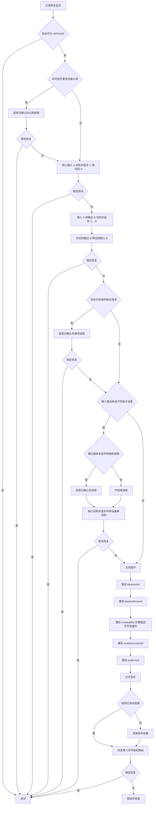

# HFP 模式一键修复方案

## 定位

本文是一键修复的唯一流程规格。目标设备已被[`如何判定蓝牙音频设备的音频模式.md`](如何判定蓝牙音频设备的音频模式.md)判为 HFP/HSP 后，系统按固定顺序逐步处理；稳定恢复即结束，否则只向后执行。

实现位置：[`tools/bluetooth-audio-mode-checker/features/a2dp-recovery/`](../../tools/bluetooth-audio-mode-checker/features/a2dp-recovery/)。详细日志遵守[`工具详细日志.md`](工具详细日志.md)。项目架构见[`Architecture.md`](../../Architecture.md)。

## 固定处理顺序

## 统一非蓝牙设备选择

一键修复任何步骤需要“切换到其他非蓝牙设备”时，只能使用本节规则。

候选必须当前可用、具有所需方向的有效声道、不是被替换的原设备，并按以下顺序选择：

1. 内置设备。
2. 明确有线或接收器设备：USB、2.4G 接收器、显示器声音、HDMI、雷雳、火线、PCI、线路、数字声音。
3. 其他未标记为蓝牙的设备。

禁止使用经典蓝牙或低功耗蓝牙设备兜底。同级按系统顺序尝试；本级全部失败才进入下一级。输入、输出分别计算，C 与 D 可以来自同一台设备。候选失效时按最新设备列表重算。没有候选时跳过当前切换步骤。

## 入口与修复起点

- 只有模式为 `HFP_HSP` 且 A2DP 支持能力不是 `UNSUPPORTED` 的设备进入修复。
- “是否允许进入一键修复”只能由一键修复功能提供一个服务端判定。应用入口、执行器和页面不得分别重写条件；页面只消费服务端给出的资格结果，服务端执行前仍用同一判定复核实时状态。
- 多台目标按页面顺序串行处理。
- 每台开始时只记录点击时间。目标设备名称沿用修复请求参数，不重复保存为现场数据。
- 不保存默认输入输出、设备评估、占用扫描结果、格式请求或系统声音日志。各步骤需要这些信息时实时读取；日志证据以点击时间作为查询定位点。
- 输入输出切换步骤只在动作开始前读取本步骤的原路由，动作完成或失败后立即恢复；这些值仅是步骤内临时变量。
- 每个实际修复步骤只使用该步骤结束后的 `3` 秒观察窗判断是否恢复。观察失败后不得增加“自行恢复”等额外等待或确认旁路，必须直接进入流程图下一节点。
- 同一存活进程最后一次格式请求为 `0 -> 1` 且其后没有 `1 -> 0` 时，前端和服务端统一把该进程视为正在占用。该占用不要求已经出现 `StartIO` 或关联具体实体麦克风：能够唯一确定请求对应设备时归入该设备卡片；不能唯一确定时归入当前默认输入设备卡片。卡片统一提供单个解除和全部解除。此规则只统一占用显示、设备归属与解除资格，不改变一键修复在第四步处理格式请求的固定顺序。

## 结束进程统一规则

第一、四、五步只有在各自证据完整时才能请求应用进程正常退出。同一进程身份在本次修复中最多请求退出一次，最多等待 `2` 秒确认旧进程身份消失，然后严格进入流程图的下一个节点。进程未退出、后来重新出现或再次产生证据，都不得在本次修复中重复结束，不得等待额外授权，也不得启动常驻扫描或后台阻止任务。

页面单独解除和一键修复第一步必须复用同一个“实时读取、合并证据、设备归属、进程身份复核、请求退出、确认旧身份消失”能力，不得分别实现占用分类或结束进程规则。一键修复第一步只选择明确关联目标实体蓝牙麦克风的占用；只有格式请求证据而没有实体端点关联的进程仍留到第四步。应用入口负责组合两个功能，功能模块之间不得直接依赖。

“请求退出并确认旧身份消失”必须只有一个底层实现。页面单独解除以及一键修复第一、四、五步都调用该实现；系统核心进程保护、进程号复用检查、单次退出请求、真实两秒等待和退出结果分类不得由各步骤分别实现。系统核心进程无论被哪类证据误归属，都不得收到应用进程退出请求。

蓝牙传输判断、蓝牙地址标准化和物理设备身份去重必须使用同一个公共设备身份能力。模式判定、链路归属、麦克风归属、扬声器归属、格式请求分析和非蓝牙中转选择不得分别维护不同的地址清洗或蓝牙传输规则。

## 第一步：实时蓝牙麦克风占用

同时满足下列条件才算占用：进程仍存活且未发生进程号复用、当前有声音输入活动、明确关联实体蓝牙麦克风端点。

内置输入、虚拟或回环输入、`AudioTap（系统声音抓取通道）`、空设备列表和未归属活动都不算。格式请求留到第四步。

按统一规则结束全部已确认占用进程，然后观察恢复；未稳定恢复时进入第二步。

## 第二步：只切换输入

保存当前默认输入 A，按统一规则选择非蓝牙输入 C：

1. A → C，确认 C 成为默认输入。
2. 最多等待 `500` 毫秒观察目标转为 `tacl`；出现后保持 C `1` 秒，未出现则立即继续。
3. C → A，确认 A 恢复。
4. 只观察恢复后的 A。

没有 C 或切换失败时，恢复 A 并进入第三步。

## 第三步：同时切换输入输出

保存当前默认输入 A、默认输出 B，按统一规则分别选择非蓝牙输入 C、输出 D。缺少任一候选时跳过本步骤。

固定顺序：A → C；B → D；D → B；最多等待 `500` 毫秒观察目标转为 `tacl`，出现后保持 C `1` 秒；C → A；只观察恢复后的 A/B。

任一切换失败时，先恢复 B，再恢复 A。

## 第四步：格式请求

满足全部条件才允许结束请求进程：

- 同一存活进程最后一次 `kBluetoothAudioDevicePropertyFormat request` 为 `0 -> 1`，其后没有对应 `1 -> 0`。
- 当前进程启动时间不晚于请求时间。
- 请求后 `2` 秒内目标出现 `tsco`，且当前低采样率蓝牙输出只有目标设备。
- 同一进程在该 `2` 秒内没有 `StartIO（真正开始读写声音数据）`。

第四步以点击时间定位并读取完整日志，统一分析未闭合格式请求、反向恢复、`tsco` 与 `StartIO`。不得保存或合并日志证据副本。查询必须覆盖点击时仍未闭合的请求，但不得扩大到与本次修复无关的历史；单次日志查询最长 `7.5` 秒。

证据完整时按统一规则结束请求进程，然后观察恢复；未稳定恢复时进入第五步。

“当前低采样率蓝牙输出只有目标设备”按物理蓝牙设备计数。系统为同一物理设备返回多条声音端点记录时，先按蓝牙地址去重；没有地址时再按设备名去重。不得把同一物理设备的输入、输出或系统输出记录误算成多台设备，也不得因此跳过已确认的格式请求进程。

## 第五步：不同蓝牙输入输出

仅在当前默认输入、输出来自两台不同蓝牙设备时执行。

只有日志同时包含 `more than one BT device connected`、两台蓝牙设备的输入输出端点、唯一声音会话进程且进程身份仍有效时，才结束该进程。证据不足时不结束进程。

随后按统一规则选择非蓝牙输入，执行“当前输入 → 中转输入 → 当前输入”，使用 `500` 毫秒等待和 `1` 秒保持规则，只观察切回后的原输入输出组合。

## 第六步：完整声音链路重建

严格执行：

1. 关闭系统蓝牙。
2. 重启系统服务 `com.apple.bluetoothd`。
3. 重启当前用户服务 `com.apple.bluetoothuserd`。
4. 重启系统服务 `com.apple.audio.coreaudiod`，同时重载蓝牙声音插件。
5. 重启当前用户服务 `com.apple.BTServer.cloudpairing`，实际进程为 `audioaccessoryd`。
6. 重启系统服务 `com.apple.audiomxd`。
7. 打开系统蓝牙。
8. 目标未自动连接时连接目标；已连接时不得再次断开。
9. 等待目标端点出现，恢复仍可用的第六步开始前输入输出，执行最终观察。

蓝牙开关和每个服务重启分别最多等待 `5` 秒，每 `100` 毫秒检查状态或新旧进程号。任一步失败仍继续，并保证最终尝试打开蓝牙和连接目标。目标连接调用最长 `18` 秒，调用后最多等待端点 `3` 秒。不得再执行独立断开重连。

## 通用等待与验收

- 本文全部“最多等待”均指真实经过时间，状态读取和系统调用自身耗时必须计算在内，不得只累计循环间隔。
- 默认输入或输出切换：真实经过时间最多 `2` 秒，每 `100` 毫秒检查一次。
- 中转链路：真实经过时间最多 `500` 毫秒，每 `50` 毫秒检查一次；出现 `tacl` 后保持中转输入 `1` 秒。
- 稳定恢复只判断目标模式：每个实际修复步骤结束后固定观察 `3` 秒，每 `500` 毫秒读取一次主服务持续更新的当前设备评估。观察窗内必须出现 A2DP，且从首次观察到 A2DP 起直至观察窗结束不得再离开 A2DP；未出现 A2DP 或出现后再次离开，均判为该步骤未成功恢复并直接进入下一步骤。
- 不按默认输出身份、采样率或检查次数另设分支，不在步骤之间增加观察时间，也不得在每次观察中重新执行完整设备扫描。
- 只有对应切换步骤开始前仍可用的输入输出已恢复，并通过稳定观察，才报告成功。
- 全部步骤均未通过各自的 `3` 秒观察窗时，一键修复结束并报告错误。

## 交互与安全

- 页面只提交目标设备身份；服务端决定证据和动作。
- 服务端输出每台设备是否具备一键修复资格；页面不得根据模式与支持能力重新拼出另一套资格规则。
- 页面展示的已确认格式请求占用必须与服务端解除资格一致。服务端复核到请求仍未闭合且进程身份仍有效时，直接请求该进程正常退出；不得再用“当前是否正在读取实体麦克风”或“能否归属具体麦克风”过滤掉它。
- 只要进程带有未闭合格式请求证据，页面在设备卡片、解除确认和一键修复进度中显示该进程时，名称后统一追加“（格式请求）”；用于进程身份复核的原始名称和进程号保持不变。
- 批次进行态和最终“成功/错误”只显示在列表级胶囊；结果保留 `10` 秒。
- 第一、四、五步只能结束证据明确归属的应用进程。`audioaccessoryd`、`audiomxd`、`bluetoothd`、`bluetoothuserd`、`coreaudiod`和其他系统核心进程只能在第六步按服务身份重启。
- 任何失败都写入详细日志；证据不足不得结束猜测进程；页面不显示底层命令或异常堆栈。

## 一致性验收

- 页面把未闭合格式请求进程显示为正在占用时，必须放在已唯一确认的设备卡片内；无法唯一确认具体设备时放在当前默认输入设备卡片内。卡片上的单个解除和解除全部占用都必须实际请求该进程正常退出，并确认旧进程身份消失。
- 同一物理蓝牙设备存在两条或更多同地址声音端点记录时，第四步仍必须把它识别为唯一目标并结束已确认的格式请求进程。
- 进程退出后被系统以新进程号重新拉起，但新进程没有再次形成占用证据时，视为解除成功。
- 第四步结束格式请求进程并稳定恢复后，不得继续执行第五步或完整声音链路重建。
- 页面和服务端不得包含再次处理授权、阻止自动拉起、后台进程守护或等待人工原因选择的入口。
