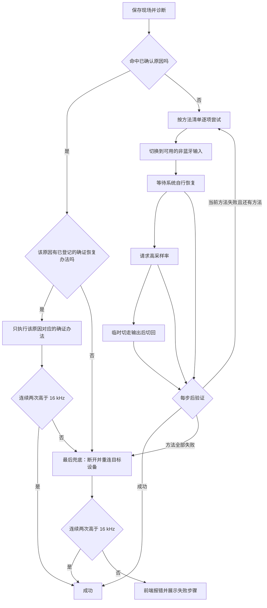

# 如何一键恢复 A2DP 模式

## 文档定位

本文规定蓝牙音频模式检查器“一键恢复 A2DP”功能的原因诊断、分级恢复、成功判定、页面反馈和失败边界。

本项目采用 FCMA（按用户功能组织代码的模块化应用架构），详细内容以项目根目录 [`Architecture.md`](../../Architecture.md) 为唯一原文。

关联规格：[`如何判定蓝色音频设备的音频模式.md`](如何判定蓝色音频设备的音频模式.md)。恢复流程不得改变该文档规定的模式判定规则。

已确认原因与已实测成功的恢复办法，以 [`进入HFP模式的原因与恢复实测记录.md`](进入HFP模式的原因与恢复实测记录.md) 为专用维护入口。不确证的原因、理论方法和仅已实现但未实测成功的方法，均不得写入该记录。当该记录增删结论时，必须同步校准本规格的原因分支、执行顺序和页面措辞。

## 用户目标

当当前默认蓝牙输出设备被判定为 `HFP_HSP` 时，用户点击模式胶囊即可尝试恢复高音质输出。

功能必须满足：

1. 先收集证据并定位原因，再选择最小扰动方案。
2. 当前方案失败后才进入下一层兜底。
3. 没有任何非蓝牙输入或输出设备时也必须继续尝试。
4. 断开重连体感最差，只能作为最后兜底。
5. 完成操作不等于恢复成功；只有实际采样率通过验证才算成功。
6. 页面必须展示原因、已经执行的步骤、每一步结果和最终采样率。

## 成功判定

恢复成功必须同时满足：

1. 目标设备是当前默认输出。
2. 当前实际输出采样率高于 `16 kHz`。
3. 连续两次读取均高于 `16 kHz`，两次读取至少间隔 `500 ms`。

任何“请求已发送”“程序已结束”“路由已切换”或“设备已重连”都不能单独作为成功依据。

## 原因诊断

原因分为三级，页面必须保留措辞强度。

### 已确认原因

- 目标设备已经断开或输出端点不存在。
- 检测到本机程序正在读取目标设备的麦克风。
- 目标设备不是当前默认输出。

### 高度疑似原因

- 麦克风占用刚刚结束，但输出仍不高于 `16 kHz`：疑似通话链路残留。
- 实际采样率已经高于 `16 kHz`，但播放器仍无声，且检测到 SoundSource 等声音路由软件：疑似旧应用输出通道或声音路由残留。
- 目标设备仍是默认输入，但当前未检测到读取者：默认输入可能令后续程序再次触发通话模式，但不能把“仅设为默认输入”当作已确认占用。

仅检测到 SoundSource 进程存在，不能直接断言它导致问题。当前工具无法可靠读取 SoundSource 内部“哪个应用被路由到哪个设备”的配置。

### 无法确认原因

- 没有本机麦克风占用，也没有可直接证明的路由异常，但采样率仍不高于 `16 kHz`。
- 可能存在非本机麦克风占用、双设备连接或系统内部状态残留；工具必须明确标为可能，不能冒充已确认。

## 分级恢复流程



### 路径选择规则

1. **命中原因**：诊断结果与已确认原因相符时，只允许调用已在实测记录中与该原因建立对应关系的恢复办法。
2. **命中原因但无对应办法**：不得把未确证方法冒充为针对性恢复，直接进入最后兜底。
3. **对应办法失败**：不再混入未命中原因的通用方法序列，直接进入最后兜底。
4. **未命中原因**：按低扰动到高扰动的顺序逐项尝试，每项后立即验证，成功即停止。
5. **最后兜底失败**：停止恢复流程，返回失败结果；前端必须显示报错、诊断结果和已执行步骤。

当前已确认原因记录尚无满足严格验证标准的对应恢复办法。因此，当前版本命中该原因时，会明确记录“无已确证对应办法”并进入最后兜底；不会擅自宣称某个方法已被实测证实。

### 第 0 阶段：保存现场

记录：

- 目标设备名称；
- 原默认输入和输出；
- 当前与最高支持采样率；
- 本机麦克风占用程序；
- 可用输入和输出设备；
- SoundSource 是否运行；
- 目标设备当前是否仍连接。

### 第 1 阶段：针对已确认原因处理

1. 目标设备未连接：直接进入最后兜底的重新连接部分。
2. 存在本机麦克风占用：请求对应程序正常退出，并确认占用消失。
3. 目标设备是默认输入且存在非蓝牙输入：切换到优先级最高的非蓝牙输入。
4. 没有非蓝牙输入：不得失败；保留当前输入，只确认没有本机程序继续读取目标麦克风。
5. 等待系统自行恢复，然后执行成功判定。

非蓝牙输入优先级：内置、USB、虚拟、显示器或其他非蓝牙设备。

### 第 2 阶段：请求高采样率

如果设备声明支持高于 `16 kHz`，尝试请求其最高支持输出采样率。请求可能被系统拒绝或被驱动改回低采样率，因此请求后必须重新执行成功判定。

### 第 3 阶段：重建声音路由

临时输出优先级：

1. 内置输出；
2. USB 或显示器等非蓝牙输出；
3. 虚拟输出；
4. 其他蓝牙输出。

存在临时输出时：切走、等待、再切回目标设备。没有任何其他输出时不得失败，跳过本阶段并进入最后兜底。

### 第 4 阶段：声音路由软件处理

当检测到 SoundSource 等软件时：

1. 页面标记“检测到声音路由软件，可能保留旧输出通道”。
2. 工具不能仅凭进程存在就结束它，也不能宣称原因已经确认。
3. 若采样率已经恢复但播放器仍无声，提示用户让播放器重新开始播放或绕过该软件。
4. 当前版本不自动关闭 SoundSource；以后若加入自动关闭，必须另行取得用户确认。

### 第 5 阶段：断开重连

只有前述阶段全部失败后才能执行：

1. 如果存在临时输出，先切到临时输出。
2. 断开目标蓝牙设备。
3. 确认设备输出端点已经从系统移除。
4. 重新连接同一设备。
5. 等待输出端点重新出现。
6. 将目标设备设为默认输出。
7. 执行成功判定。

如果重连失败：保留可用的临时输出；没有临时输出时保持系统当前状态，并明确提示需要手动连接。

## 页面反馈

执行期间模式胶囊显示“正在诊断与恢复…”。流程完成后，设备详情中显示：

- 原因判断及把握程度；
- 当前阶段；
- 每一步的 `成功 / 失败 / 跳过`；
- 当前实际采样率；
- 是否使用了断开重连；
- 最终结论。

恢复路径必须明确显示为“原因对应恢复”或“逐方法尝试”。最后兜底仍未通过验证时，页面使用失败样式显示“A2DP 恢复失败”，并保留诊断证据和所有已执行步骤。

示例：

```text
初步原因：已确认 Codex 正在读取目标麦克风
1. 解除本机麦克风占用：成功
2. 切换到非蓝牙输入：成功
3. 等待系统自行恢复：失败，仍为 16 kHz
4. 请求高采样率：失败
5. 临时切换声音输出：成功
最终结果：已恢复，当前实际输出为 44.1 kHz
```

## 性能与稳定性要求

- 恢复流程在服务端运行，不得阻塞刷新按钮和输入、输出切换接口。
- 相同状态不得重复推送或重建整张设备卡片。
- 设备扫描不得无间隔循环。
- 断开重连期间设备列表短暂变化属于真实状态变化，页面可以更新，但不得持续抽搐。

## 一致性检查清单

实现前后必须核对：

- 是否先诊断再恢复；
- 是否按扰动从小到大执行；
- 没有备用输入或输出时是否仍继续；
- 断开重连是否仅在最后执行；
- SoundSource 是否只作为疑似原因；
- 是否连续两次高于 `16 kHz` 才成功；
- 页面是否展示原因和步骤；
- 是否保持刷新设备和切换设备的响应速度。

## 实现落点

- 恢复编排：`tools/bluetooth-audio-mode-checker/features/a2dp-recovery/`
- 路径选择规则：`tools/bluetooth-audio-mode-checker/features/a2dp-recovery/recovery-policy.ts`
- 请求输出采样率：`tools/bluetooth-audio-mode-checker/core/macos-audio-format/`
- 最后兜底的蓝牙重连：`tools/bluetooth-audio-mode-checker/core/macos-bluetooth-link/`
- 运行中程序检测：`tools/bluetooth-audio-mode-checker/core/macos-running-apps/`
- 页面进度与结果：`tools/bluetooth-audio-mode-checker/features/bluetooth-audio-mode/web/`
- 完整设备扫描在独立子进程中运行，刷新接口立即返回，避免阻塞设备切换。

## 实现后验证

- 自动测试：12 项全部通过，其中 3 项专门验证恢复路径选择。
- 本机页面连续访问：约 `1–3 ms`。
- 刷新设备请求：约 `1 ms` 返回，完整扫描结果随后自动推送。
- 在后台扫描同时重复写入当前默认设备：输入约 `0.29 s`，输出约 `0.63 s`。该时间为系统写入音频路由的耗时，不再包含完整设备扫描。
- 重复选择已经是默认的设备时不再调用系统写入；本机实测输入约 `10 ms`，输出约 `2 ms`。
