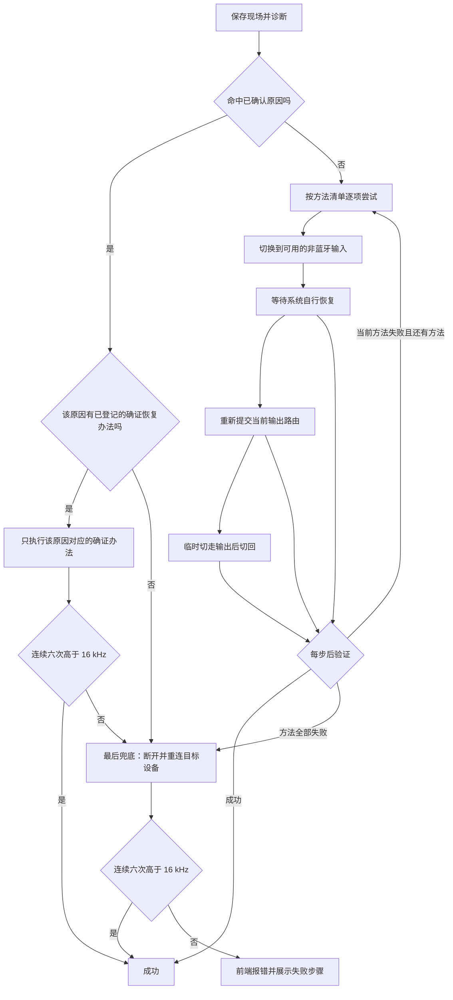

# 如何一键恢复 A2DP 模式

## 文档定位

本文规定蓝牙音频模式检查器“一键恢复 A2DP”功能的原因诊断、分级恢复、成功判定、页面反馈和失败边界。

本项目采用 FCMA（按用户功能组织代码的模块化应用架构），详细内容以项目根目录 [`Architecture.md`](../../Architecture.md) 为唯一原文。

关联规格：[`如何判定蓝色音频设备的音频模式.md`](如何判定蓝色音频设备的音频模式.md)。恢复流程不得改变该文档规定的模式判定规则。

工具自身的诊断、步骤与结果必须按 [`工具详细日志.md`](工具详细日志.md) 默认落盘，不能只在网页内短暂显示。

已确认原因与已实测成功的恢复办法，以 [`进入HFP模式的原因与恢复实测记录.md`](进入HFP模式的原因与恢复实测记录.md) 为专用维护入口。不确证的原因、理论方法和仅已实现但未实测成功的方法，均不得写入该记录。当该记录增删结论时，必须同步校准本规格的原因分支、执行顺序和页面措辞。

协议与系统接口边界见 [`../../knowledge/wiki/08-HFP与A2DP链路建立及恢复接口边界.md`](../../knowledge/wiki/08-HFP与A2DP链路建立及恢复接口边界.md)。采样率是当前端点和传输链路协商后的结果，不得再把“请求 44.1 kHz”等格式写入动作描述成释放 HFP 或建立 A2DP 的方法。

## 用户目标

当当前默认蓝牙输出设备被判定为 `HFP_HSP` 时，用户点击模式胶囊即可尝试恢复高音质输出。

功能必须满足：

1. 先收集证据并定位原因，再选择最小扰动方案。
2. 当前方案失败后才进入下一层兜底。
3. 没有任何非蓝牙输入或输出设备时也必须继续尝试。
4. 断开重连体感最差，只能作为最后兜底。
5. 完成操作不等于恢复成功；只有实际采样率通过验证才算成功。
6. 页面必须展示原因、已经执行的步骤、每一步结果和最终采样率。

## 成功判定

恢复成功必须同时满足：

1. 目标设备是当前默认输出。
2. 当前实际输出采样率高于 `16 kHz`。
3. 恢复开始时检测到的目标麦克风本机占用已经消失；仍有占用时不得执行断开重连，也不得判定成功。
4. 连续六次读取均高于 `16 kHz`，相邻读取至少间隔 `500 ms`，覆盖至少 `2.5 s`，避免把链路切换期间短暂出现的高采样率当成恢复成功。
5. 目标设备输出音量端点必须保持在恢复前音量附近；如果系统总音量未变但目标设备音量端点在同步后再次被写低，必须判定为“采样率已恢复但音量端点不稳定”，不得显示为恢复成功。

任何“请求已发送”“程序已结束”“路由已切换”“设备已重连”或一次短暂出现的高采样率都不能单独作为成功依据。采样率恢复只能证明系统端点格式已经恢复，不能证明播放器已经实际出声；当前无法自动读取播放器的真实声音输出时，页面必须避免使用“声音已经恢复”之类措辞。

## 原因诊断

原因分为三级，页面必须保留措辞强度。

### 已确认原因

- 目标设备已经断开或输出端点不存在。
- 检测到本机程序正在读取目标设备的麦克风。
- 目标设备不是当前默认输出。

### 高度疑似原因

- 麦克风占用刚刚结束，但输出仍不高于 `16 kHz`：疑似通话链路残留。
- 实际采样率已经高于 `16 kHz`，但播放器仍无声，且检测到 SoundSource 等声音路由软件：疑似旧应用输出通道或声音路由残留。
- 目标设备仍是默认输入，但当前未检测到读取者：默认输入可能令后续程序再次触发通话模式，但不能把“仅设为默认输入”当作已确认占用。

仅检测到 SoundSource 进程存在，不能直接断言它导致问题。当前工具无法可靠读取 SoundSource 内部“哪个应用被路由到哪个设备”的配置。

### 无法确认原因

- 没有本机麦克风占用，也没有可直接证明的路由异常，但采样率仍不高于 `16 kHz`。
- 可能存在非本机麦克风占用、双设备连接或系统内部状态残留；工具必须明确标为可能，不能冒充已确认。

## 分级恢复流程



### 路径选择规则

1. **命中原因**：诊断结果与已确认原因相符时，只允许调用已在实测记录中与该原因建立对应关系的恢复办法。
2. **命中原因但无对应办法**：不得把未确证方法冒充为针对性恢复，直接进入最后兜底。
   - 若命中的原因是“本机程序仍在读取目标麦克风”，由于占用存在时 A2DP 不具备恢复条件，必须立即返回失败并列出占用程序；不得断开重连目标设备制造瞬时高采样率并判成功。用户结束语音输入后可以再次执行恢复。
3. **对应办法失败**：不再混入未命中原因的通用方法序列，直接进入最后兜底。
4. **未命中原因**：按低扰动到高扰动的顺序逐项尝试，每项后立即验证，成功即停止。
5. **最后兜底失败**：停止恢复流程，返回失败结果；前端必须显示报错、诊断结果和已执行步骤。

当前已确认原因记录尚无满足严格验证标准的对应恢复办法。因此，当前版本命中该原因时，会明确记录“无已确证对应办法”并进入最后兜底；不会擅自宣称某个方法已被实测证实。

### 第 0 阶段：保存现场

记录：

- 目标设备名称；
- 原默认输入和输出；
- 当前与最高支持采样率；
- 本机麦克风占用程序；
- 可用输入和输出设备；
- SoundSource 是否运行；
- 目标设备当前是否仍连接。
- 系统当前输出音量、目标设备输出音量端点与静音状态，供链路恢复后重新同步；不得擅自提高到用户未设置的音量。

### 第 1 阶段：针对已确认原因处理

1. 目标设备未连接：直接进入最后兜底的重新连接部分。
2. 存在本机麦克风占用：请求对应程序正常退出，并确认占用消失。
3. 目标设备是默认输入且存在非蓝牙输入：切换到优先级最高的非蓝牙输入。
4. 没有非蓝牙输入：不得失败；保留当前输入，只确认没有本机程序继续读取目标麦克风。
5. 等待系统自行恢复，然后执行成功判定。

非蓝牙输入优先级：内置、USB、虚拟、显示器或其他非蓝牙设备。

### 第 2 阶段：请求系统重新评估当前输出路由

在不改变当前默认输入和默认输出设备身份的前提下，重新向系统提交“目标设备仍是默认输出”，然后执行成功判定。

本动作只是低扰动候选方法：Apple 公开文档没有承诺它会释放 HFP 音频连接或激活 A2DP。页面必须显示“请求系统重新评估输出路由”，不得显示为“已经重建 A2DP”。

不得在本阶段请求 `44.1 kHz` 或设备最高采样率。采样率只用于读取、验证和展示恢复结果。

### 第 3 阶段：重建声音路由

临时输出优先级：

1. 内置输出；
2. USB 或显示器等非蓝牙输出；
3. 虚拟输出；
4. 其他蓝牙输出。

存在临时输出时：切走、等待、再切回目标设备。没有任何其他输出时不得失败，跳过本阶段并进入最后兜底。

### 第 4 阶段：声音路由软件处理

当检测到 SoundSource 等软件时：

1. 页面标记“检测到声音路由软件，可能保留旧输出通道”。
2. 工具不能仅凭进程存在就结束它，也不能宣称原因已经确认。
3. 若采样率已经恢复但播放器仍无声，提示用户让播放器重新开始播放或绕过该软件。
4. 当前版本不自动关闭 SoundSource；以后若加入自动关闭，必须另行取得用户确认。

### 第 5 阶段：断开重连

只有前述阶段全部失败后才能执行：

1. 如果存在临时输出，先切到临时输出。
2. 断开目标蓝牙设备。
3. 确认设备输出端点已经从系统移除。
4. 重新连接同一设备。
5. 等待输出端点重新出现。
6. 将目标设备设为默认输出。
7. 执行成功判定。
8. 通过采样率判定后，将恢复前保存的输出音量重新同步给系统总音量和目标设备输出音量端点，再次确认采样率没有回落，并延迟复读音量端点。同步时只允许在原值附近做 1 个百分点的短暂变化以强制触发绝对音量下发，最终必须回到用户原值。
9. 如果用户观察到“调节音量瞬间有声，随后又变小”，而系统总音量读数未下降，工具必须把目标设备输出音量端点重新读取并写入详细日志；若该端点同步后再次掉低，页面返回失败，提示疑似设备端或声音会话仍在回写音量。

如果重连失败：保留可用的临时输出；没有临时输出时保持系统当前状态，并明确提示需要手动连接。

## 页面反馈

执行期间模式胶囊显示“正在诊断与恢复…”。流程完成后，设备详情中显示：

- 原因判断及把握程度；
- 当前阶段；
- 每一步的 `成功 / 失败 / 跳过`；
- 当前实际采样率；
- 是否使用了断开重连；
- 最终结论。

恢复路径必须明确显示为“原因对应恢复”或“逐方法尝试”。最后兜底仍未通过验证时，页面使用失败样式显示“A2DP 恢复失败”，并保留诊断证据和所有已执行步骤。采样率通过验证时，结果区域只能使用中性样式显示“系统参数已恢复，待听感确认”，不能使用绿色成功样式；设备模式胶囊仍按模式判定规格显示采样率对应模式，两者不得混为一谈。

示例：

```text
初步原因：已确认 Codex 正在读取目标麦克风
1. 解除本机麦克风占用：成功
2. 切换到非蓝牙输入：成功
3. 等待系统自行恢复：失败，仍为 16 kHz
4. 请求系统重新评估当前输出路由：失败
5. 临时切换声音输出：成功
最终结果：已恢复，当前实际输出为 44.1 kHz
```

## 性能与稳定性要求

- 恢复流程在服务端运行，不得阻塞刷新按钮和输入、输出切换接口。
- 相同状态不得重复推送或重建整张设备卡片。
- 设备扫描不得无间隔循环。
- 断开重连期间设备列表短暂变化属于真实状态变化，页面可以更新，但不得持续抽搐。

## 一致性检查清单

实现前后必须核对：

- 是否先诊断再恢复；
- 是否按扰动从小到大执行；
- 没有备用输入或输出时是否仍继续；
- 断开重连是否仅在最后执行；
- SoundSource 是否只作为疑似原因；
- 是否在麦克风占用仍存在时明确失败且不执行断开重连；
- 是否连续六次、覆盖至少 `2.5 s` 高于 `16 kHz` 才成功；
- 是否验证目标设备输出音量端点，而不是只验证系统总音量；
- 页面是否展示原因和步骤；
- 是否保持刷新设备和切换设备的响应速度。

## 实现落点

- 恢复编排：`tools/bluetooth-audio-mode-checker/features/a2dp-recovery/`
- 路径选择规则：`tools/bluetooth-audio-mode-checker/features/a2dp-recovery/recovery-policy.ts`
- 当前输出路由重提交：`tools/bluetooth-audio-mode-checker/core/macos-audio-route/`
- 最后兜底的蓝牙重连：`tools/bluetooth-audio-mode-checker/core/macos-bluetooth-link/`
- 系统总音量、目标设备输出音量读取与重新同步：`tools/bluetooth-audio-mode-checker/core/macos-audio-volume/`
- 运行中程序检测：`tools/bluetooth-audio-mode-checker/core/macos-running-apps/`
- 页面进度与结果：`tools/bluetooth-audio-mode-checker/features/bluetooth-audio-mode/web/`
- 完整设备扫描在独立子进程中运行，刷新接口立即返回，避免阻塞设备切换。
- 服务启动后的首次完整扫描也必须在后台运行；缓存尚未生成时接口返回“正在读取”，页面保持可操作，扫描完成后由实时通道自动填充设备，不得同步阻塞首屏。

## 实现后验证

- 自动测试：23 项全部通过，包含恢复路径选择、禁止把采样率写入当作模式切换、“麦克风仍被占用时不得断开重连或返回成功”、连续六次高采样率验收，以及系统输出音量读取。
- 本机页面连续访问：约 `1–3 ms`。
- 刷新设备请求：约 `1 ms` 返回，完整扫描结果随后自动推送。
- 在后台扫描同时重复写入当前默认设备：输入约 `0.29 s`，输出约 `0.63 s`。该时间为系统写入音频路由的耗时，不再包含完整设备扫描。
- 重复选择已经是默认的设备时不再调用系统写入；本机实测输入约 `10 ms`，输出约 `2 ms`。
- 2026-07-17 本次修改后实测：刷新缓存接口 5 次约 `0.7–5.9 ms`；重复选择当前默认输出约 `4.1 ms`，未因稳定性与音量同步逻辑变慢。
- 2026-07-17 23:46 的复现日志确认：语音占用期间，HFP 扬声器增益先把标量音量从 `20%` 拉到 `6.67%`；重连后 A2DP 端点收到约 `37%` 的绝对音量，随后通话端仍继续回报约 `33.33%`。因此恢复流程不得在麦克风占用存在时重连，并须在 A2DP 稳定后重新同步恢复前音量。23:55 本机重新同步 `51% -> 50%` 后，设备分别回报约 `50.39% -> 49.61%`，且保持 `1 A2DP / 0 SCO`。
- 2026-07-17 实测：保持 `Redmi电脑音箱-3899` 同时作为默认输入、输出时，重新提交输出路由和最终断开重连均未使输出高于 `16 kHz`；页面应返回恢复失败，不得宣称成功。原始记录见 [`../../knowledge/wiki/cases/2026-07-17-跨设备HFP候选解决方案调研.md`](../../knowledge/wiki/cases/2026-07-17-跨设备HFP候选解决方案调研.md)。
- 2026-07-18 实现目标设备输出音量端点读取和复核后，本机读取 `Redmi电脑音箱-3899` 结果为系统总音量 `57%`、目标设备声道音量 `57%`、未静音。若用户仍听到“调节瞬间有声，随后又变小”，本工具应记录该差异并把后续方向转向播放器应用音量、声音会话或设备内部状态，而不是继续把系统总音量当作唯一依据。
