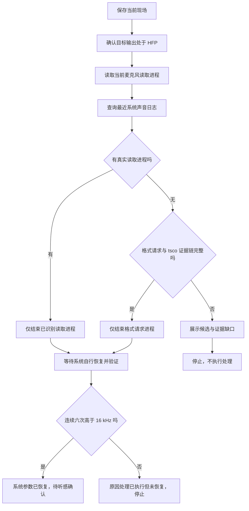

# 如何一键恢复 A2DP 模式

## 文档定位

本文规定蓝牙音频模式检查器“一键恢复 A2DP”功能的原因定位、证据分级、原因对应处理、成功判定和失败边界。

本项目采用 FCMA（按用户功能组织代码的模块化应用架构），详细内容以项目根目录 [`Architecture.md`](../../Architecture.md) 为唯一原文。

关联规格：

- [`如何判定蓝牙音频设备的音频模式.md`](如何判定蓝牙音频设备的音频模式.md)
- [`如何排查程序只请求蓝牙输入格式但未开始录音.md`](如何排查程序只请求蓝牙输入格式但未开始录音.md)
- [`进入HFP模式的原因与恢复实测记录.md`](进入HFP模式的原因与恢复实测记录.md)
- [`工具详细日志.md`](工具详细日志.md)

采样率是当前端点和传输链路协商后的结果，不得把请求高采样率描述成释放 HFP 或建立 A2DP 的方法。

## 当前目标

用户点击模式胶囊后，工具必须：

1. 保存当前设备、模式、采样率、声道和麦克风读取进程。
2. 查询最近系统声音日志，定位麦克风真实读取、蓝牙输入格式请求和 `tsco` 切换之间的证据链。
3. 区分“已确认原因”“高度疑似候选”和“无法确认”。
4. 只有命中已确认原因时，才执行该原因直接对应的处理。
5. 原因未确认、对应处理失败或处理后仍未恢复时立即停止。
6. 不切换备用输入，不重新提交输出路由，不临时切换输出，不重启系统声音服务，不断开重连设备。

当前阶段以观察原因定位是否准确为首要目标，不追求通过扩大操作范围提高表面恢复率。

## 成功判定

恢复成功必须同时满足：

1. 目标设备仍是当前默认输出。
2. 恢复开始时检测到的目标麦克风本机占用已经消失。
3. 当前实际输出采样率高于 `16 kHz`。
4. 连续六次读取均高于 `16 kHz`，相邻读取至少间隔 `500 ms`，覆盖至少 `2.5 s`。

程序已经退出、请求已经发送、日志已经定位到候选进程或一次短暂出现高采样率，都不能单独判定恢复成功。

## 原因定位

### 原因一：程序正在真实读取目标麦克风

同时满足：

1. 目标设备是当前活动输出或默认输出。
2. 目标输出当前不高于 `16 kHz`。
3. 系统声音进程列表明确给出正在读取目标麦克风的本机进程。

结论强度：已确认。

原因对应处理：只向已识别的读取进程发送正常退出请求，并复查同一进程是否仍读取目标麦克风。不得处理占用列表之外的进程。

### 原因二：程序提交蓝牙输入格式请求并触发 `tsco`

同时满足：

1. 当前没有本机进程真实读取目标麦克风。
2. 最近系统日志存在 `kBluetoothAudioDevicePropertyFormat request 0 -> 1`。
3. 日志方括号中的请求进程编号能映射到仍在运行的具体进程，并核对进程启动时间，避免编号复用。
4. 同一进程在对应时间窗内没有 `StartIO`。
5. 格式请求后两秒内出现 `Current profile tsco`。
6. 当前只有一个处于低采样率输出状态的传统蓝牙输出设备，且它就是用户点击的目标设备。

结论强度：已确认本次格式请求者及其与当前 HFP 切换的时序关系。

原因对应处理：只向该请求进程发送正常退出请求。处理后等待系统自行释放通话链路并执行成功判定；不得自动重新启动该进程，不得继续执行其他恢复方法。

### 原因三：存在格式请求，但证据链不完整

包括：

- 只有格式请求，没有随后两秒内的 `tsco` 日志；
- 请求进程已经退出，无法核对进程身份；
- 同时存在多个低采样率蓝牙输出，无法确认请求对应哪个设备；
- 同一进程存在 `StartIO`，但当前麦克风读取列表为空，时间边界无法对齐；
- 最近日志窗口已经过期或读取失败。

结论强度：高度疑似或无法确认。

处理：只展示请求原文、进程编号、可解析的进程身份和证据缺口，不结束进程。

### 原因四：只有 `tsco` 或低采样率状态

只有 `Current profile tsco`、SCO 数量、`16 kHz` 或单声道，只能证明设备已经处于 HFP，不能说明谁触发。

结论强度：无法确认。

处理：停止，不调用 `disconnectSCO`，不刷新路由，不重启后台服务，不断开重连。

### 原因五：命中特定历史案例

历史案例只能作为诊断提示。除非当前电脑、系统版本、输入设备地址、输出设备地址、日志时序和历史记录全部一致，否则不得套用历史原因或执行历史动作。

当前版本先展示是否命中历史案例，不据此自动处理。

## 工作流

## 处理边界

1. 不存在通用接口可以只关闭其他进程的麦克风输入而保留该进程运行；当前原因对应处理会请求整个进程正常退出。
2. 不使用强制结束信号；进程拒绝正常退出时记录失败并停止。
3. 不结束系统声音核心、蓝牙服务或 `audioaccessoryd`。
4. 不把 `coreaudiod` 日志外层进程编号当作格式请求者；请求者必须取日志正文方括号中的进程编号。
5. 不因某个程序正在运行就把它当作原因。
6. 不因目标设备是默认输入就把默认输入状态当作原因。
7. 不自动重新启动被处理的进程。
8. 本轮不使用任何通用恢复清单或最后兜底。

## 页面反馈

执行期间显示“正在定位原因…”。完成后必须展示：

- 原因结论和把握程度；
- 查询日志的时间窗口；
- 格式请求原文；
- 请求进程编号、进程名、程序路径和启动时间；
- 是否观察到同进程 `StartIO`；
- 是否观察到请求后两秒内的 `tsco`；
- 是否执行原因对应处理；
- 处理后进程是否仍存在或仍在读取麦克风；
- 连续采样率验证结果；
- 明确说明“未执行切路由、重启服务或断开重连”。

结果标题按以下规则显示：

| 结果 | 标题 |
| --- | --- |
| 已确认原因、处理后连续六次高于 `16 kHz` | 系统参数已恢复，待听感确认 |
| 已确认原因、处理完成但仍不高于 `16 kHz` | 原因处理完成，系统参数未恢复 |
| 只定位到候选或无法确认原因 | 原因定位完成，未执行处理 |

## 详细日志

每次点击至少记录：

1. 原因定位开始和目标设备。
2. 当前设备快照和麦克风读取进程。
3. 系统日志查询时间窗口、耗时、成功或失败。
4. 解析出的每条格式请求、请求进程编号、方向和原文。
5. 每条 `StartIO` 和 `tsco/tacl` 事件的时序匹配结果。
6. 原因分级及未升级为已确认的缺口。
7. 原因对应处理的目标进程身份、请求结果和复查结果。
8. 连续采样率验证结果。
9. 明确记录未执行任何兜底。

## 一致性检查清单

- 是否先读取日志再决定处理；
- 是否只有完整证据链才结束格式请求进程；
- 是否核对进程启动时间以避免编号复用；
- 是否只处理诊断命中的进程；
- 是否在原因不明时停止；
- 是否没有切换输入输出、重启服务或断开重连；
- 是否连续六次高于 `16 kHz` 才判定恢复；
- 是否展示日志原文和证据缺口；
- 是否保持刷新设备和切换设备的响应速度。

## 实现落点

- 原因诊断与处理编排：`tools/bluetooth-audio-mode-checker/features/a2dp-recovery/`
- 当前麦克风读取者：`tools/bluetooth-audio-mode-checker/core/macos-microphone-usage/`
- 运行中进程身份核对：`tools/bluetooth-audio-mode-checker/core/macos-running-apps/`
- 页面结果：`tools/bluetooth-audio-mode-checker/features/bluetooth-audio-mode/web/`
- 详细日志：`tools/bluetooth-audio-mode-checker/core/detailed-logging/`

## 实现后验证

- 自动测试共 28 项通过，其中 5 项覆盖格式请求解析、`StartIO` 排除、`tsco` 两秒时序、唯一目标约束和反向请求排除。
- 恢复策略测试确认：原因未确认时停止；恢复编排源码不调用输入输出切换、系统声音服务重启、SCO 断开或蓝牙重连。
- 使用当前非 HFP 设备执行一次只读诊断，结果为“仅原因定位”，没有结束进程或执行其他处理。
- 页面脚本语法检查通过；确认提示和结果区域已明确说明不会执行切路由、重启服务或断开重连。
