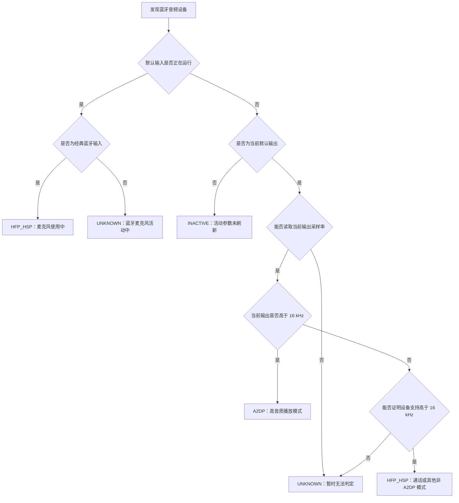

# 如何判定蓝牙音频设备的音频模式

## 文档定位

本文记录本项目当前正在使用的蓝牙音频设备模式判定技术，是修改相关代码前必须先维护、代码完成后必须再次校准的规格文档。

当前实现位于：

- [`tools/bluetooth-audio-mode-checker/features/bluetooth-audio-mode/index.ts`](../../tools/bluetooth-audio-mode-checker/features/bluetooth-audio-mode/index.ts)：设备归组和模式判定；
- [`tools/bluetooth-audio-mode-checker/core/macos-audio-probe/index.ts`](../../tools/bluetooth-audio-mode-checker/core/macos-audio-probe/index.ts)：读取设备、当前采样率和传输类型；
- [`tools/bluetooth-audio-mode-checker/core/macos-audio-probe/read-max-output-rate.c`](../../tools/bluetooth-audio-mode-checker/core/macos-audio-probe/read-max-output-rate.c)：读取设备支持的最高输出采样率；
- [`tools/bluetooth-audio-mode-checker/core/macos-audio-events/index.ts`](../../tools/bluetooth-audio-mode-checker/core/macos-audio-events/index.ts)：监听当前输出设备和实际采样率变化；
- [`tools/bluetooth-audio-mode-checker/features/bluetooth-audio-mode/detector.test.ts`](../../tools/bluetooth-audio-mode-checker/features/bluetooth-audio-mode/detector.test.ts)：判定边界的自动验证。

## 判定目标

工具需要把已连接的蓝牙音频设备分为以下状态：

- `A2DP`（高音质播放模式）；
- `HFP_HSP`（通话模式或其他非高音质播放模式）；
- `INACTIVE`（设备已连接，但当前没有承担系统声音输出）；
- `UNKNOWN`（现有参数不足，不能可靠判断）。

类型定义中虽然保留了 `LE_AUDIO`（新一代低功耗蓝牙音频模式）状态，但当前判定函数不会产出该状态，不能对外宣称已经能够识别。

## 当前使用的数据

### 默认输入与 HFP 的关系

某个蓝牙音频设备被设为系统级或应用级默认输入，只能说明它是后续麦克风调用的候选路由，不能单独证明设备已经进入 HFP/HSP。只有系统声音事件明确表明这个输入设备已经开始运行，才算实际调用。正常情况下，macOS 会在麦克风被应用实际调用时即时切入通话链路，并在调用结束后释放通话链路、恢复 A2DP；若调用结束后没有恢复，才进入本项目要排查的异常范围。

因此，页面和日志必须区分“默认输入”和“输入正在运行”。默认输入但未运行时不得改变模式；经典蓝牙输入已经运行时，由于 A2DP 不承载麦克风上行声音，可直接判定设备正在使用 HFP/HSP 输入链路。低功耗蓝牙输入仍保持未知，当前版本不得借此宣称已经识别 LE Audio。

### 识别蓝牙设备

系统设备报告中的传输类型为 `bluetooth` 或 `bluetooth-le` 时，设备进入判定范围。其他传输类型直接忽略。

同名的输入端点和输出端点会先合并成一个设备组，再从组内选择输出端点和输入端点。输出端点优先选择当前默认输出，其次选择系统提示音输出，再比较声道数和采样率；输入端点优先选择当前默认输入，再比较运行状态和声道数。

### 读取设备支持的最高输出采样率

本机辅助程序通过苹果电脑的声音系统接口读取设备可用的标称采样率范围，并取所有范围中的最大值。

该值按设备名称缓存在当前工具进程内，避免每次刷新都重新编译或重复读取。若读取失败，记为未知。

如果当前实际输出采样率高于读到的最高支持值，或最高支持值无法读取，则以两者中可证明的较大值作为设备已支持的最高输出采样率。

手动刷新必须做合并与限速：网页连续点击只能返回缓存并请求合并后的后台扫描，不得让每次点击都连续触发完整系统设备枚举或重复读取蓝牙输出能力。读取动作本身不作为 HFP/HSP 判定依据，但在蓝牙耳机处于敏感路由状态时，高频系统探测可能扰动系统声音服务，因此刷新调度必须以低扰动为优先级。

### 读取当前实际输出采样率

首次扫描从系统设备报告读取当前采样率。工具启动后，本机监听组件持续监听：

- 当前默认输出设备变化；
- 当前默认输出设备的标称采样率变化；
- 当前默认输出设备的实际采样率变化；
- 当前默认输出设备的运行状态变化。

监听事件到达后，优先使用大于零的实际采样率；实际采样率不可用时，再使用大于零的标称采样率，然后立即重新判定并刷新页面数据。

部分蓝牙设备从 A2DP 切入 HFP 时，CoreAudio 可能没有稳定触发采样率属性回调。因此活动输出监听允许增加低频兜底读取：只读取当前默认输出设备名、标称采样率、实际采样率和运行状态；相同快照必须在服务端去重，不得导致重复完整设备扫描或重复重建页面。

默认输入或默认输出由本工具切换后，必须主动安排一组完整设备重扫，用来刷新输入下拉框、输出下拉框和所有设备卡片。实时输出监听只描述当前活动输出设备，不能单独证明默认输入已经切换，也不能替代完整设备重扫。

完整设备重扫结果比旧的实时输出快照更新；只有在本次完整重扫开始之后到达的实时输出快照，才允许叠加到重扫结果上。不得用切换前缓存的旧采样率覆盖切换后的完整扫描结果。

### 实时模式与麦克风占用的合并

麦克风占用检测和输出采样率监听是两条独立的更新链路。占用检测完成时，只允许将新的麦克风占用字段合并到当前最新设备状态；不得使用占用检测开始时携带的旧采样率、旧模式或旧默认输出状态覆盖期间到达的实时更新。

因此，当麦克风占用和采样率变化接近同时发生时，页面可以分别收到两次更新，但后到的占用结果不得把已经刷新的 HFP 模式改回旧 A2DP 模式。

默认输出不是蓝牙设备时，蓝牙麦克风开始采集不会引起活动输出采样率变化。因此，系统声音事件监听还必须读取当前默认输入设备名、“是否正在运行”、标称采样率和实际采样率：默认输入从空闲变为运行，或监听器启动时发现默认输入已经运行，必须立即把该设备标为输入活动、刷新卡片参数并按需触发一次麦克风占用识别。该轻量监听只读设备属性，不得枚举声音进程、打开输入端点或自行开始录音。

输入活动事件到达后，优先使用大于零的实际输入采样率，实际值不可用时再使用大于零的标称输入采样率；同时安排一次完整设备重扫，补齐同名输出端点的当前格式和声道。重扫结果必须再次叠加最新输入活动状态，不能把仍在运行的输入错误改回 `INACTIVE`。

### 麦克风占用检测不得改变蓝牙模式

- A2DP 状态下不得周期性打开或枚举蓝牙输入端点来查询占用。
- 实时输出进入不高于 `16 kHz` 的状态时，允许启动一次占用识别。
- 无论当前默认输出是不是蓝牙设备，默认输入从空闲变为运行时，都允许启动一次占用识别；这是修复“只调用蓝牙麦克风、输出仍走内置扬声器时占用不刷新”的主触发条件。
- 检测到占用程序时可以继续短间隔复核，以便及时显示释放结果。
- 一旦检测到占用程序已经全部退出，必须立即停止占用轮询，等待系统释放通话链路；不得为了确认“仍未占用”继续注册声音客户端。
- 首次进入页面但设备已经处于低采样率，或默认输入已经处于运行状态时，只允许执行一次占用识别；结果为空时不得继续轮询。
- 验收时必须检查系统日志：语音结束且占用结果变为空后，不得继续出现由本工具辅助进程产生的连续声音客户端注册记录。

本机实测验证：修复前辅助进程约每 `0.75` 秒注册并注销两个蓝牙声音客户端；修复后，空占用结果写入后连续观察 `8` 秒，没有再出现辅助进程注册记录。系统声音服务重建会触发一次新的低采样率状态事件，因此允许随该事件执行一次识别，但结果为空后仍必须停止。

2026-07-18 在本机以“MacBook Air 扬声器为默认输出、DJI Mic Mini-9DC1E8 为默认输入”验证：输入设备开始运行后，工具先收到默认输入运行事件，再于约 `0.5` 秒内识别到实际调用进程并推送到页面；采集结束后，占用列表清空且扫描停止。整个过程不依赖蓝牙设备成为默认输出。

同日补充验证输入活动参数：系统声音设置打开输入电平监测后，DJI Mic Mini-9DC1E8 即使不是默认输出，也会得到 `isActive=true` 和输入活动状态；页面模式显示 HFP/HSP，输入为 `16 kHz / 1 声道`，同名输出端点为 `16 kHz / 1 声道`，且正常录音期间不显示异常恢复入口。切回输出页后，设备恢复为未活动。

## 当前判定规则

等价规则如下：

1. 默认输入仅被选中、但没有运行：不改变模式。
2. 经典蓝牙默认输入正在运行：判定为 `HFP_HSP`，卡片显示实时输入参数和同名输出端点参数，但不把正常录音误当成需要恢复的异常。
3. 低功耗蓝牙默认输入正在运行：判定为 `UNKNOWN`，卡片显示“蓝牙麦克风活动中”和可读参数，不产出 `LE_AUDIO`。
4. 输入没有运行且设备不是当前默认输出：判定为 `INACTIVE`，不使用待机端点参数冒充当前模式。
5. 当前实际输出采样率高于 16 kHz：判定为 `A2DP`。
6. 设备支持的最高输出采样率高于 16 kHz，同时当前实际输出采样率不高于 16 kHz：判定为 `HFP_HSP`。
7. 当前实际输出采样率无法读取：判定为 `UNKNOWN`。
8. 当前实际输出采样率不高于 16 kHz，但无法证明设备支持高于 16 kHz：判定为 `UNKNOWN`，不得强行归类。

上述有效判定目前都标记为高把握；参数不足时标记为低把握。

## 明确不参与结论的数据

当前实现会读取或展示部分辅助信息，但以下内容不参与模式结论：

- 输出声道数和输入声道数；
- 仅仅被选为当前默认麦克风、但尚未运行；
- 麦克风是否被某个程序占用；
- 设备声明支持的蓝牙服务；
- 蓝牙链路日志；
- 设备是否同时连接多台主机。

因此，不能用“单声道”、占用进程列表或“设备声明支持某服务”覆盖采样率规则给出的结果。参与模式判定的是系统声音事件直接报告的默认输入运行状态，不是占用扫描的推测结果。

## 设备卡片展示规则

- 模式结果只在设备卡片顶部的模式胶囊中显示。
- `HFP_HSP` 的设备卡片胶囊作为恢复入口时，显示短操作文案 `HFP/HSP模式（点我修复）`；这只是入口文案，不改变判定规则，也不代表工具直接读取到了具体蓝牙协议。
- 经典蓝牙输入正在运行时，胶囊显示 `HFP/HSP模式（麦克风使用中）`，不得提供恢复入口；正常录音结束后仍保持低采样率，才按异常模式提供原因定位入口。
- 展开设备卡片后，保留输入输出参数、麦克风占用和恢复结果等可操作内容。
- 设备不是默认输出、但默认输入正在运行时，仍必须展示输入采样率、输入声道、同名输出端点采样率和输出声道；输出分组要注明该端点当前未承担播放。
- 每张设备卡片均不显示额外的一句话模式结论，也不显示设备最高采样率、当前活动采样率和判定规则组成的依据列表。

## 当前技术边界

- 苹果电脑系统通常不直接向本工具提供当前蓝牙协议名称，所以结论是依据采样率规则得到的工程判定，不是直接读取协议名称。
- `HFP_HSP` 的实际含义是“设备有高于 16 kHz 的输出能力，但当前输出不高于 16 kHz”，页面文案因此写作“通话模式或其他非 A2DP 模式”，不能缩窄为已经直接证明某一具体协议。
- 当前默认输出设备可以依据活动输出参数判定；经典蓝牙默认输入实际运行时也可以依据输入运行事件判定为 HFP/HSP。除此之外的非默认输出设备保持 `INACTIVE`。
- 当前没有单独识别 `LE_AUDIO` 的实现。
- 当前实现仅支持苹果电脑操作系统。

## 一致性检查清单

修改判定代码前后都必须核对：

- 参与判定的数据是否只有设备能力上限、当前活动输出采样率，以及经典蓝牙默认输入的实际运行事件；
- 16 kHz 边界和大于、不高于关系是否改变；
- 非默认输出且输入未运行的设备是否仍禁止使用待机参数判定；
- 实际采样率与标称采样率的取值优先级是否改变；
- 新增状态是否真的能由代码产出；
- 页面说明、工具说明、自动验证和本文是否表达同一套规则；
- 刷新设备和切换设备的速度是否变慢，如变慢必须继续定位并尝试修复。
- 手动刷新是否仍被合并与限速，连续点击不得连续启动完整系统设备枚举。
