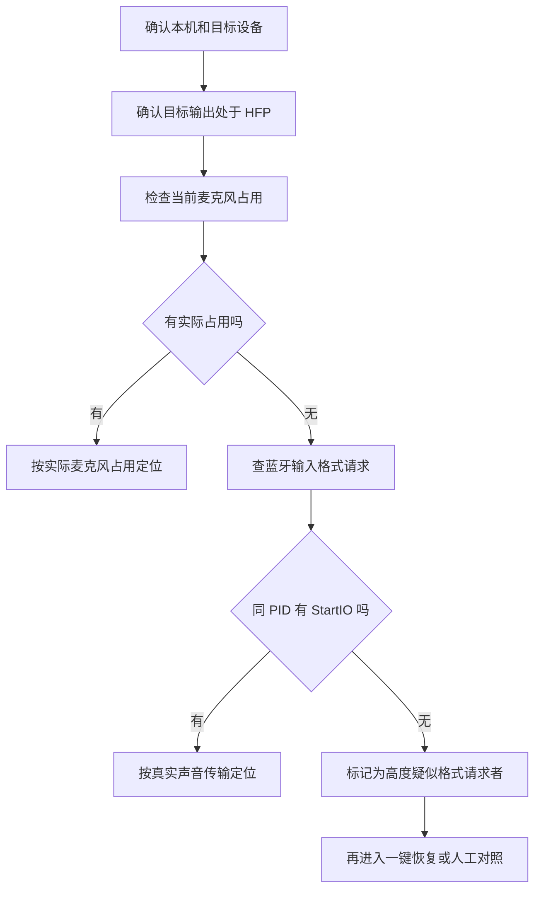

# 如何排查程序只请求蓝牙输入格式但未开始录音

## 文档定位

本文是一项 HFP（蓝牙通话模式）原因定位技术方案，用于快速排查是否存在“程序没有真正开始录音，但向系统提交了蓝牙输入格式请求”的情况。

本文只规定如何定位原因，不规定自动退出程序、断开设备或执行一键恢复。恢复动作必须在原因定位之后，再按 [`如何一键恢复A2DP模式.md`](如何一键恢复A2DP模式.md) 执行；A2DP（蓝牙高质量立体声播放模式）用于指代恢复后的高音质播放链路。

已确证事实仍以 [`进入HFP模式的原因与恢复实测记录.md`](进入HFP模式的原因与恢复实测记录.md) 为准。本文产生的结果默认只是“高度疑似”，只有完成同机、同设备、同条件对照，才能升级为已确认原因。

## 适用场景

当同时满足以下现象时，使用本文方案：

1. 目标蓝牙输出设备已经处于 HFP（蓝牙通话模式），实际输出采样率不高于 `16 kHz`。
2. 当前没有看到本机程序正在读取目标设备的麦克风。
3. 用户想知道“为什么处于该模式”，而不是立刻重连设备。

不满足第 1 条时，不能用本文解释当前问题；不满足第 2 条时，优先按“本机程序实际读取麦克风”定位。

## 本机身份前置核对

开始排查前必须先确认当前电脑和目标设备，避免把另一台电脑或另一副耳机的结论混进来。

建议记录：

```bash
scutil --get LocalHostName
hostname
system_profiler SPHardwareDataType | sed -n 's/^ *Model Identifier: //p; s/^ *Serial Number.*: //p'
```

同时记录目标设备：

- 设备显示名；
- 蓝牙地址；
- 当前默认输出；
- 当前默认输入；
- 当前实际输出采样率。

如果本机身份、系统版本、蓝牙设备或默认输入输出组合和既有记录不同，只能写成新的现场，不能直接套用旧结论。

## 快速排查步骤

### 第 1 步：确认目标输出确实处于 HFP

先用本项目工具或系统音频探测结果确认：

- 目标设备是当前活动输出或默认输出；
- 当前实际输出采样率不高于 `16 kHz`；
- 目标设备支持高于 `16 kHz` 的输出能力。

仅看到某个设备是默认输入，不等于已经处于 HFP（蓝牙通话模式）。

### 第 2 步：确认当前没有实际麦克风读取者

查看本项目工具的麦克风占用结果。如果有程序正在读取目标设备麦克风，本次原因应先归入“实际麦克风占用”，不使用本文方案解释。

如果占用列表为空，继续检查统一日志。

### 第 3 步：查最近蓝牙输入格式请求

查询最近 10 分钟的蓝牙音频格式请求：

```bash
log show --style syslog --last 10m --predicate 'eventMessage CONTAINS[c] "kBluetoothAudioDevicePropertyFormat request"'
```

重点识别这类行：

```text
2026-07-18 12:47:04.276197+0800  localhost coreaudiod[90589]: [ 30114 ]BTUnifiedAudioDevice: kBluetoothAudioDevicePropertyFormat request 0 ->1
```

读取规则：

- `coreaudiod[90589]` 是 macOS（苹果电脑系统）的声音系统守护进程，不是直接可疑程序。
- `[ 30114 ]` 才是提交格式请求的 PID（进程编号）。
- `BTUnifiedAudioDevice`（蓝牙音频设备对象）标记这条日志来自蓝牙音频设备处理路径。
- `request 0 ->1` 表示发生了从一种蓝牙音频格式向另一种格式的切换请求；在本项目既有案例中，该方向与进入通话链路同窗出现。

### 第 4 步：查同一进程是否真正开始声音传输

把上一步得到的 PID（进程编号）填入查询：

```bash
log show --style syslog --last 10m --predicate 'eventMessage CONTAINS[c] "BluetoothHALPlugIn_StartIO" AND eventMessage CONTAINS[c] "PID=30114"'
```

判读：

- 查到同一 PID（进程编号）的 `StartIO`（真正开始传输声音）：说明该进程很可能已经真正开始声音传输，本次不属于“只请求格式但未开始录音”。
- 查不到同一 PID（进程编号）的 `StartIO`（真正开始传输声音），且当前麦克风占用为空：可以写成“高度疑似：程序提交蓝牙输入格式请求但未开始录音”。

`StartIO`（真正开始传输声音）是 CoreAudio（macOS 声音系统）开始传输声音数据的日志标记；没有该标记不等于永远没录音，只表示查询窗口内没有看到这类直接证据。

### 第 5 步：映射进程身份

查询可疑 PID（进程编号）的程序路径：

```bash
ps -p 30114 -o pid= -o lstart= -o command=
```

记录：

- PID（进程编号）；
- 进程启动时间；
- 程序路径；
- 程序名；
- 是否仍在运行。

如果进程已经退出，只能记录“日志显示该 PID 曾提交请求，当前无法从进程表确认路径”，不得硬猜程序身份。

## 结论分级

### 可以写成高度疑似

同时满足：

1. 目标设备实际输出不高于 `16 kHz`；
2. 当前没有本机程序读取目标麦克风；
3. 最近日志存在格式请求；
4. 该请求的 PID（进程编号）能映射到具体程序或至少保留 PID；
5. 同一窗口没有该 PID 的 `StartIO`；
6. 请求时间与设备进入 HFP（蓝牙通话模式）的时间接近。

### 可以升级为已确认

高度疑似之外，还必须完成同机、同设备、同条件对照：

1. 记录退出或禁用候选程序前，目标设备处于 HFP（蓝牙通话模式）；
2. 退出或禁用候选程序；
3. 保持默认输入输出组合尽量不变；
4. 重新制造相同连接条件；
5. 目标输出连续恢复到高于 `16 kHz`；
6. 再次启动候选程序但不触发对应格式请求时，不能简单写成“只要运行就异常”。

满足后，才允许写入 [`进入HFP模式的原因与恢复实测记录.md`](进入HFP模式的原因与恢复实测记录.md)。

### 必须排除或降级

- 当前有程序实际读取目标麦克风：优先归入实际麦克风占用。
- 只看到目标设备是默认输入：只能写成候选路由事实。
- 只看到某程序正在运行：不能作为触发证据。
- 日志窗口已经过期或查询超时：只能写“证据不足”，不能写“没有发生”。
- 只看到 `coreaudiod`：不能把系统声音守护进程当作上游原因。

## 和一键恢复的关系

本方案属于“先定位原因”的技术方案，不属于“快速一键恢复”的执行步骤。

推荐流程：



未来如果把它产品化，建议先做成“一键原因定位”能力，输出候选进程和证据链；恢复按钮只消费定位结果，不在原因未明时直接结束程序。
